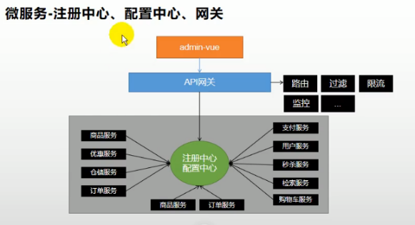
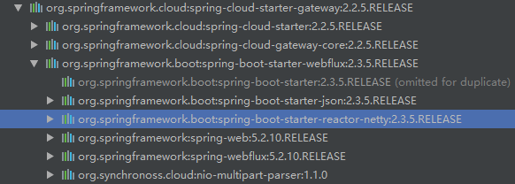
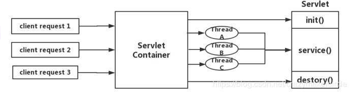
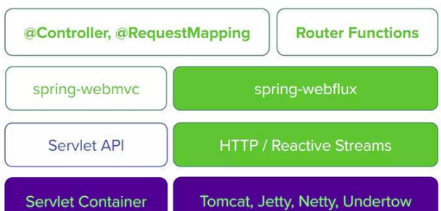
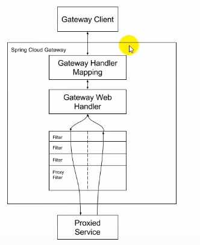

### SpringCloud Alibaba

####  一、简介

​          Spring Cloud  Alibaba 致力于提供微服务开发的一站式解决方案，此项目包含开发分布式应用微服务的必要组件，方便开发者通过Spring Cloud 编程模拟轻松使用这些组件来开发分布式应用服务。依托于这个，只需要添加少量的注解和配置，就可以将Spring Cloud 应用接入阿里微服务解决方案，通过阿里中间件来迅速搭建分布式应用系统。[中文文档](https://github.com/alibaba/spring-cloud-alibaba/blob/master/README-zh.md)

#### 二、 Sentinel

​          把流量作为切入点，从控制流量、熔断降级、系统负载保护等多个维度保护服务的稳定性。

#### 三、 Nacos

​           一个更易于构建云原生应用的动态服务发现、管理配置和服务管理平台。

##### 3.1 注册中心

​       需求：注册发现服务，便于远程调用服务。[官方使用说明](https://github.com/alibaba/spring-cloud-alibaba/blob/master/spring-cloud-alibaba-examples/nacos-example/nacos-discovery-example/readme-zh.md)

##### 3.2 配置中心

​      需求：动态更改微服务的配置项，无需更改原码以及重新打包部署。     

​      **基本使用**

​      引入依赖：

```xml
<!--配置中心-->
<dependency>
    <groupId>com.alibaba.cloud</groupId>
    <artifactId>spring-cloud-starter-alibaba-nacos-config</artifactId>
    <version>2.2.1.RELEASE</version>
</dependency>
```

 在yml中配置服务名称和配置中心地址，在nacos控制中心添加配置DataID为服务名+”.properties“

```yml
cloud: 
  #服务的注册和发现
  nacos:
    discovery:
      server-addr: 127.0.0.1:8848
    config:
      refresh-enabled: true
      server-addr: 127.0.0.1:8848
application:
  name: hrrecruit
```

 在使用配置的类上加注解**@RefreshScope**，从配置文件中加载配配置 【**@Value**("${xxx}")注解】。

```java
@RestController
@RefreshScope
@RequestMapping("/recruit")
public class TestController {
    @Autowired
    private FeignApi feignApi;

    @Value("${recruit.name}")
    private String name;

    /**
     * 测试远程调用
     * @return
     */
    @RequestMapping("testFeign")
    public String testFeign(){
        System.out.println("测试远程服务");
        String re = feignApi.TestFeign();
        return "测试远程调用："+re;
    }

    /**
     * 测试配置中心
     * @return
     */
    @RequestMapping("testConfig")
    public String testConfig(){
        System.out.println("测试配置中心");
        return "测试配置中心："+name;
    }

}
```

**命名空间**：一般用于配置隔离。默认所有新增的配置都在public空间。比如：测试环境、开发环境、生产环境。

​     每一个微服务之间互相隔离配置，每一个微服务都创建自己的命令空间，只加载自己的命名空间下的所有配置；


##### 3.3 远程调用 Feign 

​     需求：服务之间的调用

​     **基本使用deom**

​     引入依赖

```xml
<!--服务的调用-->
<dependency>
    <groupId>org.springframework.cloud</groupId>
    <artifactId>spring-cloud-starter-openfeign</artifactId>
    <version>2.2.2.RELEASE</version>
</dependency>
```

构建一个服务的远程调用接口，并添加**@FeignClient**注解。

```JAVA
@FeignClient("hrsalary") //远程被调用的服务注册名称
public interface FeignApi {
    //远程调用服务的接口全路径 
    //ps：方法签名要完全与被调用的接口保持一致
    @RequestMapping("/salary/get")
    public String TestFeign();

}
```

在启动类上添加**@EnableFeignClients**(basePackages = "com.hr.recruit.recruit.feign") 扫描远程调用的接口包。以上步骤完成后就可以按照接口进行远程调用

#### 四、GateWay

#####   1、简介

​      SpringCloud Gateway 是 Spring Cloud 的一个全新项目，该项目是基于 Spring 5.0，Spring Boot 2.0 和 Project Reactor 等技术开发的网关，它旨在为微服务架构提供一种简单有效的统一的 API 路由管理方式。

​     SpringCloud Gateway 作为 Spring Cloud 生态系统中的网关，目标是替代 Zuul，在Spring Cloud 2.0以上版本中，没有对新版本的Zuul 2.0以上最新高性能版本进行集成，仍然还是使用的Zuul 2.0之前的非Reactor模式的老版本。而为了提升网关的性能，SpringCloud Gateway是基于WebFlux框架实现的，而WebFlux框架底层则使用了高性能的Reactor模式通信框架Netty。

​    Spring Cloud Gateway 的目标，不仅提供统一的路由方式，并且基于 Filter 链的方式提供了网关基本的功能，例如：安全，监控/指标，和限流。




（1）**Filter**（过滤器）：

和Zuul的过滤器在概念上类似，可以使用它拦截和修改请求，并且对上游的响应，进行二次处理。过滤器为org.springframework.cloud.gateway.filter.GatewayFilter类的实例。

（2）**Route**（路由）：

网关配置的基本组成模块，和Zuul的路由配置模块类似。一个**Route模块**由一个 ID，一个目标 URI，一组断言和一组过滤器定义。如果断言为真，则路由匹配，目标URI会被访问。

**（**3**）Predicate**（断言）：[官网链接](https://docs.spring.io/spring-cloud-gateway/docs/2.2.5.RELEASE/reference/html/#gateway-request-predicates-factories)

这是一个 Java 8 的 Predicate，可以使用它来匹配来自 HTTP 请求的任何内容，例如 headers 或参数。**断言的**输入类型是一个 ServerWebExchange。

   注意：**Spring Cloud Gateway 底层使用了高性能的通信框架Netty**。

##### 2、模型架构

​     在2017年加入Webflux，从而填补了spring在响应式编程的空白，在springCloud集成的Zuul版本中，采用的是Tomcat容器，而它使用的是传统的Servlet IO处理模型【servlet container为每个请求绑定一个线程，高并发下弊端明显】。SpringCloud GateWay使用WebFlux中的reactor-netty响应式编程组件，底层则采用了Netty为通讯框架。

SpringCloud GateWay依赖图



**传统 Zuul 版本Servlet IO 模型**



**Webflux模型**

​      Webflux模型替代了传统的Servlet IO线程模型，用少量的线程去处理request和response io操作。这些线程称为Loop线程，而业务交给响应式编程框架处理，响应式编程是非常灵活的，用户可以将业务中阻塞的操作提交到响应式框架的work线程中去执行，而不阻塞的操纵依然交给Loop线程去处理，大大提高了Loop线程的利用率。结构图如下：

​                                            


##### 3、处理流程

​      客户端向网关发出请求后，在Handler Mapping中找到与请求相匹配的路由，将其发送到 Web Handler。 Web Handler 通过指定的过滤器链来将请求发送到实际的服务中执行业务逻辑，处理完成返回也需要经过过滤器。过滤器之间用虚线分开是因为可能在发送代理请求前或后执行业务逻辑。

​                                             

##### 4、实例

**依赖**

```xml
<dependency>
    <groupId>org.springframework.cloud</groupId>
    <artifactId>spring-cloud-starter-gateway</artifactId>
</dependency>
```

**配置服务发现地址和服务名称等基本信息**

```yml
spring:
  cloud:
    gateway:
      ##路由规则【数组】
      routes:
      - id: query_route
          uri: https://baidu.com
          ##断言规则 【数组】
          predicates:
            - Query=test,123
        - id: method_route
          uri: https://baidu.com
          predicates:
              - Method=GET,POST

    nacos:
      discovery:
        server-addr: 127.0.0.1:8848
server:
  port: 88
```

**主程序类注解**

```java
@EnableDiscoveryClient
@SpringBootApplication(exclude = {DataSourceAutoConfiguration.class})
public class GatewayApplication {

    public static void main(String[] args) {
        SpringApplication.run(GatewayApplication.class, args);
    }

}
```


#### 五、 RocketMQ

​         开源的分布式消息系统，基于高可用分布式集群技术，提供低延迟的高可靠的消息发布于订阅服务。

#### 六、 Dubbo

​         Apache Dubbo 是一款高性能的Java RPC框架。

#### 七、 Seata

​        阿里巴巴开源产品，一个易于使用的高性能微服务分布式事物解决方案。

#### 八、 Alibaba Cloud ACM 

​        一款子在分布式架构环境中对应用配置进行集中管理和推送的应用配置中心产品。

#### 九、 Alibaba Cloud OSS

​       阿里云对象存储服务(Object Storage Service) 简称OSS，阿里云提供的海量、安全、低成本、高可靠的云存储服务，在任何应用、时间、地点存储和访问任意类型的数据。

**依赖**

```xml
<dependency>
    <groupId>com.alibaba.cloud</groupId>
    <artifactId>spring-cloud-starter-alicloud-oss</artifactId>
    <version>2.2.0.RELEASE</version>
</dependency>
```


#### 十、 Alibaba Cloud SchedulerX

​       阿里中间件团队开发的一款分布式任务调度，提供秒级、精准、高可靠、高可用的定时调度任务(基于corn表达式)

#### 十一、 Alibaba Cloud SMS

​      覆盖全球的短信服务，友好、高效、智能的互联化通讯能力，帮助企业迅速搭建客户触达通道。


