#### 一、前提准备

######         1.购买服务器

​                 本次以阿里云服务器为部署基础，其他云服务器大同小异。如果需要解析域名，国内服务器需要备案，除开香港或者国外服务器不需要备案。备案时间较长，一般为20天。

######          2.项目开发

​              项目开发完成后需要打成war包。

####  二、部署

​     前提: windows+R 输入mstsc打开远程连接。输入你所购买的服务器的公网IP地址 

​                                                     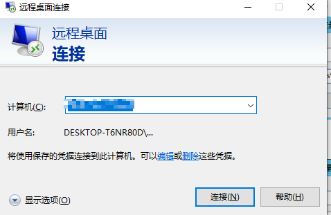

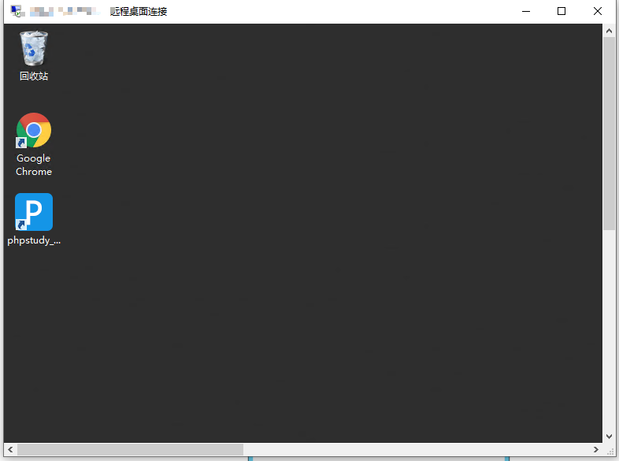

​																	成功连接至服务器

**无法连接可能是因为服务器安装的系统，建议装windows系统**

#####      **1.配置服务器**

######            1.**配置Java环境**

​                      将下载好的jdk和jre配置到系统环境变量中

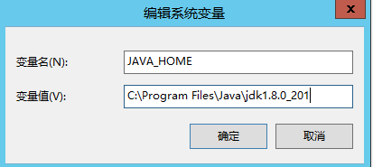

​                                                                                  配置jdk

​                                                                 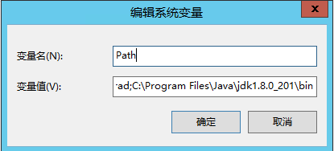

​                                                                                     配置jdk/bin

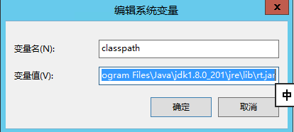

​                                                                                    配置jre

​                   测试配置是否成功 ：在命令行中依次输入java          javac          java -version  这三个命令，均有Java反馈信息即配置成功。

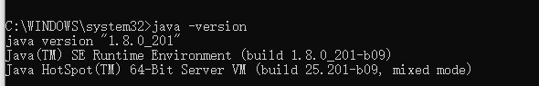

###### 2.安装数据库

​    在购买的服务器中安装数据库，本次安装phpstudy（可以免去配置）。新建数据库，导入开发sql文件。

###### 3.安装tomcat

​    下载tomcat

###### 4.配置安全组

  在所购买的服务器官网控制台配置安全组

 新建安全组   ==》  修改规则 ==》设置端口  

  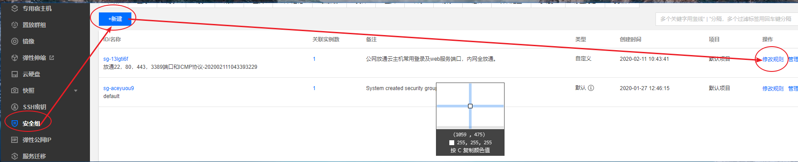

​      

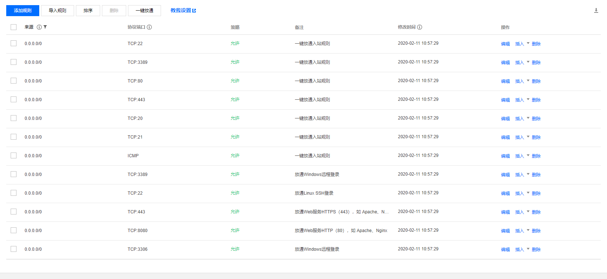

##### 2.部署工程

   1.将打包好的war包放在tomcat/webapps目录下。

2. 在bin目录下点击startup.bat启动服务器，shutdown为关闭服务。  启动服务器后如图则成功启动

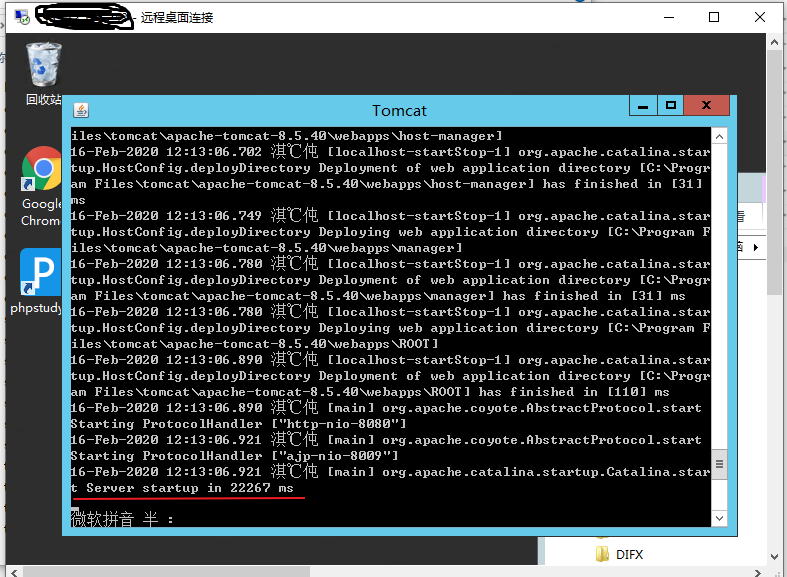

3.服务器打开浏览器 localhost : 端口号 / 项目名称 访问 

 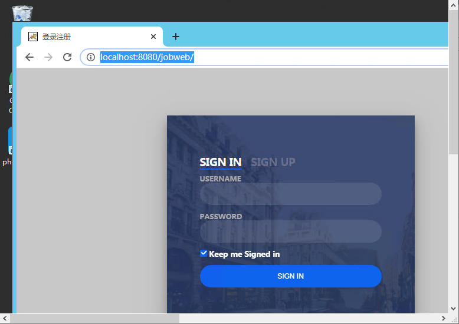

4. 外网访问 将localhost改成所购买的服务器公网地址即可

   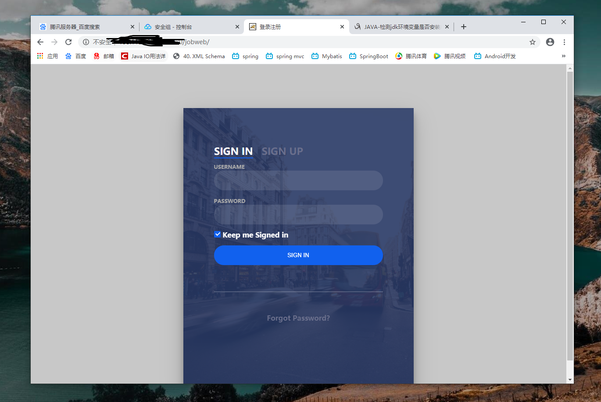