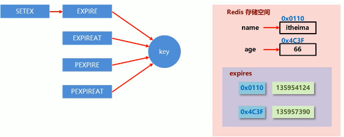

---

---

### 一、NoSql概念

​		**Not Only Sql**

#### 1.NoSql 数据库分类

| 分类         | 举例                    | 典型应用场景                                                 | 数据模型                           | 优点                                                         |                      缺点                      |
| ------------ | ----------------------- | ------------------------------------------------------------ | ---------------------------------- | ------------------------------------------------------------ | :--------------------------------------------: |
| **键值**     | redis、Tokyo、Voldemort | 内容缓存，处理大量数据的高访问负载，也用于日志系统           | key=》value，通常是hash Table实现  | 查找速度快                                                   |  数据无结构化，通常存储字符串，或者二进制数据  |
| 列存储数据库 | HBase、Risk、Cassandra  | 分布式文件系统                                               | 列族式存储，将同一列族数据存在一起 | 查找熟读快，可扩展性强，更容易进行分布式扩展                 |                  功能相对局限                  |
| 文档型数据库 | MongoDB、CouchDB        | web应用（与key-value类似，但value是结构化的，数据库能够了解value的内容） | key-value键值对，value是结构化数据 | 数据结构要求不严格，表结构可变，不需要关系型数据库那样预先定义表结构 |      查询性能不高，而且缺乏统一的查询语法      |
| 图形数据库   | Neo4j、InfoGrid         | 社交网络，推荐系统。                                         | 图结构                             | 利用图结构相关算法                                           | 很多时候需要对整个图做先关算法计算才能得出结构 |


#### **2.对比**

RDBMS（关系型数据库系统）

  **传统的ACID**

​         1.原子性（Atomicity） 2.一致性（Consistency） 3.独立性（Isolation） 4.持久性（Durability）

NoSql

   **CAP**

​        CAP定理又称CAP原则，指的是在一个分布式系统中，Consistency（一致性）、 Availability（可用性）、Partition tolerance（分区容错性），最多只能同时三个特性中的两个，三者不可兼得

​        **1. 强一致性（Consistency）**

​                   all nodes see the same data at the same time,即更新操作成功并返回客户端后，所有节点在同一时间的数据完全一致，这就是分布式的一致性。一致性的问题在并发系统中不可避免，对于客户端来说，一致性指的是并发访问时更新过的数据如何获取的问题。从服务端来看，则是更新如何复制分布到整个系统，以保证数据最终一致。

​         **2. 可用性（Available）**

​                 可用性指“Reads and writes always succeed”，即服务一直可用，而且是正常响应时间。好的可用性主要是指系统能够很好的为用户服务，不出现用户操作失败或者访问超时等用户体验不好的情况。

​         **3.分区/分布 容错性（Partition tolerance）**

​                 即分布式系统在遇到某节点或网络分区故障的时候，仍然能够对外提供满足一致性或可用性的服务。分区容错性要求能够使应用虽然是一个分布式系统，而看上去却好像是在一个可以运转正常的整体。比如现在的分布式系统中有某一个或者几个机器宕掉了，其他剩下的机器还能够正常运转满足系统需求，对于用户而言并没有什么体验上的影响。

**CAP三进二理论**：在分布式存储系统中，最多只能实现CAP中的两个需求，而由于当前的网络硬件肯定会出现延迟丢包等问题，所以**P**分区容错性是必须要实现的。最终只能在一致性**C**和可用性**A**之间进行权衡。

​		**CA：  传统的Oracle数据库**

​		**AP：  大多数的网站架构的选择**、Eureka为AP设计

​                  选择可用性 A(Availability)，即AP，此时那个失去联系的节点依然可以向系统提供服务，不过它的数据就不能保证是同步的了（失去了C属性）。

​		**CP：  Redis、MongoDB**、Zookeeper为CP设计

​                 选择一致性C(Consistency)，即CP，此时为了保证数据库的一致性，我们必须等待失去联系的节点恢复过来，在这个过程中，那个节点是不允许对外提供服务的，这时候系统处于不可用状态(失去了A属性)。

#### 3.BASE简述

   为了解决关系型数据库强一致性引起的可用性降低而提出的解决方案

   由三个术语组成： 基本可用（Basiclly Available） 软状态（Soft State） 最终一致性（Eventually consist）

   它的思想是通过让系统降低对某一时刻数据一致性的要求来换取系统整体伸缩性和性能上的改观，因为大型系统往往由于地域分布和极高性能的要求，不可能采用分布式事务来完成高这些高指标，想要完成这些指标，需要采用BASE解决方案。

#### 4.分布式 集群简述

   **分布式**：不同的多台服务器上面部署不同的服务模块（工程） ，他们之间通过RPC/RMI之间通信和调用，对外提供服务和组内协作。

   **集群**：不同的多台服务器上面部署相同的服务模块，通过分布式调度软件进行统一的调度，对外提供服务和访问。


### 二、Redis

####       1、linux安装

​           https://blog.csdn.net/qq_35451572/article/details/79516563?depth_1-utm_source=distribute.pc_relevant.none-task-blog-BlogCommendFromMachineLearnPai2-1&utm_source=distribute.pc_relevant.none-task-blog-BlogCommendFromMachineLearnPai2-1//   更换系统镜像源           

####       2、redis启动常用命令

​               **redis-server  +配置文件路径**    		   绑定启动配置

​               **redis-cli +  -p port**   							 按端口连接redis【不加参数默认端口6379】

​               **redis-cli shutdown**  							停止redis

​               **ps  -ef|grep redis**      						   查看redis启动进程

​               **redis-benchmark**      						   测试服务器读取性能

​               **config set requirepass** 					   设置访问密码，默认为空【""】

​              | grep -v "#" 过滤注释 


​               

#### 3、杂项知识

##### 	 **1）、单线程**

​          单线程模型来处理客户端的请求，对读写等事件的响应是通过epoll函数的包装来实现的，redis 核心就是 如果我的数据全都在内存里，我单线程的去操作 就是效率最高的，为什么呢，因为多线程的本质就是 CPU 模拟出来多个线程的情况，这种模拟出来的情况就有一个代价，就是上下文的切换，对于一个内存的系统来说，它没有上下文的切换就是效率最高的。redis 用 单个CPU 绑定一块内存的数据，然后针对这块内存的数据进行多次读写的时候，都是在一个CPU上完成的，所以它是单线程处理这个事。

​	2）默认16个库，下标从0开始，默认使用0号库

​	3）**select+index** 切换库

​	4）**Dbsize** 查看当前数据库的keyshuliang

​	5）**FlushDB** 清空当前库

​	6)   **FlushAll**  清空所有库

​    7）redis索引从0开始

​    8）默认端口是6379

​    9）数据最大存储512MB

​    10）数值计算最大范围 Long.Max=9223372036854775807

​    11）help +命令首词   查询命令帮助信息


#####      **2）、缓存常见场景**

######         1. 原始业务功能设计

​			 秒杀、618活动、双11活动、12036排队购票；

######         2. 运营平台监控的突发高频访问数据

​             突发的时政要闻、被强势关注围观；

######         3.高频、复杂的数据统计

​             在线人数、关注量、粉丝量、投票排行榜；

######         4. 系统功能优化或者升级

​			 单服务器升级为集群、Session管理、Token管理；

#### 4、数据类型常见命令

######     1）key

​         **keys ***            										查询所有key【*匹配所有；？匹配任意字符；[] 匹配一个指定符号】

​         **exists +key**  										判断key是否存在，存在返回1，不存咋返回0； 

​         **move +key+库下标**  		  				移动key至下标库；

​         **expire + key +时间【秒】** 				设置该key的生命周期；时间到达后销毁

​         **expireat + key +时间【秒】**

​         **persist +key**                        				将key从时效性转换为永久性

​         **rename+key+newkey**                      更改key的名称，【新名称存在会覆盖其值】

​        **renamenx+key+newkey**                  不存在则更改key的名称，【新名称存在会覆盖其值】

​		**sort+key**                                                 排序【对list、set有效】

​         **ttl + key**											    查看key的当前生命周期；

​         **type+key**							 			     查看key的数据类型

######  2）字符串【String】

​       set/get/del/append/strlen+key                  设置/获取/删除/追加/获取长度

​       Incr/Decr/Incrby/decrby+key +【nums】 递增1/递减1/递增+值/递减+值 

​       getrange/setrange+key+offset                   获取/设置区间值

​       setex+key+时间+value                                  设置存活时间以及初始化数据

​       setnx +key+value【set if not exist】         不存在则执行set命令

​       mset【more set】+key+value  ...                设置多个值

​       mget+key1+key2+...                                      获取多个值

​       msetnx+k1+v1+k2+v2...                               全部key值不存在才能执行成功

​       getset+key+value                                          先获取再赋值

**应用场景1**

​    主页高频访问信息的显示控制，eg：新浪微博大V主页显示粉丝数量与关注微博数量

 	**解决方案：**

​          在redis中为大v用户设定用户信息，以主键和属性值作为key，后台设置定时刷新策略；

​                      eg：  【key】 user:id：11721380129：fans      【value】 1254412

​          或者以json格式进行存储或者hash

​                     eg:       【key】 user:id：11721380129 

​                                 【value】 {id:11721380129,name:nzh,blogs:sadas}

​	**总结**

​    	key的设置约定

​            数据库中的热点数据key命名惯例

​				表明：主键名：主键值：字段名

   <u>redis应用于各种结构型和非结构型高热度数据访问加速</u>

**应用场景2**

​        在大型应用中进行分表操作。使用多张表存储同类型的数据，但对应的主键id必须保证统一性，使用自增属性已经不可能；Oracle数据库具有sequence【序列】设定,可以解决问题，但是Mysql数据库不具有该类似的机制。

​	**解决方案**

​       incr ，decr 操作，string在redis内部存储中默认就是一个字符串，当遇到增减操作incr，decr操作时，会自动转成数值进行计算，redis所有操作都是原子性的，采用单线程处理所有业务，命令是一个一个执行，因此无需考虑并发带来的数据不一致的影响。

​     **总结**：redis用于控制数据库表主键id，为数据库表主键提供生成策略，保障数据库表单主键的**唯一性**，此方案适用于所有数据库，并且支持数据库集群。


**应用场景3**

​        微信号每4小时进行投票；

​		商家热门产品的维持，过期自动取消；

​		热点新闻具有的时效性；

​	**解决方案：**

​      设置数据的时效性，即生命周期；

​        **setex**  key seconds value            秒级

​        **psetex**  key milliseconds value  毫秒级

​    **总结：**redis控制数据的生命周期，通过数据是否失效控制业务行为，适用于所有具有时效性限定控制的操作


######  3）列表【List】

​     lpush/rpush+key+values                               反序链表/正序链表

​     lrange+key+offset                                           获取key对应的区间值【0 -1为所有】

​     lindex+key+index                                            按索引下标获取值【从上到下；0,1，...】

​     llen+key														    获取list的szie

​     lrem+key +count+value                                 删除list中n个值为value的

​     ltrim+key+offset                              				截取区间的值再重新赋值

​     lpop/rpop														 从左右弹出栈

​     blpop/brpop+key+time                                  规格有效时间内获取并移除数据

​     rpoplpush+key1+key2                                    将key1的栈尾元素弹出到key2的栈顶位置。

​     linsert + key  before/after + value1+ value2  在vaule1的前面或者后面插入vaule2

​    

**说明:** 字符串链表，left、right都可以插入，效率极高；中间插入效率低下；值全部移除，对应键销毁；

###### 4）set【无序无重复集合】

​     sadd/smembers/sismember+key                 添加集合、添加元素/查询全部元素/判断元素是否存在，存在：1,否则0；

​     scard                                                                  获取集合的元素个数

​     srem +key +value                                            删除元素

​     srandmember+ key+count							随机获取count个集合中的元素【count<集合元素数】

​     spop + key														随机出栈一个元素

​     smove +key1+key2+value                              将key1中的value元素移动到key2中；

​     集合类：sdiff  +key1+key2                             key1与key2做差集运算

 					sinter  +key1+key2                          key1与key2做交集运算

​					 sdiff  +key1+key2                             key1与key2做并集运算

###### 5）hash

​    hset/hget/hmset/hmget/hgetall/hdel           设置单个值/获取单个值/设置多个值/获取多个值/获取所有/删除单个key

​    hexists key +某key                                            判断key这个hash中是否存在键为key的键值对

​    hkeys/hvals+key                                                获取hash中所有的键/获取hash中所有的value值

​    hincrby+key+某key+int                                    自增整数

​    hincrbyfloat+key+某key+float                         自增浮点数


###### 6）zset【有序集合】

​     在value值前包含一个score，根据这个进行排序，默认从低到高

​     zadd +key+score1+value1+....                         设置一个或多个值

​     zrange+key+offset+【withscores】               根据偏移量显示所有value，追加withscore，显示对应分数

​     zrevrangebyscore +key+offset+【withscores】  offset为分数偏移量值，此处也需要逆序分数区间

​																	             根据偏移量逆序显示所有value，追加withscore，显示对应分数

​     zrangebyscore+key+score1+score2               根据分数范围查询value

​                           携带withscore                 			 显示对应value的分数

​						   分数前带“（ ”                    			则范围不包含该分数

​                          携带Limit +开始下标+个数           从下标处开始查询n个value值

  	 zcard+key                                                         获取集合的个数

  	 zcount + key+score区间                                 获取分数在此区间的value个数

  	 zrank+key+value  										   获取对应value值的下标

​       zrevrank+key+value  									 逆序获取对应value值的下标

 	  zscore+key+value 										  获取对应value值的score值

​       zrem+key+value                                             删除对应的value值以及分数

​	   zincrby+key+inetger+memeber                  对应value值增加

​	   zremrangebyrank +key+index1+index2    移除对应下标区间的value值

​       zremrangebysocre+key+min+max             移除对应分数区间的value值

​	   zinterstore +key+nums+key1+key2+...               

​																				 将num个集合进行交集并把结果存储到key集合中

​       zunionstore +key+nums+key1+key2+...                

​																				 将num个集合进行并集并把结果存储到key集合中


  

 

​       


#### 5、配置文件

```properties
bind 0.0.0.0  
#连接绑定
protected-mode no
#保护模式
port 6379
#端口
tcp-backlog 511
timeout 0
tcp-keepalive 300
daemonize yes
#守护进程模式启动；不打印启动日志信息 作为后台服务，不会自动关闭
supervised no
pidfile /var/run/redis_6379.pid
loglevel notice
#日志级别
logfile "6379.log"
#日志文件名称；一般以端口号命名
databases 16
#数据库个数
always-show-logo yes
save 900 1
save 300 10
save 60 10000
#使用bgsave指令进行持久化；格式是  save second change
stop-writes-on-bgsave-error yes
#在进行bgsave操作时发生错误是否停止操作
rdbcompression yes
#rdb模式文件是否压缩；采用LZF压缩
rdbchecksum yes
#rdb模式在读写时是否进行文件格式校验；设置为no可节约读写性能10%，但存在数据损坏的风险
dbfilename dump.rdb
#rdb持久化存储文件名称；一般dump后加端口号
dir /root/redis-5.0.8/conf/data
#存储文件的路径
slaveof ip port
#主从复制master连接地址，端口
masterauth <master-password>
#配置认证密码
slave-read-only yes
#从库只读
slave-serve-stale-data yes
#
repl-ping-slave-period
#slave ping 命令的频率
min-slaves-to-write 3
#slave连接数少于3关闭master服务
min-slaves-max-lag 10
#延迟大于10秒关闭master服务
repl-backlog-size 1mb
#复制积压缓存区大小
repl-timeout
#主从连接超时时间，超过则释放slave连接。
replica-read-only yes
repl-diskless-sync no
repl-diskless-sync-delay 5
repl-disable-tcp-nodelay no
replica-priority 100
lazyfree-lazy-eviction no
lazyfree-lazy-expire no
lazyfree-lazy-server-del no
replica-lazy-flush no
appendonly no
#是否开启aof持久化存储
appendfilename "appendonly.aof"
#aof持久化存储文件名称
appendfsync everysec
#aof持久化存储策略
no-appendfsync-on-rewrite no
auto-aof-rewrite-percentage 100
#aof重写百分比
auto-aof-rewrite-min-size 64mb
#aof重写对比大小
aof-load-truncated yes
aof-use-rdb-preamble yes
maxmemory
#占用物理内存的比例，默认值为0【不限制】；生产环境一般在50%以上
maxmemory-samples
#每次选取逐出数据的个数
maxmemory-policy
#逐出策略【默认为】
cluster-enabled yes
#是否开启集群

lua-time-limit 5000
slowlog-log-slower-than 10000
slowlog-max-len 128
latency-monitor-threshold 0
notify-keyspace-events ""
hash-max-ziplist-entries 512
hash-max-ziplist-value 64
list-max-ziplist-size -2
list-compress-depth 0
set-max-intset-entries 512
zset-max-ziplist-entries 128
zset-max-ziplist-value 64
hll-sparse-max-bytes 3000
stream-node-max-bytes 4096 
stream-node-max-entries 100
activerehashing yes
client-output-buffer-limit normal 0 0 0
client-output-buffer-limit replica 256mb 64mb 60
client-output-buffer-limit pubsub 32mb 8mb 60
"redis-6379.conf" 62L, 1456C
```

##### 1.日志配置

  **loglevel  debug/verbose/notice/warning**

​       #日志级别,开发环境设为verbose，生产环境设为notice；简化日志输出量，降低写日志IO的频度；

  **logfile "6379.log"**
       #日志文件名称；一般以端口号命名

##### **2.服务器配置**

   **include /path/server-端口号.conf**

​       #导入并加载指定位置的配置文件，用于快速创建redis公共配置较多的redis实例配置文件，便于维护；

##### 3.客户端配置

​    **maxclients**

​       #设置同一时刻最大客户端连接数。到达后redis会关闭新的连接

​    **timeout**

​       #客户端空闲等待最长时间，到达后关闭该连接。值为0；则关闭；


#### 6、持久化

#####        1、**RDB**

######              1）概念

​					将当前数据状态进行保存，快照形式，存储数据结果，存储格式简单，关注点在数据；

######               2）命令

​                   **save :**将当前数据存储在指定的dump.rdb 文件中；当过多数据保存时，save指令执行会**阻塞**redis服务器，直到当前rdb过程完成为止，**有可能长时间阻塞；线上环境一般不使用**；

​                   **bgsave :** 原理是**调用fork函数生成子进程**，再创建rdb文件，完成会返回消息在日志文件中；该指令是对save阻塞问题的优化。redis内部所有涉及RDB的操作都采用bgsave。

######             3）RDB自动持久化

​                  **save second【监控的时间内】 changes 【key的变化量】**

​                 在满足限定时间范围内可以的变化量达到指定数量即进行持久化       

> ​            注意：需跟进业务情况进行设置，过高过低都可能出现性能问题，时间和次数通常具有互补对应关系。该配置执行的是bgsave操作； 

######             4）总结

​                  **RDB优点：**

​                           1、存储效率高，rdb是一个紧凑压缩的二进制文件；

​                           2、适用于数据备份，全量复制等场景

​                           3、RDB恢复数据的速度比AOF快很多

​                  **RDB缺点：**

​                           1、无法做到实时持久化，数据丢失的可能性大；

​                           2、bgsave每次运行都需要执行fork函数创建子进程，消耗性能

​                           3、redis众多版本之间未进行RDB文件格式的版本统一，有可能出现各个版本之间数据格式无法兼容

######             5）应用

​                       服务器中每x个小时执行bgsave备份；并将rdb文件拷贝到远程机器中，用于灾难恢复；

​                     

#####       2、AOF

​    **Append only file**

######             	1）概念

​                  将数据的操作过程进行保存，独立日志形式，存储操作过程，重启时再重新执行AOF文件中命令；存储格式复杂，关注点在数据的操作过程；主要作用是解决了数据持久化的实时性，目前已经是redis持久化的主流方式；


######     2）三种策略

​      **always：**每次写入操作均同步到AOF文件中，**数据零误差**，性能较低，数据误差要求较高时使用；

​	  **everysec：**每秒将缓冲区的指令同步到aof文件中，**数据准确性较高，性能较高**，建议使用，也是默认配置；在系统突然宕机的情况下丢失1秒内的数据；

​      **No：**由操作系统控制每次同步到AOF文件的周期，整体过程**不可控**；

######    3）配置

​       **appendonly  yes|no**                                 是否开启aof持久化，默认不开启；

​       **appendfsync  always|everysec|no**     aof 写数据策略

​      **appendfilename** **filename**                      aof持久化文件名，默认名称问为appendonly.aof,一般配置加端口号

​      **dir**                                                                  文件保存路径

###### 4）AOF重写

​      **概念：**随着命令的不断写入AOF文件会变得越来越大，很多命令存在重复、冗余的情况，redis引入AOF**重写机制压缩文件体积**。AOF文件重写是将redis进程内的数据转化为写命令同步到新的AOF文件的过程。简单来说就是将一个数据的若干条命令执行结果转化为当前最终数据对应的指令进行记录。

​    **过程：**

​       

   **AOF重写的作用**

​     1.降低磁盘的占用量，提高磁盘的利用率；

​     2.提高持久化效率，降低持久化写时间，提高IO性能；

​     3.降低恢复数据用时，提高数据恢复效率；

   **AOF重写的规则**

​     1.进程内已经超时的数据不再重写；

​     2.忽略无效指令，重写时使用进程内数据直接生成，这样新的aof文件只保留最终数据的写入命令；

​     3.对同一数据的多条写命令合并为一条命令。

 **AOF重写方式**

  1.手动重写命令

​     **bgrewriteaof**

  2.配置自动重写

​	**auto-aof-rewrite-min-size szie**   重写大小

​    **auto-aof-rewrite-percentage  percentage**   重写百分比

##### 3、RDB、AOF对比

|   持久化方式   |       RDB        |      AOF       |
| :------------: | :--------------: | :------------: |
|    存储空间    | 小【数据被压缩】 | 大【指令重写】 |
|    存储速度    |        慢        |       快       |
|    恢复速度    |        快        |       慢       |
|   数据安全性   |    会丢失数据    |  根据策略决定  |
| 恢复时资源消耗 |    高/重量级     |   低/轻量级    |
|   启动优先级   |        低        |       高       |


**应用场景**

​       对数据非常敏感，使用AOF持久化，但aof文件过大恢复速度慢；

​       数据呈现阶段性有效，使用RDB持久化，阶段性不会丢失，恢复速度快；

​       灾难恢复使用RDB；

​       双保险策略，RDB和AOF均开启；redis启动时优先使用AOF来恢复数据；


#### 7、事务

##### 1）概念

​          redis事务就是一个命令执行队列，将一系列命令包装成一个队列。执行时按照顺序依次执行，中间不会被打断；

​          当事务执行时，部分命令不无效或错误不会执行失败，也不存在回滚；

##### 2）命令

######       1. 开启事务

​          **multi :**  设定事务的开启位置，此命令执行后，后续所有指令均加入到事务中；

######       2. 执行事务

​          **exec : ** 设定事务的结束位置，并执行事务。与multi成对使用。

######       3. 取消事务

​         **discard：**终止当前事务，在multi命令后使用，exec命令之前；

######       4. 锁

​         **watch key1 key2 :**  对key添加监视锁，在执行exec前被监视的key发生变化，事务则无效；

​         **unwatch :**   释放所有的锁

###### 5.应用场景

**场景 一** 

​        商品售罄追加三件，补货完成，库存清空，如何避免最后一件不被多人同时购买【超卖问题】

   **分析**

​       使用watch监控key有没发生变化已经不能解决问题，这里是要监控具体的数据；虽然redis是单线程的，但多个客户端对同一数据同时进行操作，如何避免不被同时修改。

 **解决方案---------分布式锁**

​      是要**setnx**设置一个公共锁，setnx存在这个锁则返回0，无法进行操作其他数据：不存在设置成功则返回1，可以操作其他数据；

​     操作完毕通过**del**操作**释放锁**；

​    该方案只是一种设计概念，依赖于规范管理，具有风险性。存在死锁的情况【未解锁就宕机】

   改良方案：使用expire命令为锁添加时效；通常操作都是微妙或毫秒级，因此锁的时效不能过大；具体业务需要进行测试后确定；


#### 8、删除策略

##### 	1.概述

​      **数据特征**

​         redis是一种内存级数据库，所有数据均放在内存中，内存中的数据key通过ttl指令来还来获取其状态

​            **xx：**具有的时效性

​           **-1：**永久有效的数据

​           **-2：**已过期的或被删除的或未定义的数据

​    **删除目标**

​        在内存占用和cpu占用之间寻找一种平衡，两者兼顾不好会造成redis的性能下降，甚至引发服务器宕机或者内存泄露；

​         

#####       2.数据删除策略

######            1）定时删除

​             **定时数据的存储结构**

​             

​              创建一个定时器，当key的过期时间到达，又定时器任务立即执行对该key的删除操作

​              优点：节约内存，到时即删，快速释放不必要的内存；

​              缺点：cpu压力很大，不分时段占用CPU资源，会影响redis服务器的响应时间和指令的吞吐量；

​			【**用处理器的性能换取存储空间**】

###### 		   2）定期删除

​                 周期性轮询redis库中的时效性数据，采用随机抽取的策略，利用过期数据占比的方式控制删除频度；

​                **【每秒花费固定的CPU资源维护内存，重点抽查，随机抽取数据】**

​                **详细过程**

​                         

​                   特点：CPU性能占用设置有峰值，检测频度可自定义设置；内存压力不大，长期占用内存的冷数据会被持续清理

###### 		   3）惰性删除

​                数据到达过期时间，不做处理。等下次访问该数据发现过期，则删除，返回不存在；

​               优点：节约CPU性能，发现必须删除的时候才进行删除；

​               缺点：**内存占用严重**，出现长期占用内存的数据；

​               **【存储空间换取处理性能】** 


##### 3.逐出算法

###### 1. 概念

   redis是使用内存存储数据，在执行每个命令前，都会调用freeMemoryIfNeeded() 来检测内存是否充足，如果不满足新数据的内存最低存储要求，redis要临时删除一些数据为当前指令清理存储空间。清理数据的策略称为逐出算法。

   逐出数据的过程不是100%能够清理出足够的使用空间，如果不成功则反复执行。当对所有数据尝试完毕后，如果还不能达到内存存储要求，将抛出**Out of Memeory**【OOM】的错误信息

######  2. 相关配置

​       **1.maxmemory**

​          占用物理内存的比例，默认为0；表示不限制。生产环境中根据需求设置，同大于50%；

​       **2.maxmemory-sample**

​         在**volatile/allkeys-random**策略中随机挑选逐出数据的个数；

​       **3.maxmemory-policy**

​         逐出数据的策略

**策略**

   **expire型检测：**在会过期的数据集中进行逐出

​              volatile-lru【least-recently-used】：驱逐最久没有使用的键

​              volatile-lfu【least -frequently-used】:驱逐使用频率最少的键

​              volatile-ttl：从过期的数据集中进行淘汰

​			  volatile-random：随机驱逐maxmemory-sample配置的个数数据

**全库检测：**

​             allkeys-lru【least-recently-used】：驱逐最久没有使用的键

​              allkeys-lfu【least -frequently-used】:驱逐使用频率最少的键

​			  allkeys-random：随机驱逐maxmemory-sample配置的个数数据

**noeviction：**当内存使用超过配置的时候会返回错误，不会驱逐任何键【redis4.0中默认的策略】


#### 9、高级数据类型

##### **1）bitmaps**

​	**1、命令**

​     	**setbit key offset vlaue**                         设置指定key对应偏移量上的bit值，value只能是0或1；

​     	**getbit key offset **                                   获取指定key对应偏移为位bit值；

​     	**bitop op destkey key1 key2....**         【进行and，or，not，xor异或操作】

​    	 **bitcount key 【start end】**                 统计key中1的数量；

​	**2、应用场景**

​        大数据的 用户签到、活跃统计、

##### 2）hyperLogLog

​    **1、命令**

​         **pfadd key elements...**                         添加一个或多个元素

​         **pfcount [key...]**                                       统计数据

​         **pfmerge destkey [sourcekey ...]**        合并多个数据到目的key

   2、**注意**

​         1.核心是基数**估算**算法，不准确，存在0.81%标准错误的近似值；

​         2.用于基数统计，不是存储集合，不保存数据；

​         3.消耗存储空间极小，每个hyperLogLog最多只占用12k内存用于标记数据；

​         4.pfadd 命令不是一次分配12k内存，依次增加；pfmerge合并后存储空间顶满12k；无论之前多大；


##### 3）GEO

  应用于地理位置的计算

​    **1.基础命令**

​         **geoadd key  经纬度【x、y】 点名称**                                 在一个地理集中加入一个或多个点

​         **geopos key 点名称**                                                               在一个地理集中获取点

​     **2.计算命令**

​          **geodist key  point1 point2**                                              计算地理集中连个点之间的平面距离

​          **georadius key  经纬度  半径距离 单位【参数】**              根据坐标求范围内的数据

​          **georadiusmember key point 距离半径 单位 【参数】** 

​                                                                                                         根据点求范围内的数据

​          **geohash key  点名称**                                                          获取指定点对应的hash值


#### 10、主从复制

#####          1、概述

​                在企业级开发中，单点redis服务器已经不满足三高【高并发、高可用、高性能】要求；高可用一般用宕机全年时间来衡量，追求五点——可用性达到99.999%；为此提供多台服务器连接方案；

​               提供数据：**master**，主服务器，主库，主客户端【**写数据，数据变化时同步到从库**】

​               接收数据：**slave**,从服务器，从库，从客户端【**读数据；禁止写数据**】

​               特征：一个master可以拥有多个slave；一个slave对应一个master【**一对多**】；

​               需要解决的问题：**数据同步**；

​               **核心工作：master的有效即时数据复制到salve中；**


​            **作用**

​                 1）、读写分离：提高服务器的读写负载能力。

​                 2）、负载均匀：基于主从结构，配合读写分离，由slave分担master的负载，并根据需求变化。改变slave的数量，通过多个节点分担数据的读取负载，大大提高redis服务器的并发量和数据吞吐量；

​                 3）、故障恢复：当master出现问题，由于slave提高服务，实现快速的故障恢复；

​                 4）、数据冗余：实现数据热备份，是持久化的另外一种数据冗余方式；

​                 5）、高可用：基于主从复制，构建哨兵模式与集群，实现redis的高可用方案；


##### 2、三个阶段

​      

###### 1）建立连接【准备阶段】


​           连接方式：

​                    1. 客户端发送命令:  **slaveof  ip port**

​                    2.启动服务器时添加参数： **redis-server  --slaveof  ip port**

​                    3.【主流】配置文件配置：**slaveof  ip port** 

​          断开连接： **slaveof no one**   从库发送断开命令；

######  2）数据同步

​                    **同步流程**：

​                                   1.salve请求同步数据                         2.master创建RDB同步数据，复制积压缓存区接收指令【大小可配置】。socket发送rdb

​                                   3.slave恢复rdb同步数据   

​       							4.slave请求部分数据【缓存区】     5.发送缓存区指令

​                                   6.savle恢复部分部分数据【进行bgrewriteaof恢复数据】

​                    最终状态：slave具有master端的全部数据，包含RDB过程接收的指令；master保存当前数据同步的位置；


​                                  

​                     **说明**：

​                             1.如果master数据量巨大，数据同步应该错开流量高峰，避免造成阻塞；

​                             2.复制缓冲区大小设定不合理会导致数据溢出。进行增量【部分】复制时发现数据丢失会进行第二次全量复制，从而致使陷入死循环；

​                                 **repl-backlog-size    x mb**  配置缓冲区大小；

​                             3. master单机时占用内存的比列不应过大，建议使用50%-70%；留下30-50%执行bgsave命令个创建复制缓冲区；

​                             4. 为避免slave进行全量复制、增量复制时服务器响应阻塞或数据不同步，建议关闭此期间的对外服务；

​								 **slave -server-state-data yes|no**

​                             5. 当多个slave同时对master请求同步数据时，master会发送多个rdb文件，对带宽造成冲击，master带宽不足，数据同步需要根据业务需求，适量错峰；

​                             6. slave过多，建议调整拓扑结构，由一主多从变为树状结构；中间节点既是master也是slave。使用树状结构时；由于层级深度，导致层级之间存在数据同步延迟，数据一致性变差；

###### 3）命令传播

**命令传播阶段出现断网现象：**

​                         网络闪断闪连                       忽略

​                         短时间网络中断                   增量复制

​                         长时间网咯中断                   全量复制    

**命令复制的三个核心要素：**

​            1、服务器的运行id【**run id**】；运行redis服务器会自动生成；

​                           连接master时会记录id；用于身份识别，信息传输；

​            2、master的**复制积压缓存区**【偏移量，字节值】

​                           **先进先出队列**；存储空间大小可配置；超出队列头元素将被弹出；

​                           当master执行数据变更过指令时，会将该指令存储到该缓存区；

​                           当服务器启动时；如果开启AOF或者被连接为master节点时，会创建该缓存区；

​                           将命令按aof方式以字节形式进行存储，每个字节均带有偏移量；通过区分offset记录当前master与不同slave命令传输的差异；

​            3、主从服务器的**复制偏移量** 

​                                  描述复制缓存区的指令字节位置； 

​                                  master对应多个slave的复制偏移量；

​                                  slave对应一个master的复制偏移量；

​        进入命令传播阶段，master与slave之间需要进行信息交换，使用心跳机制进行维护，实现双方连接在线；

**心跳机制：**

​     **master心跳：**

​                  指令：ping

​                  周期：由**repl-ping-slave-period**配置决定，默认十秒；

​                  作用：判断slave是否在线

​                  查询：INFO replication

​     **slave心跳：**

​                   指令：replconf ack +offset

​                   周期：一秒

​                   作用1：汇报slave自己的复制偏移量，获取最新的数据变更指令

​                   作用2：判断master是否在线

​    **注意**

​              当slave多数掉线或者延迟过高，master为了保障数据稳定，

可以选择拒绝所有信息同步操作

```
min-slave-to-wirte  2     slave连接数少于2个，禁止同步数据；关闭master写功能
min-slave-max-lag   10    slave延迟都大于10秒时，禁止同步数据；关闭master写功能
```

两者都由slave发送命令【repliconf ack】确定


##### 3、完整流程

​    


##### 4、常见问题

  1）频繁的全量复制

​         **master重启，会导致全量复制；**

​                  内部解决方案：内部创建master-replid，使用runid相同的生成策略；在master关闭时只需shutdown save，进行rdb持久化，将runid与offset保存到rdb文件中【repl-id，repl-offset】；通过命令**redis-check-rdb+rdb文件**可以查看或**info**；

​        **slave不提供服务**；

​                 原因：复制积压缓存区过小，断网后slave的offset越界，触发全量复制；

​                 解决方案：

​                           修改复制积压缓存区大小  **repl-backlog-size**

​                 设置建议：

​                            1.测算主从重连平均时长

​                            2.info获取master每秒写命令总量【write_size_per_second】

​                            3.最优复制积压缓存区大小 = 2 x 重连平均时长 x 每秒写量

​       **master的CPU占用过高**

​     		   master各种资源被slave严重占用，影响master的写入吞吐量；

​      		  设置合理的超时时间，确认释放slave：**repl-timeout**+second【默认60秒】；

​      **连接异常断开**

​               原因：master发送ping命令频度较低；master设置超时时间太短；ping命令丢包；

​               解决方案：

​                         提高ping指令的发送频度   **repl-ping-slave-period**

​                         超时时间repl-timeout的量至少是ping指令频度的5到10倍，否则slave很容易被判定为超时    


#### 11、哨兵模式

​        

#####         1.概念

​                哨兵【sentinel】是一个分布式系统，用于对主从结构中的每台服务器进行监控，当出现故障时通过投票机制选择新的master并将所有slave连接到新的master；


​     

#####    2.哨兵的作用以及过程

######      1）监控

​           同步各个节点信息；master存活检测、master与slave运行情况检测；

​           获取master的状态；获取sentinel的状态【是否在线】；获取所有slave的状态【根据master中的slave信息】

​           

​            

######       2）通知

​            当被监控的服务器出现问题时，向其他【哨兵间、客户端】发送通知

######       **3） 自动故障转义**

​             断开master与slave连接，投票选取一个slave作为新的master，将其他slave连接到新的master，并告诉客户端新的服务器地址；

​            **服务器挑选master原则：**

​                                 1、在线 、响应快、断开时间短、优先原则【配置优先级、offset、runid】

​            挑选完成发送指令：

​                                向新的master发送slaveof no one；断开连接

​                                向其他slave发送slaveof 新master的ip以及端口；重写连接；


注意：哨兵也是一台redis服务器，只是不提供数据服务；通常哨兵数配置为单数【避免投票出现平局】；


#####  2、搭建哨兵模式

​     配置为一拖多的主从结构

​     有几个reids服务器就启动几个哨兵，一般为基数【偶数可能会产生平局投票】

​     启动哨兵           redis-sentinel  sentinel-端口号.conf

​     **配置**

```properties
port 26381
#端口号
dir "/redis-4.0.11/data/sentinels"
#文件存储地址
sentinel myid 87c3fe755eaea1b256682197f974622bea98ae64
sentinel deny-scripts-reconfig yes
sentinel monitor mymaster 127.0.0.1 6380 2
#监视的master地址 端口 掉线slave判定数
sentinel config-epoch mymaster 0
sentinel leader-epoch mymaster 0
sentinel known-slave mymaster 127.0.0.1 6381
sentinel known-slave mymaster 127.0.0.1 6382
sentinel known-sentinel mymaster 127.0.0.1 26380 c71b325b3c9daf4f4994dedcbbc24fada6298070
sentinel known-sentinel mymaster 127.0.0.1 26382 432c79e92f2d9f1d161f9cf77f93f5d316cc57e3
sentinel current-epoch 0
```

​    

####  12、集群

#####       1、概述

​               业务发展中会遇到数据峰值的瓶颈；redis提供的服务可以达到10万/秒，当前业务ops已经达到20万/秒；内存单机容量达到256G，当前业务需求内存容量为1T等；

​            **集群的作用**

​                      1.分散单台服务器器的访问压力，实现负载均衡，

​                      2.分散单台服务器的存储压力，实现可扩展性；

​                      3.降低单台服务器宕机带来的业务灾难；


​            

#####   2、集群搭建

​        模型为将三个一主一从进行集群

​        **添加配置**

```properties
cluster-enabled yes
#开启集群
cluster-config-file nodes-6385.conf
#启动后自动生成的配置文件名
cluster-node-timeout 10000
#集群节点服务响应超时时间；用于判断是否下线或为从节点
cluster-migration-barrier
#master连接slave的最小数
```

​        执行集群命令需要安装 ruby，gem

​        执行命令在redis安装目录src下执行ruby脚本

​        **./redis-trib.rb create  --replicas  slave个数  多个【ip地址：端口】**


 **节点相关命令**

  


#### 13、企业级解决方案

#####          1.缓存预热

​                缓存预热就是在系统启动前，提前将相关的缓存数据直接加载到缓存系统。避免在用户请求的时候，先查询数据库，然后再将数据缓存的问题，用户直接查询事先被预热的缓存数据

#####          2. 缓存雪崩

​             缓存雪崩好就是**短时间内过期数据量太大**，导致对数据库服务器造成巨大压力。如果能够有效避免集中时间过期，可以有效解决雪崩现象的出现【约40%】，配合其他策略一起使用，并监控服务器的运行数据，根据运行记录做快速调整。

​            


#####  3.缓存击穿

​        缓存击穿就是在**单个高热数据过期瞬间，数据访问量大，redis未命中后，发起了大量对同一数据的数据库访问**，导致对数据库服务器造成压力。应对策略是在业务数据分析与预防方面进行，配合运行监测与即时策略调整，毕竟单个key的过期监控难度较高，配合雪崩处理策略；


#####   4.缓存穿透

​    缓存穿透是访问了大量不存在的数据，调过了合法数据的redis数据缓存阶段，每次都去访问数据库，导致数据库服务器器压力过。应对策略可以返回空值，设置白名单，实时监控，key加密、配运维进行防空等。


##### 5.数据监控

######       1）监控指标

​                性能指标【Performance】 内存指标【Memory】 基本活动指标【Basic activty】 持久性指标【Persistence】 错误指标【Error】

**Performance**

| latency                   | redis响应一个请求的时间 |
| ------------------------- | ----------------------- |
| instantaneous_ops_per_sec | 平均每秒处理请求总数    |
| hit rate                  | 缓存命中率              |

**Memory**

| used_memory             | 已使用内存                                  |
| ----------------------- | ------------------------------------------- |
| mem_fragmentation_ratio | 内存碎片率                                  |
| evicted_keys            | 由于最大内存限制被驱逐的key数量             |
| blocked_clients         | 由于BLPOP，BRPOP，BRPOPPUSH而被阻塞的客户端 |

**Basic activty**

| connected_clients          | 客户端连接数               |
| -------------------------- | -------------------------- |
| connected_slave            | 连接的slave数量            |
| master_last_io_seconds_ago | 最近一次主从交互之后的秒数 |
| keyspace                   | 数据库中的key值总数        |

**Persistence**

| rejected_connections          | 达到连接上线被拒绝的连接数 |
| ----------------------------- | -------------------------- |
| keyspace_misses               | Key值查找失败次数          |
| master_link_down_since_second | 主从断开的持续时间         |

**Error**

| rdb_last_save_time          | 最后一次持久化存储到disk的时间戳 |
| --------------------------- | -------------------------------- |
| rdb_changes_since_last_save | 自最后一次持久化来数据库的更改数 |


######        2）监控方式

​             **工具**

​                         相关工具如：redis-stat  redis-faina  zabbix

​             **命令**

-   benchmark  -c 连接数       -n 请求数  ....

-   redis指令【连接后使用】

​                                      monitor

​                                      showlog【慢查询】  


​          

​                

​    


​      

  


  

 

​                                                                                                                                                                                                                                                                                                                                                                                                                                                                                                                                                                                                                         

​       