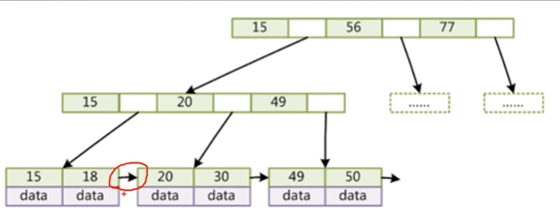
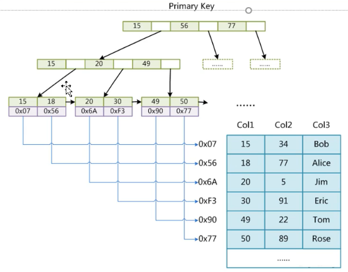
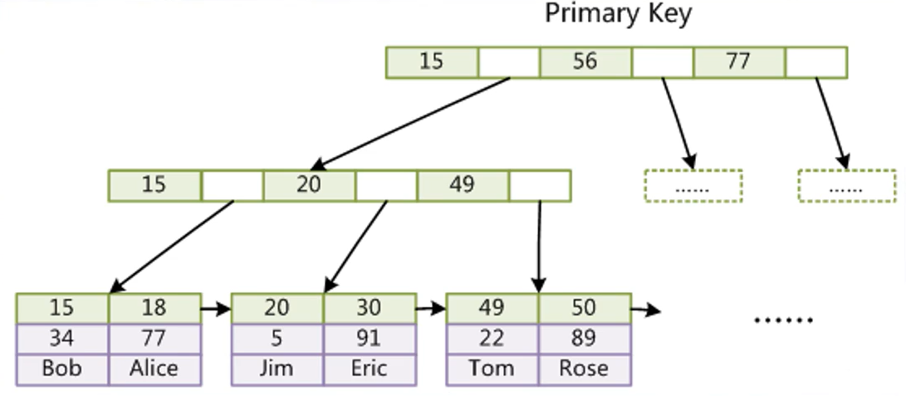

### 一、版本

#### 1、Linux版本

#####      1）安装服务器

​           passwd  用户名 修改linux用户密码

​       	安装服务器

​			sudo apt-get install mysql-server

​		   安装客户端

​			sudo apt-get install mysql-client

​			sudo apt-get install libmysqlclient-dev

​			修改配置文件  /etc/mysql/mysql.conf.d/mysqld.cnf


#####     2）常用命令

            -  service mysql  start/restart                               启动/重启服务
            - sudo mysql -u root -p   /mysql -uroot -p                    登录服务器【-u 用户名  -p 密码】
            - use mysql                                                   操作数据库
            - select user,plugin from mysql.user；                        查看用户信息
            - create database +名称
            - show global variables like 'wait_timeout                    查看全局变量
            - set global wait_timeout=86400;                              修改变量
            - GRANT ALL PRIVILEGES ON 库名称.* TO drcloudapi@"%" IDENTIFIED BY "123456" WITH GRANT OPTION  设置库所有访问权限


### 二、基础

####   1、基本SQL

- **DML**（data manipulation language）： 它们是SELECT、UPDATE、INSERT、DELETE，就象它的名字一样，这4条命令是用来对数据库里的数据进行操作的语言 
- **DQL**（data query  language）：数据查询语言DQL基本结构是由SELECT子句，FROM子句，WHERE子句组成的查询块：
  SELECT <字段名表>    FROM <表或视图名>   WHERE <查询条件

- **DDL**（data definition language）： DDL比DML要多，主要的命令有CREATE、ALTER、DROP等，DDL主要是用在定义或改变表（TABLE）的结构，数据类型，表之间的链接和约束等初始化工作上，他们大多在建立表时使用 
- **DCL**（Data Control Language）： 是数据库控制功能。是用来设置或更改数据库用户或角色权限的语句，包括（grant,deny,revoke等）语句。在默认状态下，只有sysadmin,dbcreator,db_owner或db_securityadmin等人员才有权力执行DCL
-  **TCL** - Transaction Control Language：事务控制语言，COMMIT - 保存已完成的工作，SAVEPOINT - 在事务中设置保存点，可以回滚到此处，ROLLBACK - 回滚，SET TRANSACTION - 改变事务选项

| SQL功能  | 动词                   |
| -------- | ---------------------- |
| 数据查询 | Select                 |
| 数据定义 | Create、Drop、Alter    |
| 数据操纵 | Insert、Update、Delete |
| 数据控制 | Grant、Revoke          |

函数

```sql
--数字相关函数
SELECT MOD(5,2);//取余数
SELECT ROUND(1.53);//四舍五入到整数
SELECT FORMAT(23.44467,3);//保留小数位
SELECT BIN(2);//返回二进制编码
SELECT HEX(16);//返回16进制编码
SELECT OCT(9);//返回8进制编码
SELECT CONV(9,10,8);//将9从十进制转换成八进制

--字符相关函数
SELECT ASCII('ab');//取左边第一个字符的ascii码
SELECT CONCAT('a',NULL) as a;//连接一个或多个字符，一个为null，则返回null
SELECT length('abcdsds');//返回字符的长度
SELECT LOCATE('fd','abcd');//返回子串出现的起始位置，不存在则返回0
SELECT INSTR('football','ball');//返回子串出现的起始位置，不存在则返回0
SELECT LEFT('football',5);//从左返回5个字符
SELECT RIGHT('football',5);//从右返回5个字符
SELECT SUBSTRING('football' FROM 2 FOR 5);//从某位置返回固定长度的子串
SELECT TRIM(' dsds sdsd ');//从头尾去除空格
SELECT LTRIM(' abc ');//从头去除空格
SELECT RTRIM(' abc ');//从尾去除空格
SELECT REPLACE('www.baidu.com','www','W');//替代字符
SELECT INSERT('what are you',6,3,'is');//指定替代位置
SELECT REPEAT('com.',3);//返回一个重复3次的字符串
SELECT REVERSE('abcdef');//逆序字符串

--日期相关函数
SELECT NOW();//返回当前的日期时间
SELECT DAYOFWEEK('2020-7-1');//返回星期的索引，星期天为1,1-7
SELECT WEEKDAY('2020-7-2');//返回星期的索引，星期一为1,1-7;
SELECT DAYOFYEAR('2020-1-1');//返回日在一年中的索引,1-366;
SELECT DAYOFMONTH('2020/7/25');//返回日期中的日,1-31;
SELECT MONTH('2020/7/25');//返回日期中的月份
SELECT DAY('2020/7/25');//返回日期中的日
SELECT YEAR('2020/7/25');//返回日期中的年
SELECT DAYNAME('2020/7/25');//返回日期的星期英文名称
SELECT QUARTER('2020/7/25');//返回日期中的季节索引,0-4;
SELECT WEEK('2020/1/25',1);//返回日期在一年中的星期数,可指定起始日从星期几开始

--加密函数
SELECT PASSWORD('dss');//对字符串进行加密,用于用户密码
SELECT MD5('1231232');//普通数据的加密
```

#### 2、范式

​      范式的英文名称是Normal Form，它是英国人E.F.Codd（关系数据库的老祖宗）在上个世纪70年代提出关系数据库模型后总结出来的。范式是关系数据库理论的基础，也是我们在设计数据库结构过程中所要遵循的规则和指导方法。目前有迹可寻的共有8种范式，依次是：1NF，2NF，3NF，BCNF，4NF，5NF，DKNF，6NF。通常所用到的只是前三个范式，即：第一范式（1NF），第二范式（2NF），第三范式（3NF）。

**第一范式**

​        第一范式就是属性不可分割，**每个字段都应该是不可再拆分**的。比如一个字段是姓名（NAME），在国内的话通常理解都是姓名是一个不可再拆分的单位，这时候就符合第一范式；但是在国外的话还要分为FIRST NAME和LAST NAME，这时候姓名这个字段就是还可以拆分为更小的单位的字段，就不符合第一范式了

**第二范式**

​      第二范式就是要求表中要有主键，表中其他其他字段都依赖于主键，因此第二范式只要记住**主键约束**就好了。比如说有一个表是学生表，学生表中有一个值唯一的字段学号，那么学生表中的其他所有字段都可以根据这个学号字段去获取，依赖主键的意思也就是相关的意思，因为学号的值是唯一的，因此就不会造成存储的信息对不上的问题，即学生001的姓名不会存到学生002那里去

**第三范式**

​       第三范式就是要求表中不能有其他表中存在的、存储相同信息的字段，通常实现是在通过**外键**去建立关联，因此第三范式只要记住外键约束就好了。比如说有一个表是学生表，学生表中有学号，姓名等字段，那如果要把他的系编号，系主任，系主任也存到这个学生表中，那就会造成数据大量的冗余，一是这些信息在系信息表中已存在，二是系中有1000个学生的话这些信息就要存1000遍。因此第三范式的做法是在学生表中增加一个系编号的字段（外键），与系信息表做关联。


####   3、存储过程

#####         	1）概述

​                 MySQL 5.0 版本开始支持存储过程。存储过程（Stored Procedure）是一种在数据库中存储复杂程序，以便外部程序调用的一种数据库对象。存储过程是为了完成特定功能的SQL语句集，经编译创建并保存在数据库中，用户可通过指定存储过程的名字并给定参数(需要时)来调用执行。存储过程思想上很简单，就是数据库 **SQL 语言层面的代码封装与重用**。

##### 	 2）优缺点

​           **优点**

​                      在生产环境下，可以通过直接修改存储过程的方式修改业务逻辑或bug，而不用重启服务器去修改代码。执行数据快，存储过程经过编译后会比一条一条执行要快，减少网络传输流量，更方便。

​           **缺点**

​                  过程化编程，复杂业务处理的维护成本高。调试不方便，不同数据库之间可移植性差。【不同数据库语法不一致】  

#####  3）基础语法

######          1）声明格式

 delimiter $$ 存储过程声明

```sql
--创建存储过程

CREATE
    [DEFINER = { user | CURRENT_USER }]//数据库，默认当前库
　 Procedure sp_name ([proc_parameter[,...]])
　   begin
    [characteristic ...] routine_body
    end$$
    
proc_parameter:--参数修饰符
    [ IN | OUT | INOUT ] param_name type
  --IN 入参
  --OUT 出参
  --INOUT 入出参
characteristic:--特殊属性
    COMMENT 'string'
  | LANGUAGE SQL
  | [NOT] DETERMINISTIC
  | { CONTAINS SQL | NO SQL | READS SQL DATA | MODIFIES SQL DATA }
  | SQL SECURITY { DEFINER | INVOKER }
 
[begin_label:] BEGIN   --sql体开始
　　[statement_list]
　　　　……
END [end_label]--结束

--调用方式：call +存储过程名称
eg1：
delimiter $$
create procedure test_one()
begin 
   declare id int DEFAULT 12345678;
   set id =123456;
   select id;
end$$

call test_one();


```


######          2）变量

​        **局部变量**

​        需要用户自己定义，范围是存在于begin-end$$区域。

```
  declare +名称 +类型【部分类型需要指定长度】 [default +默认值]    //中括号可省略
  
```

​          **用户变量**

​           mysql用户变量，mysql中用户变量不用提前申明，在用的时候直接用“@变量名”使用就可以了。

```sql
-- 第一种用法，使用set时可以用“=”或“:=”两种赋值符号赋值
set @age=19;
set @age:=20;

-- 第二种用法，使用select时必须用“:=”赋值符号赋值
select @age:=22;

select @age:=StuAge 
from demo.student 
where StuNo='A001';   
```

​          **会话变量**

​         mysql会话变量，服务器为每个连接的客户端维护一系列会话变量。其作用域仅限于当前连接，即每个连接中的会话变量是独立的。

```
-- 显示所有的会话变量
show session variables;

-- 设置会话变量的值的三种方式
set session auto_increment_increment=1;
set @@session.auto_increment_increment=2;
set auto_increment_increment=3;        -- 当省略session关键字时，默认缺省为session，即设置会话变量的值

-- 查询会话变量的值的三种方式
select @@auto_increment_increment;
select @@session.auto_increment_increment;
show session variables like '%auto_increment_increment%';        -- session关键字可省略

-- 关键字session也可用关键字local替代
set @@local.auto_increment_increment=1;
select @@local.auto_increment_increment;
```

​        


#### 4、索引

  索引是对于一列或多列**排好序**的**数据结构**，是帮助MySQL高效获取数据的数据结构。

在MySql数据库中，有四种索引：聚集索引（**主键索引**）（聚簇索引）、**普通索引**、**唯一索引**以及**全文索引**（FUNLLTEXT INDEX）

索引又可分为**聚簇索引**和**非聚簇索引**【聚集索引/非聚集索引】两种：

**聚簇索引的叶子节点就是数据节点，而非聚簇索引的叶子节点仍然是索引节点，只不过有指向对应数据块的指针。**

**聚簇索引**：

​	特点是存储数据的顺序和索引顺序一致，且一个表只能有一个聚簇索引，因为物理存储只能有一个顺序。主键索引一般都是聚簇索引

**Create Cluster Index** index_name **ON** table_name(column1,column2,...);

**非聚簇索引**

​	表数据存储顺序与索引顺序无关，一个表对应的非聚簇索引可以有多条，根据不同列的约束可以建立不同要求的非聚簇索引；其行数量与数据表列数据量一致。

**Create NonCluster  Index** index_name ON table_name(column1,column2,...);


##### 1、聚簇索引思想

​		1、大多数表都应该有聚簇索引或使用分区来降低对表尾页的竞争，在一个高[事务](http://baike.baidu.com/view/121511.htm)的环境中，对最后一页的封锁严重影响系统的吞吐量。

​		2、在聚簇索引下，数据在物理上按顺序排在数据页上，重复值也排在一起，因而在那些包含范围检查 (between、<、<=、>、>=)或使用group by或order by的查询时，一旦找到具有范围中第一个键值的行，具有后续索引值的行保证物理上连在一起而不必进一步搜索，避免了大范围扫描，可以大 大提高查询速度。

​		3、在一个频繁发生插入操作的表上建立聚簇索引时，不要建在具有单调上升值的列(如IDENTITY)上，否则会经常引起封锁冲突。

​		4、在聚簇索引中**不要包含经常修改的列**，因为**码值修改后，数据行必须移动到新的位置**。

​		5、选择聚簇索引应基于where子句和连接操作的类型

##### 2、索引底层实现

​      **B+Tree【B树变种】实现**

   -  非叶子节点不存储数据，只存储索引【有上层的冗余】，存放更多的索引。

   -  叶子节点包含所有的索引字段。

   -  叶子节点由指针连接，提高区间访问的性能。

      

​      **Hash 实现**

​           哈希索引就是采用一定的哈希算法，把键值换算成新的哈希值，检索时不需要类似B+树那样从根节点到叶子节点逐级查找，只需一次哈希算法即可立刻定位到相应的位置，速度非常快。在MySQL中，只有HEAP/MEMORY引擎表才能显式支持哈希索引。

          - 范围查询检索，这时候哈希索引就毫无用武之地了
          - 哈希索引也不支持联合索引的最左匹配规则；
          - like ‘xxx%’ 这样的部分模糊查询（这种部分模糊查询，其实本质上也是范围查询）；


##### **3、引擎体现**

MySql中不同的数据存储引擎对聚簇索引的支持不同就很好解释了。

​	 **MYISAM非聚族索引**是按**列值**与**行号**来组织索引的。它的叶子节点中保存的实际上是指向存放数据的物理块的指针。从MYISAM存储的物理文件我们能看出，非聚簇索引的数据表和索引表是分开存储的，MYISAM引擎的索引文件（xxx.MYI）和数据文件(xxx.MYD)是相互独立的。MYISAM的主键索引和辅助索引**没有任何区别**，主键索引仅仅只是一个叫做PRIMARY的唯一、非空的索引，且MYISAM引擎中可以不设主键。

​                                                                     

​	**INNODB聚簇索引**中的每个**叶子节点**包含**主键值**、**事务ID**、**回滚指针**(rollback pointer用于事务和MVCC）和余下的列值。数据存储文件只有xxx.ibd;其二级索引与主键索引有很大的不同。InnoDB的二级索引的叶子包含主键值，而不是行指针(row pointers)，这**减小了移动数据**或者数据页面分裂时维护二级索引的开销。二级索引的叶子节点存放的是KEY字段加主键值。因此，通过二级索引查询首先查到是主键值，然后InnoDB再根据查到的主键值通过主键索引找到相应的数据块。




##### 4、联合索引

​      两个或更多个列上的索引被称作联合索引，联合索引又叫复合索引。对于复合索引:Mysql从左到右的使用索引中的字段，一个查询可以只使用索引中的一部份，但只能是最左侧部分。例如索引是key index (a,b,c). 可以支持a | a,b| a,b,c 3种组合进行查找，但不支持 b,c进行查找 .当最左侧字段是常量引用时，索引就十分有效。

###### 1）命名规则

​    1、符合最左规则

​    2、条件是OR关系是，索引不起作用【除非or中每个条件都使用了索引，否则不生效】

​    3、数据量少的字段不需要加索引

​    4、需要加索引的字段，要在Where条件中

######   2）创建方式

   - Alter table

     - Create Index

######   3）**底层存储结构**


##### 5、索引失效

        1. or中每个条件都使用了索引列，否则不生效。
        2. 模糊查询中，以%或_开头的无效。eg：“%aa” ,”下划线aa“ 失效 ;  ”aa%“ ,"aa下划线" 不失效；
        3. 复合索引中，只有满足最左匹配的生效，否则不生效。
        4. 索引字段类型是字符串的，在条件中必须用引号才会有效。
        5. 如果数据库任务全表扫描比使用索引快，则不会使用索引进行查询。

##### 6、索引相关面试

​      1）InnoDB引擎建表必须有主键，且推荐使用整型自增主键；为什么？

​            整型相比于其他类型的排序效率更高，底层实现为B+树，如果主键不是自增，那么在数据插入的时候为了使得B+树变得有序，必须分列节点或者平衡该树。此行为的性能开销很大。

​      2）索引为什么使用B+树作为底层存储结构

​          B+树是一颗多路查找树，为了查找的更快，需要尽可能的降低树的深度，B+树的深度是最低的。而且所有数据存储叶子节点，查询的路径深度都相同，那么查询是比较稳定，此外在叶子节点间存在指针，便于区间查询和遍历。

​      3）


#### 5、事务

**内容在存储引擎中的[InnoDB]()**

#### 6、存储引擎

**概述：**

 -  如果要提供提交、回滚、崩溃恢复能力的事务安全（ACID兼容）能力，并要求实现并发控制，**InnoDB**是一个好的选择；
 -  如果数据表主要用来**大量插入少量查询**，则**MyISAM**引擎能提供较高的处理效率；
 -  如果只是临时存放数据，数据量不大，并且不需要较高的数据安全性，可以选择将数据保存在内存中的**Memory**引擎，MySQL中使用该引擎作为临时表，存放查询的中间结果；
 -  如果只有INSERT和SELECT操作，可以选择**Archive**，Archive支持高并发的插入操作，但是本身不是事务安全的。Archive非常适合存储归档数据，如记录日志信息可以使用Archive


使用哪一种引擎需要灵活选择，**一个数据库中多个表可以使用不同引擎以满足各种性能和实际需求**，使用合适的存储引擎，将会提高整个数据库的性能


##### 0、锁

MySQL的锁机制比较简单，其最显著的特点是不同的**存储引擎**支持不同的锁机制。

MySQL大致可归纳为以下3种锁：

- 表级锁：开销小，加锁快；不会出现死锁；锁定粒度大，发生锁冲突的概率最高，并发度最低。

- 行级锁：开销大，加锁慢；会出现死锁；锁定粒度最小，发生锁冲突的概率最低，并发度也最高。

- 页面锁：开销和加锁时间界于表锁和行锁之间；会出现死锁；锁定粒度界于表锁和行锁之间，并发度一般

##### 1  、**MyIsam引擎**

######   1） **MyISAM的锁调度机制**：

 读和写锁是互斥，读操作是串行的。当一个写进程和一个读进程同时请求时，MyIsam默认写锁的优先级大于读锁，即使读锁的进程已经到达锁等待队列，写锁到达后也会插在读锁的前面。所以该引擎不适合有大量的查询和写操作，容易发生查询饿死的情况

设置来调节MyISAM的调度行为**进行调优**：

- 通过指定启动参数**low-priority-updates**，使MyISAM引擎默认**给予读请求以优先**的权利。
- 通过执行命令**SET LOW_PRIORITY_UPDATES=1**，使该连接发出的**更新请求优先级降低**。
- 通过指定INSERT、UPDATE、DELETE语句的**LOW_PRIORITY**属性，**降低该语句的优先级**。

虽然上面3种方法都是要么更新优先，要么查询优先的方法，但还是可以用其来解决查询相对重要的应用（如用户登录系统）中，读锁等待严重的问题。

另外，MySQL也提供了一种折中的办法来调节读写冲突，即给系统参数**max_write_lock_count**设置一个合适的值，**当一个表的读锁达到这个值**后，**MySQL便暂时将写请求的优先级降低**，给读进程一定获得锁的机会。

###### 2)  **表级锁**

​		只可用表级锁，而MySQL的表级锁有两种模式：

 		**表共享锁**（Table Read Lock）和**表独占写锁**（Table Write Lock），MySQL支持锁升级，即在条件满足时，允许从 表共 享锁升级为 表独占锁。他们在工作时表现如下：

  - 对某一个表的读操作，不会阻塞其他用户对同一表读请求，但会阻塞对同一表的写请求；
  - 对MyISAM的写操作，则会阻塞其他用户对同一表的读和写操作；
  - MyISAM表的读操作和写操作之间，以及写操作之间是串行的。

  当一个线程获得对一个表的写锁后，只有持有锁的线程可以对表进行更新操作。其他线程的读、写操作都会等待，直到锁被释放为止。

​				**自动加锁**

​					MyISAM在执行查询语句（SELECT）前，会自动给涉及的所有表加读锁，在执行更新操作（UPDATE、DELETE、INSERT等）前，会自动给涉及的表加写锁，

​				**显式加锁**

​					MyISAM表显式加锁，一般是为了一定程度模拟事务操作，实现对某一时间点多个表的一致性读取。

```mysql
LOCK tables orders read local,order_detail read local;
SELECT SUM(total) FROM orders;
SELECT SUM(subtotal) FROM order_detail;
Unlock tables;
```

ps：锁表的时候加了**LOCAL关键字**表示允许走并发插入的逻辑，具体是否可以并发插入还需要看是否满足concurrent_insert指定的条件，只有手动锁表的时候才需要指定LOCAL关键字。

**注意：**当使用LOCK TABLE时，不仅需要一次锁定用到的所有表，而且，同一个表在SQL语句中出现多少次，就要通过与SQL语句中相同的别名锁多少次，否则也会出错；！


###### 3）  并发锁

  在一定条件下，MyISAM也支持查询和插入操作的并发进行。

  MyISAM存储引擎有一个**系统变量****concurrent_insert**，专门用以控制其并发插入的行为，其值分别可以为0、1或2。

- 当concurrent_insert设置为0时，不允许并发插入。

- 当concurrent_insert设置为1时，表里没有空行时允许从表尾插入（默认）

- 当concurrent_insert设置为2时，无论MyISAM表中有没有空行，都允许在表尾插入记录


  可以利用MyISAM存储引擎的并发插入特性，来解决应用中对同一表查询和插入锁争用。例如，将concurrent_insert系统变量为2，总是允许并发插入；同时，通过定期在系统空闲时段执行OPTIONMIZE  Optionmize TABLE语句来整理空间碎片，收集因删除记录而产生的中间空洞。


##### 2） InnoDB引擎

​    对比：InnoDB与MyISAM的最大不同有两点：一是**支持事务**（TRANSACTION）；二是采用了**行级锁**。

行级锁和表级锁本来就有许多不同之处，另外，事务的引入也带来了一些新问题。

###### **1、事务及其ACID属性**

  事务是由一组SQL语句组成的逻辑处理单元，事务具有4属性，通常称为事务的ACID属性。

- **原子性**（Actomicity）：事务是一个原子操作单元，其对数据的修改，要么全都执行，要么全都不执行。
- **一致性**（Consistent）：在事务开始和完成时，数据都必须保持一致状态。这意味着所有相关的数据规则都必须应用于事务的修改，以操持完整性；事务结束时，所有的内部数据结构（如B树索引或双向链表）也都必须是正确的。
- **隔离性**（Isolation）：数据库系统提供一定的隔离机制，保证事务在不受外部并发操作影响的“独立”环境执行。这意味着事务处理过程中的中间状态对外部是不可见的，反之亦然。
- **持久性**（Durable）：事务完成之后，它对于数据的修改是永久性的，即使出现系统故障也能够保持。


###### 2、并发事务带来的问题

  相对于串行处理来说，并发事务处理能大大增加数据库资源的利用率，提高数据库系统的事务吞吐量，从而可以支持可以支持更多的用户。但并发事务处理也会带来一些问题，主要包括以下几种情况。

- **更新丢失**（Lost Update）：当两个或多个事务选择同一行，然后基于最初选定的值更新该行时，由于每个事务都不知道其他事务的存在，就会发生丢失更新问题——最后的更新覆盖了其他事务所做的更新。例如，两个编辑人员制作了同一文档的电子副本。每个编辑人员独立地更改其副本，然后保存更改后的副本，这样就覆盖了原始文档。最后保存其更改保存其更改副本的编辑人员覆盖另一个编辑人员所做的修改。如果在一个编辑人员完成并提交事务之前，另一个编辑人员不能访问同一文件，则可避免此问题
- **脏读**（Dirty Reads）：一个事务正在对一条记录做修改，在这个事务并提交前，这条记录的数据就处于不一致状态；这时，另一个事务也来读取同一条记录，如果不加控制，第二个事务读取了这些“脏”的数据，并据此做进一步的处理，就会产生未提交的数据依赖关系。这种现象被形象地叫做“脏读”。
- **不可重复读**（Non-Repeatable Reads）：一个事务在读取某些数据时已经发生了改变、或某些记录已经被删除了！这种现象叫做“不可重复读”。
- **幻读**（Phantom Reads）：一个事务按相同的查询条件重新读取以前检索过的数据，却发现其他事务插入了满足其查询条件的新数据，这种现象就称为“幻读”。

###### 3、事务的隔离级别

​        有4种，由低到高分别为Read uncommitted【读未提交】 、Read committed【读已提交】 、Repeatable read 【重复读】、Serializable 【串行】。而且，在事务的并发操作中可能会出现脏读，不可重复读，幻读。下面通过事例一一阐述它们的概念与联系。

  **1）Read uncommitted---------”脏读“**

​		读未提交，顾名思义，就是**一个事务可以读取另一个未提交事务的数据。**

事例：老板要给程序员发工资，程序员的工资是3.6万/月。但是发工资时老板不小心按错了数字，按成3.9万/月，该钱已经打到程序员的户口，但是事务还没有提交，就在这时，程序员去查看自己这个月的工资，发现比往常多了3千元，以为涨工资了非常高兴。但是老板及时发现了不对，马上回滚差点就提交了的事务，将数字改成3.6万再提交。

分析：实际程序员这个月的工资还是3.6万，但是程序员看到的是3.9万。他看到的是老板还没提交事务时的数据。这就是脏读。

那怎么解决脏读呢？Read committed！**读提交**，能解决脏读问题。


**2) Read committed-----不可重复**

读提交，顾名思义，就是**一个事务要等另一个事务提交后才能读取数据。**

事例：程序员拿着信用卡去享受生活（卡里当然是只有3.6万），当他埋单时（程序员事务开启），收费系统事先检测到他的卡里有3.6万，就在这个时候！！程序员的妻子要把钱全部转出充当家用，并提交。当收费系统准备扣款时，再检测卡里的金额，发现已经没钱了（第二次检测金额当然要等待妻子转出金额事务提交完）。程序员就会很郁闷，明明卡里是有钱的…

分析：这就是读提交，若有事务对数据进行更新（UPDATE）操作时，读操作事务要等待这个更新操作事务提交后才能读取数据，可以解决脏读问题。但在这个事例中，**出现了一个事务范围内两个相同的查询却返回了不同数据，这就是不可重复读。**

那怎么解决可能的不可重复读问题？Repeatable read ！


**3）Repeatable read -----幻读**

重复读，就是在**开始读取数据（事务开启）时，不再允许修改操作**

事例：程序员拿着信用卡去享受生活（卡里当然是只有3.6万），当他埋单时（事务开启，不允许其他事务的UPDATE修改操作），收费系统事先检测到他的卡里有3.6万。这个时候他的妻子不能转出金额了。接下来收费系统就可以扣款了。

分析：重复读可以解决不可重复读问题。写到这里，<u>应该明白的一点就是，不可重复读对应的是修改，即UPDATE操作</u>。但是可能还会有幻读问题。因为幻读问题对应的是插入INSERT操作，而不是UPDATE操作。


**4）Serializable 序列化---吞吐量低**

​	  Serializable 是最高的事务隔离级别，在该级别下，事务串行化顺序执行，可以避免脏读、不可重复读与幻读。但是这种事务隔离级别效率低下，比较耗数据库性能，一般不使用。

**值得一提的是：大多数数据库默认的事务隔离级别是Read committed，比如Sql Server , Oracle。MySQL的默认隔离级别是Repeatable read。**

```sql
select @@tx_isolation;              //查看mysql的数据库的事务隔离级别
show variables like 'autocommit';   //查看事务设置
set   autocommit=0;                 //关闭事务的自动提交
```

| 隔离级别         | 隔离级别的值 | 导致的问题                                                   |
| ---------------- | ------------ | ------------------------------------------------------------ |
| Read-Uncommitted | 0            | 导致脏读                                                     |
| Read-Committed   | 1            | 避免脏读，允许不可重复读和幻读                               |
| Repeatable-Read  | 2            | 避免脏读，不可重复读，允许幻读                               |
| Serializable     | 3            | 串行化读，事务只能一个一个执行，避免了脏读、不可重复读、幻读。执行效率慢，使用时慎重 |

spring 事务：传播行为和隔离级别 https://blog.csdn.net/yujin753/article/details/42242297

###### 3、行级锁

InnoDB 存储引擎中实现了两种标准的行级锁：

- **共享锁（S Lock）**：允许事务读一行
- **排它锁（X Lock）**：允许事务删除和更新一行

**共享锁是兼容锁**，就是当一个事务已经获得了行 r 的共享锁，其他事务可以立即获得行 r 的共享锁，因为读并未改变行 r 的数据。

**排他锁是非兼容锁**，如果有事务想获取行 r 的排他锁，若行 r 上有共享锁或者排它锁，则它必须等其他事务释放行 r 的锁。

在 InnoDB 存储引擎中，默认情况下使用的是一致性的非锁定行读，也就是通过行多版本控制器来读取行数据，我们可以显示的为行加上共享锁和排它锁，语句如下：

- **SELECT ..... For Update :**对读取的行记录加一个**排它锁**，其他事务想要在这些行上加任何锁都会被阻塞

- **SELECT ....... Lock  In Share Mode：**对读取的行记录加一个**共享锁**，其他事务可以向被锁定的记录加共享锁，但是想要加排它锁。则会被阻塞。

另外，为了允许行锁和表锁共存，实现多粒度锁机制，InnoDB还有两种内部使用的意向锁（Intention Locks），这两种意向锁都是表锁。

意向共享锁（IS）：事务打算给**数据行加共享锁**，事务在给一个数据行加共享锁前必须先取得**该表**的IS锁。

意向排他锁（IX）：事务打算给**数据行加排他锁**，事务在给一个数据行加排他锁前必须先取得**该表**的IX锁。


#### 7、执行计划

​       关键词 **Explain**

需要注意:

- **Explain **不考虑触发器、存储过程或用户自定义函数对查询的影响

- **Explain **不考虑缓存

- **Explain **只能分析执行计划，不能显示存储引擎在执行查询过程中进行的操作

- **Explain** 统计信息是估算的，并非精确值

  

EXPLAIN 的行数为查询涉及的表数, 结果各列的含义为:

- id: 查询的唯一标识
- select_type: 查询的类型
- table: 查询的表, 可能是数据库中的表/视图，也可能是 FROM 中的子查询
- type: 搜索数据的方法
- possible_keys: 可能使用的索引
- key: 最终决定要使用的key
- key_len: 查询索引使用的字节数。通常越少越好
- ref: 查询的列或常量
- rows: 需要扫描的行数，估计值。通常越少越好
- extra: 额外的信息

​          

**id**

   1、**id相同**：执行顺序由上至下

   2、**id不同**：如果是子查询，id的序号会递增，id值越大优先级越高，越先被执行

   3、**id相同又不同（两种情况同时存在）**：id如果相同，可以认为是一组，从上往下顺序执行；在所有组中，id值越大，优先级越高，越先执行

**select_type**

   1、**SIMPLE**：简单的select查询，查询中不包含子查询或者union 
   2、**PRIMARY**：查询中包含任何复杂的子部分，最外层查询则被标记为primary 
   3、**SUBQUERY**：在select 或 where列表中包含了子查询 
   4、**DERIVED**：在from列表中包含的子查询被标记为derived（衍生），mysql或递归执行这些子查询，把结果放在零时表里 
   5、**UNION**：若第二个select出现在union之后，则被标记为union；若union包含在from子句的子查询中，外层select将被标记为derived 
   6、**UNION RESULT**：从union表获取结果的select 