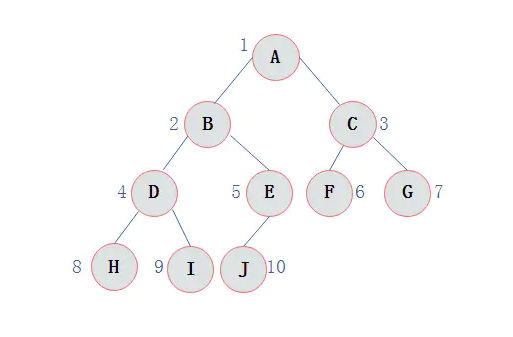

#### 一、二叉树

##### 0. 概念

  **节点的度**：一个节点含有的子树的个数称为该节点的度

  **树的度**：一棵树中，最大的节点的度称为树的度；

  **叶节点或终端节点**：度为0的节点称为叶节点

  **节点的层次**：从根开始定义起，根为第1层，根的子节点为第2层，以此类推；

   **树的高度或深度**：树中节点的最大层次；

   **满二叉树**：一个二叉树，如果每一个层的结点数都达到最大值，则这个二叉树就是满二叉树。也就是
说，如果一个二叉树的层数为K，且结点总数是(2^k) -1 ，则它就是满二叉树。

   **完全二叉树**：完全二叉树是效率很高的数据结构，完全二叉树是由满二叉树而引出来的。对于深度为K
的，有n个结点的二叉树，当且仅当其每一个结点都与深度为K的满二叉树中编号从1至n的结点一一对
应时称之为完全二叉树。 要注意的是满二叉树是一种特殊的完全二叉树

​       

#####    	1. 先序遍历

​          <u>第一次到达该结点时就返回节点值</u>

​         A=》B=》D均返回, 到达H时返回H节点后继续向左检索无左子节点，返回H【第二次到达H节点】，继续向右进行检索，无右子节点。返回H【第三次到达H节点】。返回D【第二次到达D节点】。=》I =》E=> J => C=> F =>G

最终先序遍历结果为：ABDHIEJCFG

#####    	2. 中序遍历

​       <u>第二次到达该结点时就返回节点值</u>

​       ABD均不反回节点值，到达H时继续向左检索无左子节点，返回H【第二次到达H节点】返回节点值，继续向右进行检索，无右子节点。返回H【第三次到达H节点】。返回D【此时第二次到达D节点】返回D节点值。以此类推。

中序遍历的结果为：HDIBJEAFCG

#####   	 3. 后续遍历

​         <u>第三次到达该结点时就返回节点值</u>

​        ABD均不反回节点值，到达H时继续向左检索无左子节点，返回H【第二次到达H节点】，继续向右进行检索，无右子节点。返回H【第三次到达H节点】返回节点值。返回D【此时第二次到达D节点】，到达I【向左向右共3次】返回I节点值，返回到D【第三次】返回D节点值。以此类推

​        后续遍历结果为：HIDJEBFGCA

##### 4. 二分查找

   