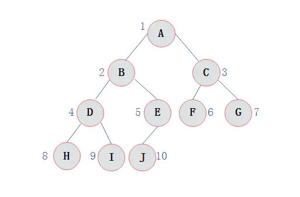
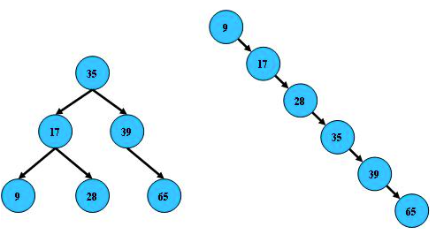
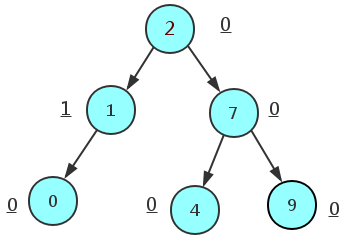
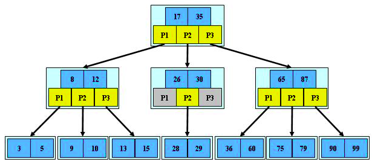
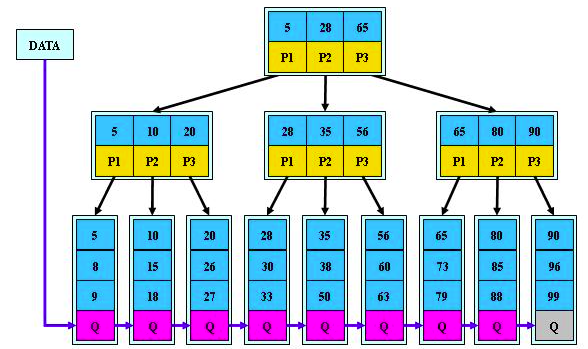
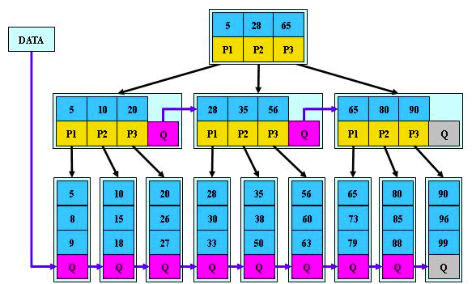

#### 一、二叉树

##### 0. 概念

  **节点的度**：一个节点含有的子树的个数称为该节点的度

  **树的度**：一棵树中，最大的节点的度称为树的度；

  **叶节点或终端节点**：度为0的节点称为叶节点

  **节点的层次**：从根开始定义起，根为第1层，根的子节点为第2层，以此类推；

   **树的高度或深度**：树中节点的最大层次；

   **满二叉树**：一个二叉树，如果每一个层的结点数都达到最大值，则这个二叉树就是满二叉树。也就是
说，如果一个二叉树的层数为K，且结点总数是(2^k) -1 ，则它就是满二叉树。

   **完全二叉树**：完全二叉树是效率很高的数据结构，完全二叉树是由满二叉树而引出来的。对于深度为K
的，有n个结点的二叉树，当且仅当其每一个结点都与深度为K的满二叉树中编号从1至n的结点一一对
应时称之为完全二叉树。 要注意的是满二叉树是一种特殊的完全二叉树


​       

#####    	1. 先序遍历

​          <u>第一次到达该结点时就返回节点值</u>

​         A=》B=》D均返回, 到达H时返回H节点后继续向左检索无左子节点，返回H【第二次到达H节点】，继续向右进行检索，无右子节点。返回H【第三次到达H节点】。返回D【第二次到达D节点】。=》I =》E=> J => C=> F =>G

最终先序遍历结果为：ABDHIEJCFG

#####    	2. 中序遍历

​       <u>第二次到达该结点时就返回节点值</u>

​       ABD均不反回节点值，到达H时继续向左检索无左子节点，返回H【第二次到达H节点】返回节点值，继续向右进行检索，无右子节点。返回H【第三次到达H节点】。返回D【此时第二次到达D节点】返回D节点值。以此类推。

中序遍历的结果为：HDIBJEAFCG

#####   	 3. 后续遍历

​         <u>第三次到达该结点时就返回节点值</u>

​        ABD均不反回节点值，到达H时继续向左检索无左子节点，返回H【第二次到达H节点】，继续向右进行检索，无右子节点。返回H【第三次到达H节点】返回节点值。返回D【此时第二次到达D节点】，到达I【向左向右共3次】返回I节点值，返回到D【第三次】返回D节点值。以此类推

​        后续遍历结果为：HIDJEBFGCA

##### 4. 二分查找

https://www.cnblogs.com/kyoner/p/11080078.html

######       4.1 普通的二分查找           

```java
public static int upper_bound_ (int v, int[] a) {
    if (a.length<=0){
        return -1;
    }
    int left=0;
    int right=a.length;//搜索区间是左闭右开 [left,right)
    while (left<right){//根据搜索区间是否取等
        int mid=(left+right)/2;
        if (a[mid]==v){
           return  mid;//返回下标
        }
        else if(a[mid]<v){
            left=mid+1;
        }else if (a[mid]>v){
            right=mid;
        }
    }
    return -1;
}
```

######    4.2 寻找左侧边界的二分查找

  【重复有序数据中】

```java
public static int left_bound_ (int v, int[] a) {
     if (a.length<=0){
        return -1;
    }
    int left=0;
    int right=a.length;
    while (left<right){
        int mid=(left+right)/2;
        if (a[mid]==v){
            right=mid;//此时不返回，而是缩小搜索的右侧边界
        }
        else if(a[mid]<v){
            left=mid+1;//
        }else if (a[mid]>v){
            right=mid;
        }
    }

    return left;//
}
```

######    4.3 寻找右侧边界的二分查找

【重复有序数据中】

```java
public static int right_bound_ (int v, int[] a) {
    if (a.length<=0){
        return -1;
    }
    int left=0;
    int right=a.length;
    while (left<right){
        int mid=(left+right)/2;
        if (a[mid]==v){
            left=mid+1;//缩小搜索区间左侧边界
        }
        else if(a[mid]<v){
            left=mid+1;
        }else if (a[mid]>v){
            right=mid;
        }
    }
    return left-1;//left已经到达大于v的下标
}
```

#### 二、树

#####    0、二叉搜索树

​     条件如下

​         1. 所有非叶子结点至多拥有两个儿子（Left和Right）；

​         2. 所有结点存储一个关键字；

​         3. 非叶子结点的左指针指向小于其关键字的子树，右指针指向大于其关键字的子树；

​                                            

​           注意：在新增删除过程中容易造成图二的结构，形成线性排列。所以，使用二叉搜索树还要考虑尽可能让B树保持左图的结构，和避免右图的结构，也就是所谓的“平衡”问题；  

#####     1、AVL树/平衡树

​      AVL树是带有平衡条件的二叉查找树【高度平衡树】,一般是用平衡因子差值判断是否平衡并通过旋转来实现平衡,左右子树树高不超过1,和红黑树相比,它是**严格**的平衡二叉树,平衡条件必须满足(所有节点的左右子树高度差不超过1)。Windows NT内核中广泛存在。由于平衡操纵很消耗性能，所以AVL树只适合查找多增删少的场景。



​                           从上面这张图我们可以看出,任意节点的左右子树的平衡因子差值都不会大于1.

##### 2、红黑树

​          通过对任何一条从根到叶子的路径上各个节点着色的方式的限制,红黑树确保没有一条路径会比其它路径长出两倍.它是一种**弱平衡二叉树** 【由于是若平衡,可以推出,相同的节点情况下,AVL树的高度低于红黑树】,相对于要求严格的AVL树来说,它的旋转次数变少,所以对于搜索,插入,删除操作多的情况下,我们就用红黑树。Java中Map中链表长度大于8就会转变为红黑树进行处理【查询速度优于链表】

##### 3、B/B-树

​       **[B-tree](https://baike.baidu.com/item/B-tree/6606402)树即[B树](https://baike.baidu.com/item/B树/5411672)**，B即Balanced，平衡的意思。因为B树的原英文名称为B-tree，而国内很多人喜欢把B-tree译作B-树，其实，这是个非常不好的直译，很容易让人产生[误解](https://baike.baidu.com/item/误解/8094198)。如[人们](https://baike.baidu.com/item/人们/876144)可能会以为B-树是一种树，而B树又是另一种树。而事实上是，**B-tree就是指的B树**。特此说明。 是一种多路搜索树（并不是二叉的）：



​                        **特性**

   								 1.关键字集合分布在整颗树中；

  								  2.任何一个关键字出现且只出现在一个结点中；

 								   3.搜索有可能在非叶子结点结束；

​								    4.其搜索性能等价于在关键字全集内做一次二分查找；

​								    5.自动层次控制；


#####    4、B+树

​      B+树是B-树的变体，也是一种多路搜索树：其定义基本与B-树同，除了：

​    	1.非叶子结点的子树指针与关键字个数相同；

​    	2.非叶子结点的子树指针P[i]，指向关键字值属于[K[i], K[i+1])的子树（B-树是开区间）；

​    	3.为所有叶子结点增加一个链指针；

​    	4.所有关键字都在叶子结点出现；

​      如图：

​                                      

**B+的特性**

​		  1.所有关键字都出现在叶子结点的链表中（稠密索引），且链表中的关键字恰好是有序的；

​    	  2.不可能在非叶子结点命中；

   	   3.非叶子结点相当于是叶子结点的索引（稀疏索引），叶子结点相当于是存储（关键字）数据的  数据层              

​    	  4.更适合文件索引系统；mySql的索引

**延申：**

   1. 查询效率更加稳定

      因为每一个查询都需到最底层的叶子节点，所以每个查询关键字的路径长度都相同。

   2. 遍历所有的数据更方便

      所有数据存储在叶子节点，在叶子节点之间存在着指针，只需要遍历叶子节点就可以遍历所有数据。

   3. 对磁盘IO操纵更低【索引】

      数据库数据存储在磁盘中，B+树的高度决定了IO操纵的次数，高低越低IO查询次数就越少。由于B+树是多路查找树，可以将高低最低化：(logt (n+1)/2)+1,随着t增大高度会更小，IO次数也会减少。

​         

#####    5、B*树

​       是B+树的变体，在B+树的非根和非叶子结点再增加指向兄弟的指针；将结点的最低利用率

从1/2提高到2/3；

​                                            

  

#####    


#### 三、图

#### 四、算法

#####        1. 动态规划


