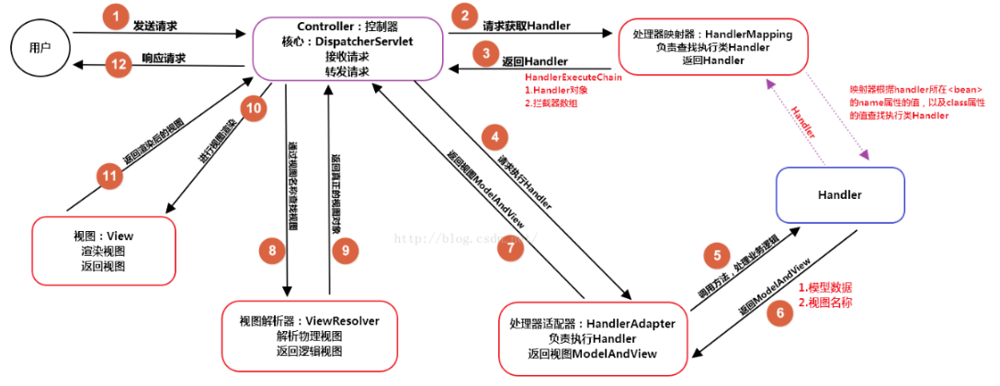
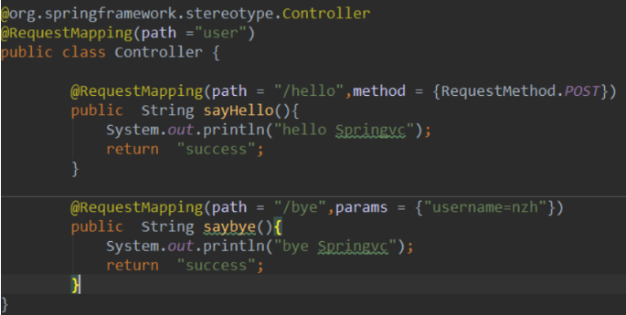
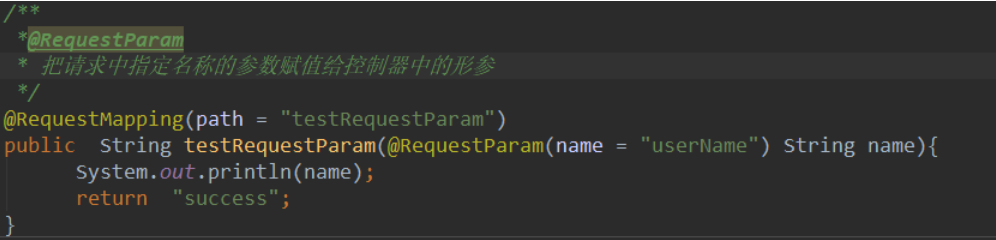
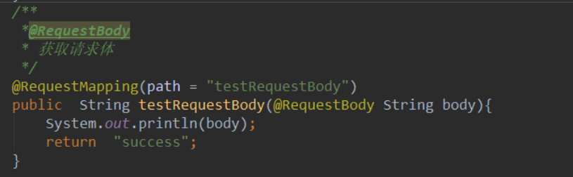
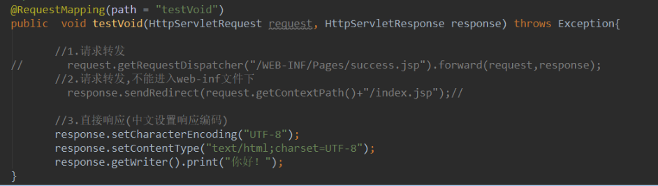
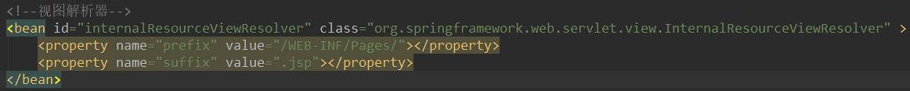
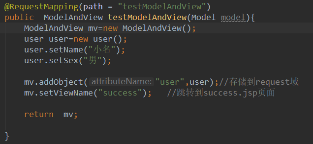

### 一、SpringMvc

####  1、DispatcherServlet

​    SpringMvc的核心就是它，实质上也是一个HttpServlet。负责将用户的请求进行分发，所有的请求都会经过它。

   **主要部件：**前端控制器(dispatcherServlet) , 请求处理器映射（handlerMapping), 处理器适配器（HandlerAdapter), 处理器Handler（需要程序员开发），视图解析器（ViewResolver）。

   **工作过程：**

​    （1）用户发送请求至**前端控制器DispatcherServlet**；
​    （2） DispatcherServlet收到请求后，调用**HandlerMapping处理器映射器**，请求获取Handle；
​    （3）处理器映射器根据请求url找到具体的处理器，生成处理器对象及处理器拦截器(如果有则生成)一并返回给DispatcherServlet；
​    （4）DispatcherServlet 调用 **HandlerAdapter处理器适配器**；
​    （5）HandlerAdapter 经过适配调用**具体处理器Handler**【也叫后端控制器】；
​    （6）Handler执行完成返回ModelAndView；
​    （7）HandlerAdapter将Handler执行结果ModelAndView返回给DispatcherServlet；
​    （8）DispatcherServlet将ModelAndView传给ViewResolver视图解析器进行解析；
​    （9）ViewResolver解析后返回具体View；
​    （10）DispatcherServlet对View进行渲染视图（即将模型数据填充至视图中）
​    （11）DispatcherServlet响应用户。




#### 2、注解

##### **1）@RequestMapping**（类，方法）

| 名称       | 类型                    | 类别 | 作用         |
| ---------- | ----------------------- | ---- | ------------ |
| value=path | String                  | 数组 | 请求路径     |
| method     | RequestMethod(枚举类型) | 数组 | 允许请求类型 |
| params     | String                  | 数组 | 参数限制条件 |




##### **2）@RestController**

作用：相当于@ResponseBody ＋ @Controller

**@RequestParam**
作用：把请求中指定名称的参数赋值给控制器中的形参 



##### **3）@ResponseBody**

 作用：将conreoller方法返回对象转化为json对象响应给客户。【方法上或者类上】
**@RequestBody**
 作用：接收http请求的json数据，将json转换为java对象。【参数上】




##### 4）@PathVariable

作用：获取传值过程中占位符的值（restful编码风格）

  .png)

​                          


##### 6）@SessionAttributes

 作用：用于控制器方法间的参数共享（将request中再存到session中）

 存储（Model接口）接口Model,：

​       ModerMap实现Model接口将key,value存入Request域。ModelMap.put(key,value)

获取：

​     取（ModerMap类)   ModelMap.get(key)

删除(Sessionstatus类):

​    **Sessionstatus**.setComplete();//清空session


#### 3、返回类型

###### 0）void

   - 利用Response直接响应【设置中文编码】

   - 利用Request对象请求转发【请求两次】或者重定向；

     

​        

###### 1）**返回值为String** 

  需要配置视图解析器



（1）转发：在返回值前面加"forward:"，譬如"forward:user.do?name=method4"

（2）重定向：在返回值前面加"redirect:"，譬如"redirect:http://www.baidu.com"


######   2）返回值为ModelAndView

   跟返回值为String原理一样，调用视图解析器。    使用ModelAndView类，可存储到request域，和跳转页面。

​                                       


### 二、Spring

####    1、概述

​      Spring是一个轻量级的IoC和AOP容器框架。是为Java应用程序提供基础性服务的一套框架，目的是用于简化企业应用程序的开发，它使得开发者只需要关心业务需求。常见的配置方式有三种：基于XML的配置、基于注解的配置、基于Java的配置。

主要由以下几个模块组成：

- Spring Core：核心类库，提供IOC服务；
- Spring Context：提供框架式的Bean访问方式，以及企业级功能（JNDI、定时任务等）；
- Spring AOP：AOP服务；
- Spring DAO：对JDBC的抽象，简化了数据访问异常的处理；
- Spring ORM：对现有的ORM框架的支持；
- Spring Web：提供了基本的面向Web的综合特性，例如多方文件上传；
- Spring MVC：提供面向Web应用的Model-View-Controller实现。


#### 2、bean

        1. **生命周期**
           1. 实例化 Instantiation
           2. 属性赋值 Populate
           3. 初始化 Initialization
           4. 销毁 Destruction

​      主要逻辑都在doCreate()方法中，逻辑很清晰，就是顺序调用以下三个方法，这三个方法与三个生命周期阶段一一对应。

​     

        1. **作用域**

​          （1）singleton：**默认，**每个容器中只有一个bean的实例，单例的模式由BeanFactory自身来维护。

​		 （2）prototype：为每一个bean请求提供一个实例。

​         （3）request：为每一个网络请求创建一个实例，在请求完成以后，bean会失效并被垃圾回收器回收。

​         （4）session：与request范围类似，确保每个session中有一个bean的实例，在session过期后，bean会随之失效。

​         （5）global-session：全局作用域，global-session和Portlet应用相关。当你的应用部署在Portlet容器中工作时，它包含很多portlet。如果你想要声明让所有的portlet共用全局的存储变量的话，那么这全局变量需要存储在global-session中。全局作用域与Servlet中的session作用域效果相同。


#### 2、容器

#####   0、概述

​    BeanFactory和ApplicationContext是Spring的两大核心接口，都可以当做Spring的容器。其中ApplicationContext是BeanFactory的子接口。

#####  1、BeanFactory

​		是Spring里面最底层的接口，包含了各种Bean的定义，读取bean配置文档，管理bean的加载、实例化，控制bean的生命周期，维护bean之间的依赖关系。BeanFactroy采用的是**延迟加载**形式来注入Bean的，即只有在使用到某个Bean时(调用getBean())，才对该Bean进行加载实例；这样，我们就不能发现一些存在的Spring的配置问题。如果Bean的某一个属性没有注入，BeanFacotry加载后，直至第一次使用调用getBean方法才会抛出异常。

​    

##### 2、ApplicationContext

​        它是在容器启动时，**一次性创建了所有的Bean**。这样，在容器启动时，我们就可以发现Spring中存在的配置错误，这样有利于检查所依赖属性是否注入。 ApplicationContext启动后预载入所有的单实例Bean，通过预载入单实例bean ,确保当你需要的时候，你就不用等待，因为它们已经创建好了。该接口作为BeanFactory的派生，除了提供BeanFactory所具有的功能外，还提供了更完整的框架功能：

​    ①继承MessageSource，因此支持国际化。

​    ②统一的资源文件访问方式。

​    ③提供在监听器中注册bean的事件。

​    ④同时加载多个配置文件。

​    ⑤载入多个（有继承关系）上下文 ，使得每一个上下文都专注于一个特定的层次，比如应用的web层。
​     


#### 2、IOC

#####   1、概述

  1）IOC就是控制反转，是指创建对象的控制权的转移，以前创建对象的主动权和时机是由自己把控的，而现在这种权力转移到Spring容器中，并由容器根据配置文件去创建实例和管理各个实例之间的依赖关系，对象与对象之间松散耦合，也利于功能的复用。DI依赖注入，和控制反转是同一个概念的不同角度的描述，即 应用程序在运行时依赖IoC容器来动态注入对象需要的外部资源。

（2）最直观的表达就是，IOC让对象的创建不用去new了，可以由spring自动生产，使用java的反射机制，根据配置文件在运行时动态的去创建对象以及管理对象，并调用对象的方法的。

（3）Spring的IOC有三种注入方式 ：构造器注入、setter方法注入、注解注入。


#### 3、AOP

#####     1、概念

​              称为面向切面编程，在程序开发中主要用来解决一些系统层面上的问题，比如日志，事务，权限等待，Struts2的拦截器设计就是基于AOP的思想，是个比较经典的例子。在不改变原有的逻辑的基础上，增加一些额外的功能。代理也是这个功能，读写分离也能用aop来做。Spring AOP中的动态代理主要有两种方式，JDK动态代理【接口代理】和CGLIB动态代理【类继承、配置方式】

#####     2、术语

   -  连接点：（Spring只支持方法类型的接入点）接口中的方法； 增强代码+连接点+业务代码      

   -  切入点：被增强的就是切入点（切入点一定是连接点）；  在程序中主要体现为书写切入点表达式   

      ​    全匹配方式：       访问修饰符(可省略) 返回值 包名.类名.方法名（参数类型列表） 

           * 通配符代表所有              ..当前包及其子包            方法参数：     *表示所有参数类型（必须有参数）              ..表示有无参数均可

   -   通知【增强类型】：拦截后要做的事情。增强代码所在类；

       方法执行时间不同可分为：         

      ​             **前置通知:核心方法前面**         

      ​             **后置通知:核心方法后面**         

      ​             **异常通知(例外通知):捕获异常里面**        

      ​             **环绕通知:invoke方法中的全部代码，有明确的切入点方法调用**       

      ​            **afterReturning(最终)**

      ​    

   -  目标对象：被代理对象          

   -  织入：把增强应用到目标对象来创建代理对象的过程           

   -  代理：一个类被AOP织入增强后，就产生一个结果代理类               

   -  切面：切入点和通知（引介）的结合；通常是一个类，里面可以定义切入点和通知


### 三、1、Mybatis

####   1、概述

 （1）Mybatis是一个半ORM（对象关系映射）框架，它内部封装了JDBC，开发时只需要关注SQL语句本身，不需要花费精力去处理加载驱动、创建连接、创建statement等繁杂的过程。程序员直接编写原生态sql，可以严格控制sql执行性能，灵活度高。

  （2）MyBatis 可以使用 XML 或注解来配置和映射原生信息，将 POJO映射成数据库中的记录，避免了几乎所有的 JDBC 代码和手动设置参数以及获取结果集。

  （3）通过xml 文件或注解的方式将要执行的各种 statement 配置起来，并通过java对象和 statement中sql的动态参数进行映射生成最终执行的sql语句，最后由mybatis框架执行sql并将结果映射为java对象并返回。（从执行sql到返回result的过程）。


#### 2、DAO/Mapper

​       Dao接口即Mapper接口。接口的全限名，就是映射文件中的namespace的值；接口的方法名，就是映射文件中Mapper的Statement的id值；接口方法内的参数，就是传递给sql的参数。**Mapper接口里的方法，是不能重载的**，因为是使用 全限名+方法名 的保存和寻找策略。Mapper **接口的工作原理是JDK动态代理**，Mybatis运行时会使用JDK动态代理为Mapper接口生成代理对象proxy，代理对象会拦截接口方法，转而执行MapperStatement所代表的sql，然后将sql执行结果返回


#### 3、分页

mybatis框架分页实现，有几种方式，最简单的就是利用原生的sql关键字limit来实现，还有一种就是利用interceptor来拼接sql，实现和limit一样的功能，再一个就是利用PageHelper来实现。这里讲解这三种常见的实现方式；无论哪种实现方式，我们返回的结果，不能再使用List了，需要一个自定义对象Pager；

```java
public class Pager<T> {
	private int page;//分页起始页
	private int size;//每页记录数
	private List<T> rows;//返回的记录集合
}
```


##### 1）limit关键字分页


##### 2）拦截器分页


##### 3）PageHelper

插件实现，原理跟跟拦截器一样。内部实现一个拦截器

```xml
<dependency>
	<groupId>com.github.pagehelper</groupId>
	<artifactId>pagehelper</artifactId>
	<version>4.2.1</version>
 </dependency>

<!-- Springboot pagehelper -->
<dependency>
    <groupId>com.github.pagehelper</groupId>
    <artifactId>pagehelper-spring-boot-starter</artifactId>
    <version>1.2.5</version>
</dependency>
```


#### 4、动态sql

  

#### 5、常见面试题

##### 1）#{}和${}的区别是什么？

​    #{}是预编译处理，${}是字符串替换。

​    Mybatis在处理#{}时，会将sql中的#{}替换为?号，**调用PreparedStatement的set方法来赋值；**

​    Mybatis在处理${}时，就是把${}替换成变量的值。**使用#{}可以有效的防止SQL注入，提高系统安全性。**

##### 2）说Mybatis是半自动ORM映射工具？它与全自动的区别在哪里？

​       Hibernate属于全自动ORM映射工具，使用Hibernate查询关联对象或者关联集合对象时，可以根据对象关系模型直接获取，所以它是全自动的。而Mybatis在查询关联对象或关联集合对象时，需要手动编写sql来完成，所以，称之为半自动ORM映射工具。

##### 3）简述Mybatis的插件运行原理，以及如何编写一个插件。

      Mybatis仅可以编写针对ParameterHandler、ResultSetHandler、StatementHandler、Executor这4种接口的插件，Mybatis使用JDK的动态代理，为需要拦截的接口生成代理对象以实现接口方法拦截功能，每当执行这4种接口对象的方法时，就会进入拦截方法，具体就InvocationHandler的invoke()方法，当然，只会拦截那些你指定需要拦截的方法。编写插件：实现Mybatis的Interceptor接口并复写intercept()方法，然后在给插件编写注解，指定要拦截哪一个接口的哪些方法即可，记住，别忘了在配置文件中配置你编写的插件。
##### 4）MyBatis实现一对多有几种方式,怎么操作的

​    有联合查询和嵌套查询。联合查询是几个表联合查询,只查询一次,通过在resultMap里面的collection节点配置一对多的类就可以完成；嵌套查询是先查一个表,根据这个表里面的 结果的外键id,去再另外一个表里面查询数据,也是通过配置collection,但另外一个表的查询通过select节点配置。


​      


​      

​      