### 一、概念

#### 		1. 启动器

#####          			spring-boot-starter- 

​                   场景启动器：帮我们导入了各个模块正常运行所依赖的组件
​                   springboot按照功能场景进行分类为各个场景。版本进行自动控制。

####      2. spring initializr 创建boot项目

​		选择需要模块（启动器），进行联网创建(主程序已经创建好)         

######                   resource文件夹目录结构如下：

​                          static：保存所有静态资源：如 js image css
 						 templates：保存模板页面（默认不支持jsp页面）；可以使用模板引擎（freemarker，**thymeleaf**）
​						 application.properties：配置文件；可以修改一些默认配置。	

#### 3. 配置文件

​                 全局配置文件分为**application.properties** (默认生成) 和**application.yml**  后者更强（更注重数据为中心）

实体类举例

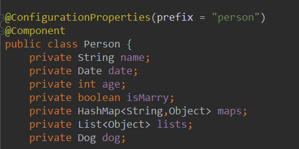


**@configurationProperties** 默认从全局配置文件中加载配置  

[**@Component**]()  加入组件容器


##### 1. 赋值方式

> **.properties**以**.**进行区分赋值          该类文件默认编码为GBK （setting-file coding选择utf-8  勾选转换）

​         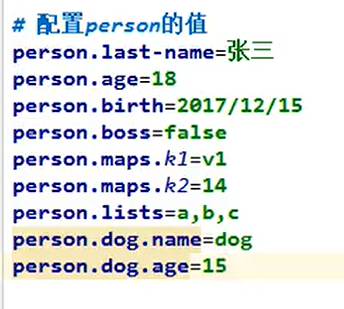


> **.yxl**  赋值前必须有缩进。同层赋值则需要统一缩进 (字符串默认不使用单引号或者双引号。单引号转义特殊字符，双引号不转义)
>
> 

   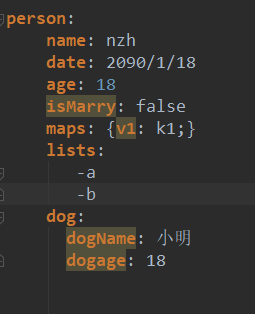


##### 2.注解

  [**@value**]()  

 **[@configurationProperties]()** 注解比较

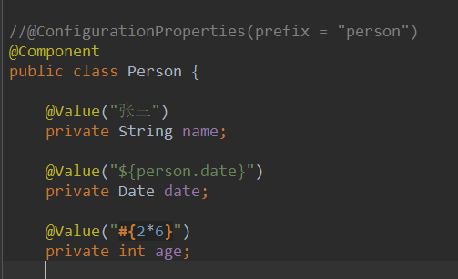                       

|                      | **@configuration**Properties | **@value** |
| :------------------: | :--------------------------: | :--------: |
|         功能         |           批量注入           |   单注入   |
| 松散绑定（松散语法） |             支持             |   不支持   |
|      sp el语法       |            不支持            |    支持    |
|    JSR303数据校验    |             支持             |   不支持   |

总结： 获取某项值采用**@value**， 使用JavaBean进行映射采用**@configurationPropertien**


[**@PropertySource**]() : 导入局部properties配置文件，标记在需要配置的各个类上

赋值头部应与@ConfigurationProperties的**prefix**值相同

```
#person.properties 文件
per.name=李四
per.age=18
per.maps.k1=vasds
```


```
@ConfigurationProperties(prefix = "per")
@Component
@PropertySource(value = {"classpath:person.properties"})
public class Person {

//    @Value("张三")
    private String name;
//    @Value("${person.date}")
    private Date date;
//    @Value("#{2*6}")
    private int age;
//    @Email
//    @Value("${person.marry}")
    private boolean isMarry;
```


[**@imporResource**:]() 导入spring的配置文件(xml ,yml)。标记在主配置类上
          

```
@ImportResource(locations = {"classpath:bean.xml"})
@SpringBootApplication
public class MainApplication {
    public static void main(String[] args) {
        SpringApplication.run(MainApplication.class,args);
    }
}
```


##### **3.配置文件占位符**

​       **格式${}**

######       1.使用随机函数

```
${random.int} ${random.value}  ${random.uuid} ${random.int[10,100]}
person.age=${random.int}
person.maps.k2=${random.int[10,100]}


```

######     2.赋值

  

```
person.name=张三
person.maps.k1=${person.lastname:李四}//存在则获取该配置文件中相应的值  : 后面的为默认值

person.dog.dogName=${person.name}_mydog
person.dog.dogAge=2
```


##### 4.多环境支持 Profile

###### 	1.properties文件方式

​       	 **采取文件区分**  eg：application-test.properties      application-dep.properties 进行区分

​           **激活方式**：在默认配置文件中  spring.profiles.active=dep

###### 	2.yml文件方式 

​      	 **采取文档方式**   --- 进行划分文档区域  

​           **激活方式**         spring  profiles：环境名称   //标记环境名称

​                            	   spring  profiles  active ：环境名称      //在默认环境 (顶部环境) 激活环境名称  

```
server:
  port: 8080
spring:
  profiles:
    active: test
---
server:
  port: 8081
spring:
  profiles: test
---
server:
  port: 8081
spring:
  profiles: prd
```


###### 3.其他激活方式

 **命令行方式**    --spring.profiles.active=环境名称

 **虚拟机参数**  -Dspring.profiles.active=环境名称

 

  


##### 5.配置文件的加载位置

###### 	1.位置  

 		四个位置  **优先级递减** 优先级高 者可以覆盖低者 低者可用互补高者。形成**互补配置**

​     		 1.项目根目录 config文件夹下
​    		  2.项目根目录下类路径（classpath）
​    		  3.项目根目录resource路径下config文件夹下
​			  4.项目根目录resource路径下类路径

###### 	2.server.context.path=/名称     

​                  配置项目启动路径


###### 	3.指定配置文件位置   **（运维期间常用）**

​       spring.config.location=路径   运行时指定配置新文件路径（**互补配置**）
​       

##### 6.外部配置的加载顺序（优先级递减）

######    1.命令行方式  

######    2.来自Java：comp/env 的JNDI属性

######    3.Java 系统的属性

######    4.操作系统的环境变量

######    5. jar外部的带profile的properties或yml文件

######    6. jar内部的带profile的properties或yml文件

######    7. jar外部的不带profile的properties或yml文件

######    8. jar内部的不带profile的properties或yml文件

######    9.@Configuration注解类的上@PropertySource

   


#### 4. 自动配置

​         1）、springboo启动会加载大量的自动配置类

​		 2）、配置时看是否有没有写好的默认自动配置类

​		 3）、查看这个自动配置类有哪些组件（存在我们需要的，就不需要再来配置了）

 		4）、给容器中自动配置类添加组件时，会从properties类中获取某些属性，我们就可以在配置文件中来指定这些属性了。


​      xxxAutoConfiguration :自动配置类

​      xxxProperties:封装配置文件中相关的属性


####       5. 日志

#####              1. 原理

​             **slf4j** 为统一抽象层接口 ，抽象层再调用实现层 **logback** 或者其他实现层；可以为实现层提供自己的配置文件
​                     


```
import org.slf4j.Logger;
import org.slf4j.LoggerFactory;

public class HelloWorld {
  public static void main(String[] args) {
    Logger logger = LoggerFactory.getLogger(HelloWorld.class);
    logger.info("Hello World");
  }
}
```

##### 			 2. 统一日志底层实现

​               **问题描述**：一个系统中可能使用了很多框架，每个框架附带的日志实现层可能有所不同（遗留问题）

​               **解决方案**：替换原框架的实现层依赖为图示的替换框架依赖（**使用中间包按图替换原依赖**）


##### 3. **导入注意**

   在使用其他框架的依赖的时候一定去除其中的日志依赖

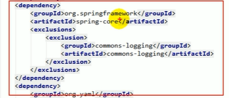


##### 4. 使用springBoot日志

######             1.记录器

​	**日志级别** : 由高到低  trace> debug>info>warn>error

​	**springboot默认**输出级别为info，info及以下(简称root级别) 

​     配置文件**修改日志级别** : **logging.level**.cqlxnb=trace（可以指定包，包下类）

    //记录器
    Logger logger = LoggerFactory.getLogger(getClass());
    
    logger.trace("tarce级别");
    logger.debug("debug级别");
    //root级别
    logger.info("info级别");
    logger.warn("warn级别");
    logger.error("error级别");

###### 2.修改默认配置

 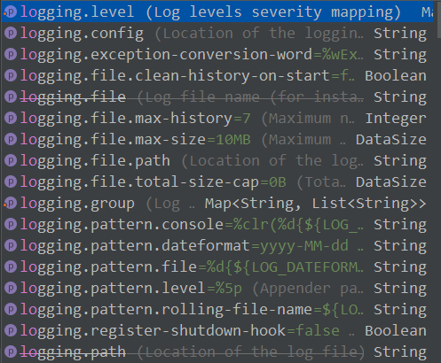

​          eg：  **logging.file.name**=指定生成日志文件的文件名

​                    **logging.pattern.console** 修改控制台日志输出格式

   

###### 3.指定配置文件(实现层)

​    类路径下放上框架的配置文件，这样Springboot就不使用默认配置了。

   日志实现层对应配置文件

| **Logging system** | customizatrion                                               |
| ------------------ | ------------------------------------------------------------ |
| **Logback**        | logback.xml 、logback-spring.xml  或者  logback.groovy  、logback-spring.groovy |
| **Log4j2**         | logf4j.xml   或者  log4j2-spring.xml                         |
| **JDK**            | logging.properties                                           |


不带**-spring** 即由日志框架加载

带**-spring**由springboot加载：可以使用一个高级功能

 指定某项配置的应用环境：

  

```xml
<springProfile name="dev">
   某项配置    
</springProfile >
    
<springProfile name="!dev">
   某项配置    
</springProfile >
```


------


### 二、开发


####       1. 静态资源

#####             	1.webjars方式

​                      **WebJars是将web前端资源（js，css等）打成jar包**，然后借助Maven工具，以jar包形式对web前端资               					  源进行统一依赖管理保证这些Web资源版本唯一性。WebJars的jar包部署在Maven中央仓库上。

​                      所有/webjars/**,都去classpath:META-INF/resources/webjars/寻找资源

​                       eg：localhost:8080/webjars/juery/2.2.0/jquery.js

```xml
<dependency>
    <groupId>org.webjars</groupId>
    <artifactId>jquery</artifactId>
    <version>2.2.0</version>
</dependency>
```


##### 				2. 项目资源

​         **静态资源的文件夹**

​         修改项目资源文件存储位置配置：

​         **spring.resources.static-locations=classpath:/www/,classpath:/com/**

**默认存储位置**

```
classpath: /META-INF/resources/,
classpath:/resource/
classpath:/static/
classpath:/public/
"/":当前项目的跟路径
```

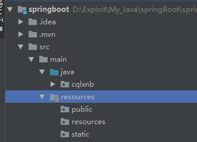 

​       eg:  在public文件夹下存在json文件夹

​       访问地址： http://localhost:8080/json/hf.json

##### 		3.欢迎页

​          **静态资源文件夹下的所有index.html**; **被 " / "映射**

##### 	4.favicon.ico

​          **所有的**/favicon.ico 都是在静态资源文件下寻找**


#### 2. thymeleaf（引擎模板）

​          https://www.thymeleaf.org/doc/tutorials/3.0/usingthymeleaf.html#introducing-thymeleaf 官方文档


```

```

######     1.  基本语法

```java
//添加识别提示thymeleaf语法
<html   xmlns:th="http://www.thymeleaf.org"> 
//添加依赖
 <dependency>
            <groupId>org.springframework.boot</groupId>
            <artifactId>spring-boot-starter-thymeleaf</artifactId>
            <version>2.2.4.RELEASE</version>
 </dependency>

```

​          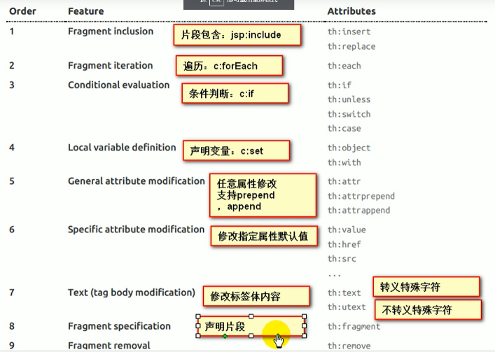

#### 3. springMvc 自动配置

​          springboot自动配置了springmvc

​          官方文档：https://docs.spring.io/spring-boot/docs/2.1.0.RELEASE/reference/htmlsingle/#boot-features-spring-mvc

​          springMVc默认配置 视图解析器 、 转换器、格式化器 等

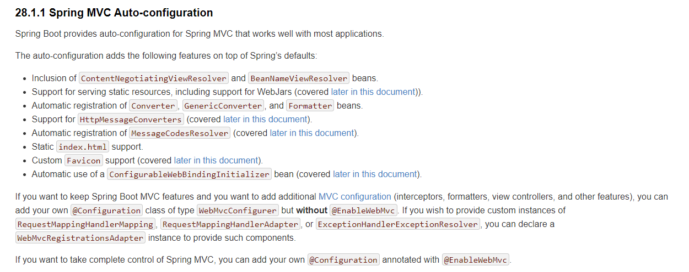

**扩展springMvc**：编写配置类（@configuration）实现 **WebMvcConfigurer** 接口   

```
@Configuration
public class SpringMvc implements WebMvcConfigurer {
    
    @Override
    public void addViewControllers(ViewControllerRegistry registry) {
        registry.addViewController("/index").setViewName("success");
    }
}
```

**全面接管springMVc** ：编写配置类（@configuration、**@EnableWebMvc**），即不再使用默认配置


#### 4. 国际化

#####       1.编写配置文件

​             **.properties文件**    命名方式       xx_语言代码 _国家.properties

​           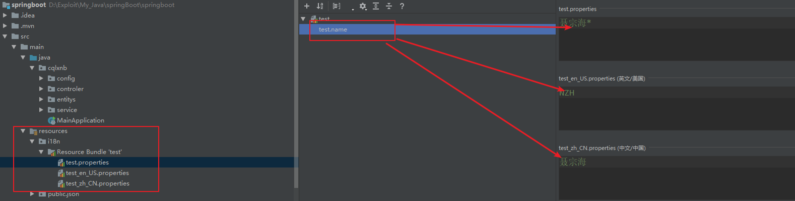

#####       2.修改配置文件加载基础名

​          在全局配置中：    **spring.messages.basename **= i18n/test    **//文件名称+前缀xx**

#####       3.页面读取

   **#{变量名称}**

   读取默认按照浏览器的语言设置

```html
   <div th:text="#{test.name}"></div>
```

#####       4.扩展

​             **自定义切换** ;**编写Locale 类 继承LocaleResolver接口，加入容器**

​            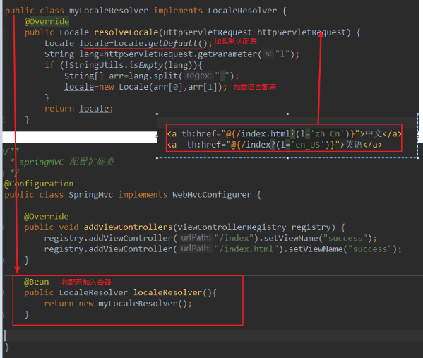


#### 5.错误处理

#####        **1.自定义错误页面**

######                 1、在有模板引擎时

​                      模板引擎下新建error文件夹，其中存放**错误代码+html**文件，springboot会优先匹配具体错误代码类型如404，无法匹配时再模糊匹配4xx.html或者5xx.html页面。

​                

######              2、模板中午error文件夹时

​                  在静态资源文件夹下匹配错误页面

######             3、上述均无发匹配时

​                 启用springboot默认的错误页面携带默认的错误信息

#####        2.自适应错误请求

​              **客户端请求**（移动端）返回 **json** 数据

​              **浏览器请求**   返回错误页面

  			自定义错误属性类继承**DefaultErrorAttributes**

```java
@Component
public class MyErrorAttributes extends DefaultErrorAttributes {


    Logger logger= LoggerFactory.getLogger(MyErrorAttributes.class);

    @Override
    public Map<String, Object> getErrorAttributes(WebRequest webRequest, boolean includeStackTrace) {
        Map<String,Object>map=super.getErrorAttributes(webRequest,includeStackTrace);
        map.put("company","公司代码");
        Map<String,Object> oldMap= (Map<String, Object>) webRequest.getAttribute("test",1);
        logger.info("测试对象"+oldMap);
        map.put("old",oldMap);
        return map;
    }
}
```

​        创建错误处理器

```java
@ControllerAdvice
public class MyExceptionHandler {


    @ExceptionHandler(UserExecption.class)//标注处理哪个异常
    public String handleException(Exception e, HttpServletRequest request, WebRequest webRequest){
        Map<String,Object> map=new HashMap<>();
        request.setAttribute("javax.servlet.error.status_code",404);//必须设置状态码
        map.put("code","user.NotIsExist");
        map.put("message",e.getMessage());
        webRequest.setAttribute("test",map,1);
        return "forward:/error";//转发到错误页面
    }

}
```


#### 6.配置嵌入式servlet容器

​        springboot默认使用tomcat作为嵌入式的Servlet容器

#####        1.定制和修改Servlet容器配置

######           1.配置文件修改

```properties
server.port=8089
server.tomcat.uri-encoding=UTF-8
server.servlet.context-path=/test
```

######           2.定制器修改

```java
@Bean
public WebServerFactoryCustomizer<ConfigurableWebServerFactory> webServerFactoryCustomizer(){
    return new WebServerFactoryCustomizer<ConfigurableWebServerFactory>() {
        @Override
        public void customize(ConfigurableWebServerFactory factory) {
            factory.setPort(8081);
        }
    };
}
```

##### 2.更换容器

​              springboot默认支持一下三种servlet容器

​                **tomcat**（默认）

​                **jetty**  (长连接)

​                **undertow** (不支持jsp）

​               更换步骤

​                    **排除原依赖 ；引入新依赖**

```
<dependency>
    <groupId>org.springframework.boot</groupId>
    <artifactId>spring-boot-starter-web</artifactId>
    <!--排除tomcat依赖-->
    <exclusions>
        <exclusion>
            <groupId>org.springframework.boot</groupId>
            <artifactId>spring-boot-starter-tomcat</artifactId>
        </exclusion>
    </exclusions>
</dependency>
<!--添加jetty依赖-->
<dependency>
    <groupId>org.springframework.boot</groupId>
    <artifactId>spring-boot-starter-jetty</artifactId>
</dependency>
```

##### 3.servlet容器自动配置原理

​        ps：嵌入式servlet容器

​        1.springboot根据导入的依赖情况,给容器添加相应的容器工厂

​              eg: **TomcatEmbeddedServletContainerFactory**

​        2.容器工厂要创建对象就会触发后置处理器

​                   **EmbeddedServletContainerCustomizerBeanPostProcessor**
​                   前提是容器工厂是嵌入式的；

​         3.后置处理器开始从容器中获取所有的定制器，并调用定制器的定制方法（配置属性）

​                   嵌入式定制器： **EmbeddedServletContainerCustomize**

#####   4.嵌入servlet容器启动原理

​        ps：嵌入式servlet容器

​      1、springboot应用启动运行**run**方法

​      2、**refreshContext(context)** :刷新**IOC容器**（创建ioc容器对象，初始化容器，创建组件），

​           如果是web应用创建**AnnotationConfigEmbeddedWebApplicationContext**

​           否则默认创建**AnnotationConfigApplciationContext**

​      3、**refresh(context)** :刷新已经创建好的IOC容器

​      4、**onRefresh()**: web的IOC容器重写了OnRefresh方法

​      5、web **IOC容器**会**创建**嵌入式的**Servlet容器**；**createEmbeddedServletContainer();**

​      6、**获取**嵌入式的Servlet容器

​            获取到servlet容器后，后置处理器就开始获取所有的定制器为servlet容器配置相关的属性；

​      7、使用**容器工厂获取**嵌入式的servlet容器

​      8、嵌入式的servlet容器创建对象并启用servlet容器

​      **总结：   先启动嵌入式的servlet容器，在将IOC容器中剩下没有创建的对象获取出来。**

​                     **ioc容器启动后创建嵌入式的servlet容器**


##### 5.外部servlet容器启动原理

​         ps：外部servlet容器启动springboot应用原理【war包方式】

​        **war包**：启动servlet容器，服务器启动springboot应用【springBootServletInitializer】,再启动**IOC**容器

​        **jar包**：  执行主函数【main】，启动**IOC**容器，再创建servlet容器；

###### *1.原理参照**servlet 3.0规则**

 		1)、 服务器启动会创建当前web应用中的每一个jar包里的 **ServletContainerInitializer**实例：

​		 2)、**ServletContainerInitializer**的实现放在jar包的**META-INF/services**文件夹下，有一个交  		javax.servlet.ServletContainerInitilizer的文件夹，其内容就是**ServletContainerInitializer的实现类**的全类名；

 		3)、还可以使用注解**@HandlesTypes**，在应用启动时加载我们感情趣的类；


######   2.外部servlet容器启动原理

 1)、启动服务器【tomcat】

 2)、**SpringServletContainerInitializer** 将 **@HandlesTypes**标注的所有类都传入到**onStartUp**方法的 Set<class<?>>集合中，为这些**WebApplicationInitializer**类型的类创建实例；

 3)、每一个**WebApplicationInitializer**都调用自己的onStart方法；

​        **相当于SpringBootServletInitalizer的类会被创建实例，并执行onStartUp方法**

4)、执行onStartUp方法时创建容器：CreateRootApplicationContext;

```java
protected WebApplicationContext createRootApplicationContext(ServletContext servletContext) {
    //1.创建springBootApplication
    SpringApplicationBuilder builder = this.createSpringApplicationBuilder();
    builder.main(this.getClass());
    ApplicationContext parent = this.getExistingRootWebApplicationContext(servletContext);
    if (parent != null) {
        this.logger.info("Root context already created (using as parent).");
        servletContext.setAttribute(WebApplicationContext.ROOT_WEB_APPLICATION_CONTEXT_ATTRIBUTE, (Object)null);
        builder.initializers(new ApplicationContextInitializer[]{new ParentContextApplicationContextInitializer(parent)});
    }

    builder.initializers(new ApplicationContextInitializer[]{new ServletContextApplicationContextInitializer(servletContext)});
    builder.contextClass(AnnotationConfigServletWebServerApplicationContext.class);
    //调用config方法，子类重写，将springBoot的主程序类传入
    builder = this.configure(builder);
    builder.listeners(new ApplicationListener[]{new SpringBootServletInitializer.WebEnvironmentPropertySourceInitializer(servletContext)});
    SpringApplication application = builder.build();
    if (application.getAllSources().isEmpty() && MergedAnnotations.from(this.getClass(), SearchStrategy.TYPE_HIERARCHY).isPresent(Configuration.class)) {
        application.addPrimarySources(Collections.singleton(this.getClass()));
    }

    Assert.state(!application.getAllSources().isEmpty(), "No SpringApplication sources have been defined. Either override the configure method or add an @Configuration annotation");
    if (this.registerErrorPageFilter) {
        application.addPrimarySources(Collections.singleton(ErrorPageFilterConfiguration.class));
    }
    //最后启动SpringBoot应用
    return this.run(application);
}


    protected WebApplicationContext run(SpringApplication application) {
        return (WebApplicationContext)application.run(new String[0]);
    }
```

5）、启动springboot应用，创建**IOC容器**

```java
public ConfigurableApplicationContext run(String... args) {
   

    Collection exceptionReporters;
    try {
        ApplicationArguments applicationArguments = new DefaultApplicationArguments(args);
        ConfigurableEnvironment environment = this.prepareEnvironment(listeners, applicationArguments);
        this.configureIgnoreBeanInfo(environment);
        Banner printedBanner = this.printBanner(environment);
        context = this.createApplicationContext();
        exceptionReporters = this.getSpringFactoriesInstances(SpringBootExceptionReporter.class, new Class[]{ConfigurableApplicationContext.class}, context);
        this.prepareContext(context, environment, listeners, applicationArguments, printedBanner);
        //刷新IOC容器
        this.refreshContext(context);
        this.afterRefresh(context, applicationArguments);
        stopWatch.stop();
        if (this.logStartupInfo) {
            (new StartupInfoLogger(this.mainApplicationClass)).logStarted(this.getApplicationLog(), stopWatch);
        }

        listeners.started(context);
        this.callRunners(context, applicationArguments);
    } catch (Throwable var10) {
        this.handleRunFailure(context, var10, exceptionReporters, listeners);
        throw new IllegalStateException(var10);
    }

    try {
        listeners.running(context);
        return context;
    } catch (Throwable var9) {
        this.handleRunFailure(context, var9, exceptionReporters, (SpringApplicationRunListeners)null);
        throw new IllegalStateException(var9);
    }
}
```

在新创建你的SpringBoot war项目中会自动多创建一个**ServletInitializer**类

eg：**ServletInitializer类**继承**SpringBootServletInitializer**重写**configure**方法：告诉springBoot主程序在哪

```java
public class ServletInitializer extends SpringBootServletInitializer {

    @Override
    protected SpringApplicationBuilder configure(SpringApplicationBuilder application) {
        return application.sources(WarDemoApplication.class);
    }

}
```

#### 7.SpringBoot启动原理

​    ***0.注意几个重要的事件回调机制**

​        配置在META-INF/spring.factories中

​                **ApplicationContextInitializer**

​                **SpringApplicationRunListener**

​        只需要放在IOC容器中

​                 **ApplicationRunner**

​                 **CommandLineRunner**

#####    1.创建SpringApplication对象

```java
public static ConfigurableApplicationContext run(Class<?>[] primarySources, String[] args) {
    return (new SpringApplication(primarySources)).run(args);
}
```

```java
public SpringApplication(ResourceLoader resourceLoader, Class... primarySources) {
    this.sources = new LinkedHashSet();
    this.bannerMode = Mode.CONSOLE;
    this.logStartupInfo = true;
    this.addCommandLineProperties = true;
    this.addConversionService = true;
    this.headless = true;
    this.registerShutdownHook = true;
    this.additionalProfiles = new HashSet();
    this.isCustomEnvironment = false;
    this.lazyInitialization = false;
    this.resourceLoader = resourceLoader;
    Assert.notNull(primarySources, "PrimarySources must not be null");
    this.primarySources = new LinkedHashSet(Arrays.asList(primarySources));
    this.webApplicationType = WebApplicationType.deduceFromClasspath();
    //从类路径下META-INF/spring.factory配置中寻找所有ApplicationContextInitializer 并保存   this.setInitializers(this.getSpringFactoriesInstances(ApplicationContextInitializer.class));
    //从类路径下META-INF/spring.factory配置中寻找所有ApplicationListener 并保存
    this.setListeners(this.getSpringFactoriesInstances(ApplicationListener.class));
    //从多个配置类中找到含有main方法的主配置类
    this.mainApplicationClass = this.deduceMainApplicationClass();
}
```


##### 2.运行run方法

```java
public ConfigurableApplicationContext run(String... args) {
    StopWatch stopWatch = new StopWatch();
    stopWatch.start();
    ConfigurableApplicationContext context = null; //ioc容器
    Collection<SpringBootExceptionReporter> exceptionReporters = new ArrayList();
    this.configureHeadlessProperty();
    //从类路径下spring.factories获取SpringApplicationRunListener
    SpringApplicationRunListeners listeners = this.getRunListeners(args);
    //回调所有的starting方法
    listeners.starting();
    Collection exceptionReporters;
    try {
        //封装命令行参数
        ApplicationArguments applicationArguments = new DefaultApplicationArguments(args);
        //准备环境--
        ConfigurableEnvironment environment = this.prepareEnvironment(listeners, applicationArguments);
        this.configureIgnoreBeanInfo(environment);
        Banner printedBanner = this.printBanner(environment);//打印图标
        //根据webApplicationType创建环境类型；
        context = this.createApplicationContext();
        exceptionReporters = this.getSpringFactoriesInstances(SpringBootExceptionReporter.class, new Class[]{ConfigurableApplicationContext.class}, context);
        //准备上下文环境，为ioc保存环境，postProcessApplicationContext注册小组件
        //applyInitializers方法：回调创建所有ApplicationContextInitializer的initialize方法
        //contextPrepared：回调创建SpringApplicationRunListeners的所有contextPrepared方法
        //prepareContext主方法完成后回调SpringApplicationRunListeners的contextLoaded方法
        this.prepareContext(context, environment, listeners, applicationArguments, printedBanner);
        //刷新ioc容器；容器初始化
        //扫描，创建，加载所有组件（配置类，组件，自动配置类）
        this.refreshContext(context);
        this.afterRefresh(context, applicationArguments);
        stopWatch.stop();
        if (this.logStartupInfo) {
            (new StartupInfoLogger(this.mainApplicationClass)).logStarted(this.getApplicationLog(), stopWatch);
        }

        listeners.started(context);
        //从ioc容器中获取**ApplicationRunner**、CommandLineRunner。回调所有run方法
        this.callRunners(context, applicationArguments);
    } catch (Throwable var10) {
        this.handleRunFailure(context, var10, exceptionReporters, listeners);
        throw new IllegalStateException(var10);
    }

    try {
        listeners.running(context);
        return context;
    } catch (Throwable var9) {
        this.handleRunFailure(context, var9, exceptionReporters, (SpringApplicationRunListeners)null);
        throw new IllegalStateException(var9);
    }
}
```


##### 3.测试

######     1、实现四个接口

​              <u>配置在类路径下DETA-INF/spring.factories中</u>

​      	     **ApplicationContextInitializer**

​                **SpringApplicationRunListener**

​              <u>标记component注解加入ioc容器</u>

​                 **ApplicationRunner**

​                 **CommandLineRunner**

###### 2、配置

**spring.factories**

```
#Initializer 第一排为借口的全类路径 后面为实现类全类路径
org.springframework.context.ApplicationContextInitializer=\
com.example.datajpa.listener.HelloSpringApplicationContextInitializer
#SpringApplicationRunListener 同上
org.springframework.boot.SpringApplicationRunListener=\
com.example.datajpa.listener.HelloSpringApplicationRunListener  
```

```java
@Component //加入ioc容器中
public class HelloApplicationRunner implements org.springframework.boot.ApplicationRunner {
    @Override
    public void run(ApplicationArguments args) throws Exception {
        System.out.println("HelloApplicationRunner-----------run运行");
    }
}
```

###### 3、运行结果


#### 8.配置三大组件

​    三大组件  

##### 	1.**Servlet**

**ServletRegistrationBean**

```java
/**
 *注册servlet
 * @return
 */
@Bean
public ServletRegistrationBean myServlet(){
    ServletRegistrationBean registrationBean=new ServletRegistrationBean(new MyServlet(),"/servlet");
    return registrationBean;
}
```

##### 	2.filter  ：

**FilterRegistrationBean**

```java
/**
 * 设置拦截器
 * @return
 */
@Bean
public FilterRegistrationBean myFilter(){
    FilterRegistrationBean registrationBean=new FilterRegistrationBean();
    registrationBean.setFilter(new MyFilter());
    registrationBean.setUrlPatterns(Arrays.asList("/servlet"));
    return registrationBean;
}
```

##### 	3.**Listener**

**ServletListenerRegistrationBean**

```java
/**
 * 监听器
 * @return
 */
@Bean
public ServletListenerRegistrationBean myListener(){
    ServletListenerRegistrationBean registrationBean=new ServletListenerRegistrationBean(new MyListener());
    return registrationBean;
}
```

  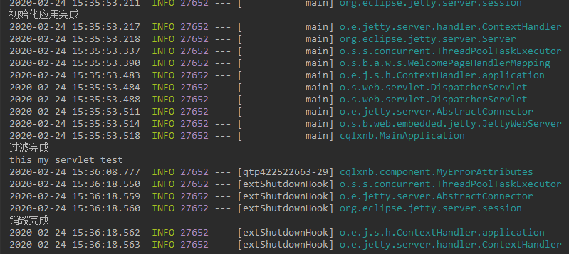


#### 9.starter原理及自定义

#####      1、原理

​        **xxxstarter**性质上就是一个空的jar文件，其中最重要的就是**pom**文件中存放有**xxxstarter-autoconfiger**模型的**依赖**。而**xxxstarter-autoconfiger**模型中就是我们需要进行编写的自动配置类。所有在使用的时候只需要引入**xxxstarter**的坐标依赖（在两者都install后）

​       

 自动配置类使用各种配置注解

```java
@Configuration()//标注这是一个配置类
@ConditionalOnClass({MessageDispatcherServlet.class})//配置判断条件
@ConditionalOnMissingBean({WsConfigurationSupport.class})//配置判断条件
@EnableConfigurationProperties({WebServicesProperties.class})// 配置属性类加入容器 生效
@AutoConfigureAfter({ServletWebServerFactoryAutoConfiguration.class})//配置顺序
public class WebServicesAutoConfiguration {
    @bean //给容器添加组件
    //...
}
```

属性类使用注解**ConfigurationProperties**

```java
@ConfigurationProperties(
    prefix = "spring.webservices"
)//绑定配置属性类 配置前缀 
public class WebServicesProperties {//...}
```

##### 2、自定义starter

自定义starter命名规范：**xxx-spring-boot-starter**

​                                           **xxx-spring-boot-starter-autoconfiger**

官方命名规范：**spring-boot-starter-xxx**

######     1.步骤

​         1）、创建一个**空**的idea项目

​         2）、在项目中新建**modules**：xxx-starter ==》**maven新建** 不选取任何场景

​         3）、在项目中新建**modules**：xxx-starter-autoconfiger ==》可以使用 **使用springboot initialize新建**  不选取任何场景

​         4）、将xxx-starter-autoconfiger module中的**依赖坐标导入xxx-starte依赖中**

​         5）、在xxx-starter-autoconfiger中编写配置类

 		6）、将自动配置类像**ApplicationContextInitializer** 配置到类路径下META-INF/spring.factories下

​         7）、将两个模块都通过maven命令install安装

######   2.实践

​     **1.配置属性类**

```java
@ConfigurationProperties(prefix = "cqlxnb.fix")
public class HelloCqlxnbProperties {
    private String preffix;
    private String suffix;
    //getter setter
}
```

​	 **2.服务类**

```java
public class HelloCqlxnbService {
    HelloCqlxnbProperties properties;
   //getter setter
    public String SayHelloCqlxnb(String name){
        return  properties.getPreffix()+name+properties.getSuffix();
    }
}
```

​	**3.自动配置类**

```java
@Configuration
@EnableConfigurationProperties(HelloCqlxnbProperties.class)
@ConditionalOnWebApplication //必须是web应用才能生效
public class HelloCqlxnbServiceAutoConfiger {

    @Autowired
    HelloCqlxnbProperties properties;

    @Bean //加入容器
    public HelloCqlxnbService  getService(){
        HelloCqlxnbService service=new HelloCqlxnbService();
        service.setProperties(properties);
        return service;
    }
}
```

​	**4.配置到类路径下META-INF/spring.factories**

```
# Auto Configure
org.springframework.boot.autoconfigure.EnableAutoConfiguration=\
com.cqlxnb.starter.HelloCqlxnbServiceAutoConfiger  
```

**5.安装后引入依赖便可在项目中使用**

```
<!--引入自定义启动器-->
<dependency>
    <groupId>com.cqlxnb.starter</groupId>
    <artifactId>defined-spring-boot-starter</artifactId>
    <version>1.0-SNAPSHOT</version>
</dependency>
```


​		**配置属性**

```yml
cqlxnb:
  fix:
    preffix: 你好
    suffix: 再见
```

​		**注入使用**

```java
@Autowired
HelloCqlxnbService helloCqlxnbService;

@RequestMapping("/testDefinedStarter")
public String testDefinedStarter(){
    return   helloCqlxnbService.SayHelloCqlxnb("nzh/n");
}
```

​		**结果**

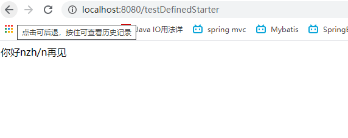

------


###  三、Docker

####      	1.概念

​       Docker 是一个开源的应用**容器引擎**，让开发者可以打包他们的应用以及依赖包到一个可移植的容器中,然后发布到任何流行的[Linux](https://baike.baidu.com/item/Linux)机器或Windows 机器上,也可以实现虚拟化,容器是完全使用**沙箱机制**,相互之间不会有任何接口；

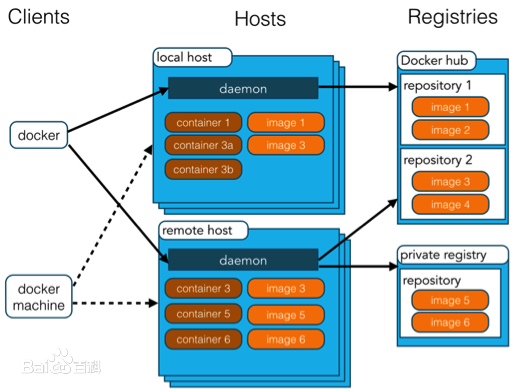


Docker 使用客户端-服务器 (C/S) 架构模式，使用远程API来管理和创建Docker容器。Docker 容器通过 Docker 镜像来创建。容器与镜像的关系类似于面向对象编程中的对象与类。

| Docker | 面向对象 |
| ------ | -------- |
| 容器   | 对象     |
| 镜像   | 类       |

##### 1.核心概念

​     **docker主机** (Host): 安装了Docker程序的机器（docker直接安装在操作系统之上）；

​     **docker客户端** (Client)：连接Docker主机进行操作；

​     **docker仓库** (Registry)：用来保存各种打包好的软件镜像；

​     **docker镜像** (Image) :软件打包好的镜像；存放在docker仓库中；

​     **docker容器** (Container): 镜像启动后的实例称为容器；容器是独立运行的一个或者一组应用；

##### 2.使用步骤

​    1、安装Docker；

​    2、仓库中寻找镜像；

​    3、通过Docker运行镜像，生成容器；

​    4、对容器的启动停止就是对软件的启动停止；

##### 3.安装操作

1. **uname -r**  ：查看系统版本

2. **yum update**：升级软件包以及内核

​    3. **安装docker**： yum install docker

​    4. **启动docker**：systemctl start docker

​    5. **设置开机启动**：systemctl enable docker

#### 2.镜像常用操

​	 1.检索：**docker search +关键字**   eg：docker search tomcat

​     2.拉取：**docker pull  +镜像名称（+tag标签）** eg : docker pull tomcat 5.5

​     3.查询本地镜像列表：**docker images**

​     4.根据镜像名启动容器：**docker run --name 名称 -d  tomcat:lastest**            【-d 后台启动】

​     5.查看运行中的容器：**docker ps**

​     6.查看所有容器：**docker ps -a**

​     7.根据id启动容器：**docker start +id**

​     8.根据id删除容器： **docker rm +id**

​     9.启动容器并做端口映射：**docker run -d -p  +主机端口：容器内部端口+容器名称** 

​     10.根据id停止容器：**docker stop + id**

**拉取速度过慢：修改为国内镜像源**

"registry-mirrors": ["[https://pee6w651.mirror.aliyuncs.com](https://link.jianshu.com/?t=https%3A%2F%2Fpee6w651.mirror.aliyuncs.com%2F)"] 

**ps**: 启动mysql镜像需要配置端口映射以及制定密码

**docker run -p +【主机端口：容器端口】 -e MYSQL_ROOT_PASSWORD=密码-d mysql**

#### **3.自定义镜像**

  vi Dockerfile 新建镜像

```
from docker.io/tomcat:latest    #你的 tomcat的镜像
MAINTAINER XXX@qq.com    #作者
COPY NginxDemo.war   /usr/local/tomcat/webapps  #放置到tomcat的webapps目录下
```

 docker build -t nginx-demo:v1 .   生成镜像

### 四、数据访问

####       	1.JDBC及自动配置原理

​             自动创建时选取JDBC组件以及数据库驱动

​              Springboot默认使用org.apache.tomcat.jdbc.pool.DataSource作为数据源；

​              数据源的相关配置都在**DataSourceProperties**里面；

​              jdbc自动配置了**JdbcTemplateConfiguration**；可以自动注入后进行操作数据库；

```yml
spring:
  datasource:
    username: root
    password: 123456
    url: jdbc:mysql://193.112.195.243:3306/jobweb
    driver-class-name: com.mysql.cj.jdbc.Driver
```


```java
@Controller
public class test {
    @Autowired
    JdbcTemplate template;

    @ResponseBody
    @GetMapping("/testTemplate")
    public Object testTemplate(){
       List<Map<String,Object>> list= template.queryForList("select * from company");
        return list.get(0);
    }
}
```

​         自动配置原理：  

  		    相关配置在**org.springframework.boot.autoconfigure.jdbc**路径下

​              参照 **DataSourceConfiguration**类SpringBoot默认支持数据源：**BasicDataSource** 、  **hikari**、 **org.apache.tomcat.jdbc.pool.DataSource**

```java
DataSourceConfiguration() {
}
//自定义数据源spring.datasource.type
//利用反射技术创建响应type的数据源，并绑定相关属性
@Configuration(
    proxyBeanMethods = false
)
@ConditionalOnMissingBean({DataSource.class})
@ConditionalOnProperty(
    name = {"spring.datasource.type"}
)
static class Generic {
    @Bean
    DataSource dataSource(DataSourceProperties properties) {
        return properties.initializeDataSourceBuilder().build();
    }
}


static class Dbcp2 {

    @ConfigurationProperties(
        prefix = "spring.datasource.dbcp2"
    )
    BasicDataSource dataSource(DataSourceProperties properties) {
        return (BasicDataSource)DataSourceConfiguration.createDataSource(properties, BasicDataSource.class);
    }
}


static class Hikari {
    @Bean
    @ConfigurationProperties(
        prefix = "spring.datasource.hikari"
    )
    HikariDataSource dataSource(DataSourceProperties properties) {
        HikariDataSource dataSource = (HikariDataSource)DataSourceConfiguration.createDataSource(properties, HikariDataSource.class);
        if (StringUtils.hasText(properties.getName())) {
            dataSource.setPoolName(properties.getName());
        }
        return dataSource;
    }
}

@Configuration(
    proxyBeanMethods = false
)
@ConditionalOnClass({org.apache.tomcat.jdbc.pool.DataSource.class})
@ConditionalOnMissingBean({DataSource.class})
@ConditionalOnProperty(
    name = {"spring.datasource.type"},
    havingValue = "org.apache.tomcat.jdbc.pool.DataSource",
    matchIfMissing = true
)
static class Tomcat {
    Tomcat() {
    }

    @Bean
    @ConfigurationProperties(
        prefix = "spring.datasource.tomcat"
    )
    org.apache.tomcat.jdbc.pool.DataSource dataSource(DataSourceProperties properties) {
        org.apache.tomcat.jdbc.pool.DataSource dataSource = (org.apache.tomcat.jdbc.pool.DataSource)DataSourceConfiguration.createDataSource(properties, org.apache.tomcat.jdbc.pool.DataSource.class);
        DatabaseDriver databaseDriver = DatabaseDriver.fromJdbcUrl(properties.determineUrl());
        String validationQuery = databaseDriver.getValidationQuery();
        if (validationQuery != null) {
            dataSource.setTestOnBorrow(true);
            dataSource.setValidationQuery(validationQuery);
        }

        return dataSource;
    }
}
```

 **加载自定义数据源**

```java
public DataSourceBuilder<?> initializeDataSourceBuilder() {
    return DataSourceBuilder.create(this.getClassLoader()).type(this.getType()).driverClassName(this.determineDriverClassName()).url(this.determineUrl()).username(this.determineUsername()).password(this.determinePassword());
}
```

​	

#### 	2.配置使用Druid

#####           **1.依赖导入**

```xml
<!-- https://mvnrepository.com/artifact/com.alibaba/druid -->
<dependency>
    <groupId>com.alibaba</groupId>
    <artifactId>druid</artifactId>
    <version>1.1.20</version>
</dependency>
```

​	

#####        2.配置数据源

```yml
spring:
  datasource:
    username: root
    password: 123456
    url: jdbc:mysql://193.112.195.243:3306/jobweb
    driver-class-name: com.mysql.cj.jdbc.Driver
    type: com.alibaba.druid.pool.DruidDataSourceC3P0Adapter
    #该数据源中的很多属性信息，DataSourceProperties类中并不存在。需要添加配置类
    initialSize: 5
    minldle: 5
    maxWait: 60000
    maxActive: 20
```

#####        3.添加配置类


```java
@Configuration
public class dataSource {
    
     @ConfigurationProperties(prefix = "spring.datasource") //配置前缀
     @Bean//加入容器
     public DataSource druid(){
         return new DruidDataSource();
     }

}
```

#####     4.使用Druid数据源监控

​      在配置类中注册Servlet、Filter

​     

```java
    //注册管理数据源的servlet
    @Bean
     public ServletRegistrationBean getStatViewServlet(){
         ServletRegistrationBean registrationBean=new ServletRegistrationBean();
         registrationBean.setServlet(new StatViewServlet());
         registrationBean.setUrlMappings(Arrays.asList("/druid/*"));//设置访问路径
         Map<String,String> initiParameters=new HashMap<>();
         initiParameters.put("loginUsername","admin");//设置登录账户
         initiParameters.put("loginPassword","123456");
         initiParameters.put("allow","");//为空默认允许所有
//       initiParameters.put("deny","");//拒绝所有
         registrationBean.setInitParameters(initiParameters);
         return registrationBean;
     }


    //注册一个web监控的过滤器
    @Bean
    public FilterRegistrationBean getStatViewFilter(){
        FilterRegistrationBean registrationBean=new FilterRegistrationBean();
        registrationBean.setFilter(new WebStatFilter());
        Map<String,String> initiParameters=new HashMap<>();
        initiParameters.put("exclusions","*.js,*.css,/druid/*");//设置不拦截路径
        registrationBean.setInitParameters(initiParameters);
        registrationBean.setUrlPatterns(Arrays.asList("/*"));//拦截所有请求
        return registrationBean;
    }
```


#### 3.整合mybatis

#####         1.注解版

######                   	1、引入场景

​                       mysql 、mybatis、 jdbc (mybatis包含) 

######                   	2、配置数据源(同上)

######                   	3、使用mapper注解

```java
@Mapper
public interface CityMapper {

    @Select("select * from tradefield")
    public List<TradeField> queryAllTrades();

    @Options(useGeneratedKeys = true,keyProperty = "tf_id")
    @Insert("insert into tradefield values(null,#{tf_name},#{tf_desc})")
    public int insertTradeField(TradeField tradeField);

}
```

​           

```java
@Autowired
CityMapper cityMapper;

@GetMapping("/getAllFields")
public List<TradeField>  getAllFields(){
    List<TradeField> fields=cityMapper.queryAllTrades();
    return fields;
}

@GetMapping("/addField/{tf_name}/{tf_desc}")
public TradeField addField(@PathVariable("tf_name") String name,@PathVariable("tf_desc") String desc){
    TradeField tradeField=new TradeField();
    tradeField.setTf_name(name);
    tradeField.setTf_desc(desc);
    cityMapper.insertTradeField(tradeField);
    return  tradeField;
}
```

```java
@Configuration
public class MybatisConfig {
    //配置定制器
    @Bean
    public ConfigurationCustomizer configurationCustomizer(){
        return new ConfigurationCustomizer() {
            @Override
            public void customize(org.apache.ibatis.session.Configuration configuration) {
                configuration.setMapUnderscoreToCamelCase(true);//启用驼峰匹配 linux系统区分大小写
            }
        };
    }
}
```


#####         	2.xml版

​      可以与注解版混合使用

```java
@Mapper//使用mapper注解或者MapperScans
public interface CityMapper {

    @Select("select * from tradefield")
    public List<TradeField> queryAllTrades();

    @Options(useGeneratedKeys = true,keyProperty = "tf_id")//返回插入id
    @Insert("insert into tradefield values(null,#{tf_name},#{tf_desc})")
    public int insertTradeField(TradeField tradeField);

    public List<TradeField> queryAllTradeByXML();

}
```


​	**mybatis主配置类**

```xml
<?xml version="1.0" encoding="UTF-8" ?>
<!DOCTYPE configuration
        PUBLIC "-//mybatis.org//DTD Config 3.0//EN"
        "http://mybatis.org/dtd/mybatis-3-config.dtd">
<configuration>

</configuration>
```


​	**mappers**

```xml
<?xml version="1.0" encoding="UTF-8" ?>
<!DOCTYPE mapper
        PUBLIC "-//mybatis.org//DTD Mapper 3.0//EN"
        "http://mybatis.org/dtd/mybatis-3-mapper.dtd">
<mapper namespace="com.example.mybatis.mappers.CityMapper">
    <select id="queryAllTradeByXML" resultType="com.example.mybatis.entitys.TradeField">
        select * from tradefield
  </select>
</mapper>
```


#### 4. SpringData JPA

######     1.标注实体

​       

```java
@Entity
@JsonIgnoreProperties(value = { "hibernateLazyInitializer"})//转化为json时忽略hibernateLazyInitializer属性
public class person implements Serializable {

    @Id//必须标注id
    @GeneratedValue(strategy = GenerationType.IDENTITY)//返回插入
    private Long id;

    @Column
    private String name;

    @Column
    private int age;
    //getter  setter ...
}
```

###### 	2.配置

```yml
  jpa:
#    控制台显示sql执行
    show-sql: true
#    声明数据处理策略：更新或者创建、会话结束销毁。。。。
    hibernate:
      ddl-auto: update
```

######     3.实现JpaRepository接口

```java
/**
 *person 处理实体
 *integer 实体主键类型
 */
public interface TradeFiledDao extends JpaRepository<person, Integer> {

}
```

------


### 五、缓存

####    1.概述

​       **spring 3.1**开始定义了org.springFramework.cache.Cache和org.springFramework.cache.CacheManager**接口**来统不同的缓存技术；并支持使用 **JCache(JSR-107)** 注解来简化开发。


​	  Cache接口为缓存的组件**规范定义**，包含缓存的各种操作集合；

​      Cache接口下的Spring提供了各种**xxxCache的实现**；如**RedisCache**、**EhCacheCahce**、**ConcurrentMapCache**等

​      每次调用有缓存功能的方法时，spring会检查指定参数的指定目标方法是否已经被调用过；如果有，直接从缓存中获取调用结果，；如果没有，则调用方法并缓存结果后再返回数据。下次调用直接从缓存中获取；

使用注意：

​       1.确定需要被缓存的方法以及其缓存策略

​       2.从缓存中读取已经缓存的数据

​    **重要概念&缓存注解**

  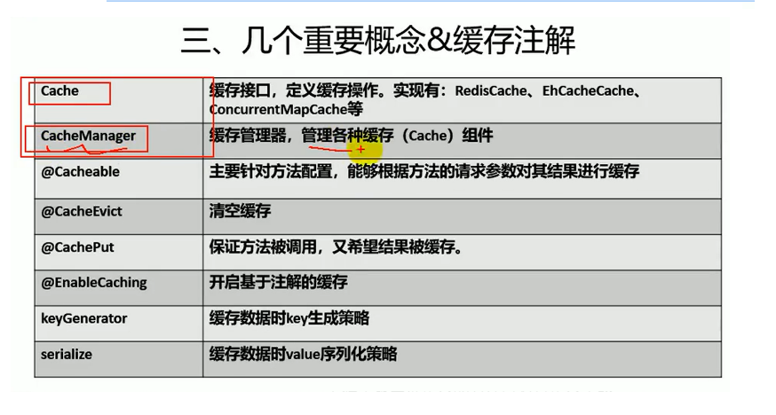


**注解spel表达式**

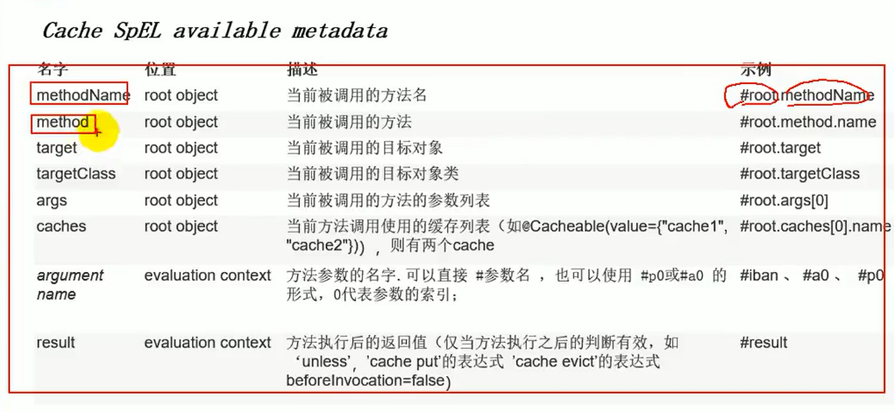


#### 2.springboot缓存原理


 **自动配置类**：org.springframework.boot.autoconfigure.cache.**CacheAutoConfiguration**


 **原理简述**：自动配置类中导入**CacheConfigurationImportSelector**配置配类，这个配置类再装配一些（如截图）组件

，默认使用**SimpleCacheConfiguration**组件。在这个组件中注册一个**缓存管理器cacheManager**；在缓存管理器中管理**ConcurrentMapCache**组件。这个组件负责缓存的**增删改查**。


```java
@Cacheable(cacheNames = {"persons"})
@GetMapping("/getAll")
public Object getAll(){
    System.out.println("调用表现层");
    return serviceImp.getAll();
}
```

```java
public Cache getCache(String name) {//name=persons
    Cache cache = (Cache)this.cacheMap.get(name);//查询缓存名
    if (cache == null && this.dynamic) {//为空
        ConcurrentMap var3 = this.cacheMap;
        synchronized(this.cacheMap) {
            cache = (Cache)this.cacheMap.get(name);//加锁再次查询
            if (cache == null) {//为空则创建名称为xx的缓存
                cache = this.createConcurrentMapCache(name);
                this.cacheMap.put(name, cache);//将业务层结果存进缓存map中
            }
        }
    }
    return cache;
}
```


**导入配置类**

```java
@Import({CacheAutoConfiguration.CacheConfigurationImportSelector.class, CacheAutoConfiguration.CacheManagerEntityManagerFactoryDependsOnPostProcessor.class})
```

 **配置类中导入配置组件**

```java

    static class CacheConfigurationImportSelector implements ImportSelector {
        CacheConfigurationImportSelector() {
        }

        public String[] selectImports(AnnotationMetadata importingClassMetadata) {
            CacheType[] types = CacheType.values();
            String[] imports = new String[types.length];
            for(int i = 0; i < types.length; ++i) {
                imports[i] = CacheConfigurations.getConfigurationClass(types[i]);
            }
            return imports;
        }
    }

```

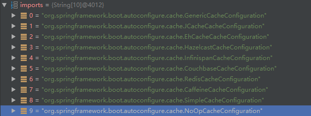

默认使用**SimpleCacheConfiguration**配置类

```java
@ConditionalOnMissingBean({CacheManager.class})
@Conditional({CacheCondition.class})
class SimpleCacheConfiguration {
    SimpleCacheConfiguration() {
    }
    @Bean//注册缓存管理器
    ConcurrentMapCacheManager cacheManager(CacheProperties cacheProperties, CacheManagerCustomizers cacheManagerCustomizers) {
        ConcurrentMapCacheManager cacheManager = new ConcurrentMapCacheManager();
        List<String> cacheNames = cacheProperties.getCacheNames();
        if (!cacheNames.isEmpty()) {
            cacheManager.setCacheNames(cacheNames);
        }
        return (ConcurrentMapCacheManager)cacheManagerCustomizers.customize(cacheManager);
    }
}
```


#### 3. 注解

##### 1、@EnableCaching

​     标注在主类上，开启缓存注解

#####          2、 **@Cacheable**

**运行流程**：

**源码中getcahe** 方法会在请求前查询缓存名称为XX的缓存，不存在则创建xx缓存，存在则返回缓存；

```java
public @interface Cacheable {
    @AliasFor("cacheNames")
    String[] value() default {};
    @AliasFor("value")
    String[] cacheNames() default {};//缓存组件名称
    String key() default ""; //keyGenerator指定则无效  默认为方法的第一个参数
    String keyGenerator() default "";//key生成器  key指定则无效
    String cacheManager() default "";//指定缓存管理器
    String cacheResolver() default "";//缓存解析器
    String condition() default "";//条件成立进行缓存
    String unless() default "";//条件不成立进行缓存
    boolean sync() default false;//是否使用异步模式
}
```

##### **3、@CachePut**

**运行流程：** 先执行方法体获取数据库执行结果，再更新缓存

```java
@CachePut(cacheNames = "{person}",key = "#result.id")//指定更新key 与@Cacheable 对应
public Person UpdatepPerson(Person person);
```

##### 4、@CacheEvict

删除缓存

```java
@CacheEvict(cacheNames = "{person}")//默认删除key为方法参数的的缓存
public void  deletePerson(int id);
```

#### 4、使用Redis

**引入redis启动器**

```xml
<dependency>
    <groupId>org.springframework.boot</groupId>
    <artifactId>spring-boot-starter-data-redis</artifactId>
</dependency>
```

**配置服务器端口**

```properties
spring.redis.host=193.112.195.243
```

**服务器安装并启动redis**，可用redisDesktopManager工具连接服务器redis，进行可视化查看。

导入依赖后

**RedisAutoConfiguration自动配置类生效**

```java

@ConditionalOnClass({RedisOperations.class})
@EnableConfigurationProperties({RedisProperties.class})
@Import({LettuceConnectionConfiguration.class, JedisConnectionConfiguration.class})
public class RedisAutoConfiguration {
    public RedisAutoConfiguration() {
    }

    @Bean
    @ConditionalOnMissingBean(
        name = {"redisTemplate"}
    )
    public RedisTemplate<Object, Object> redisTemplate(RedisConnectionFactory redisConnectionFactory) throws UnknownHostException {
        RedisTemplate<Object, Object> template = new RedisTemplate();
        template.setConnectionFactory(redisConnectionFactory);
        return template;
    }
    @Bean
    @ConditionalOnMissingBean
    public StringRedisTemplate stringRedisTemplate(RedisConnectionFactory redisConnectionFactory) throws UnknownHostException {
        StringRedisTemplate template = new StringRedisTemplate();
        template.setConnectionFactory(redisConnectionFactory);
        return template;
    }
}
```

 使用两个自动配置的两个工具类**RedisTemplate**、**StringRedisTemplate**即可操作缓存。

### 六、消息

####    1、概述

​              通过消息中间件可以提升系统的**异步**

**通信**，**扩展解耦**能力，这里存在两个重要概念即**消息代理（服务器）**和**目的地**，当消息发出后，将由消息代理接管，消息代理保证消息可以到达指定目的地。

#####             	1.**目的地的两种形式：**

######                   		1、队列（queue）

​                           **点对点通信**（p-t-p），消息代理将收到的消息放进队列，消息接收者从队列中获取消息内容，消息读取后				被移出队列，所有消息只有唯一的发送者和接收者，单并不是说只能有一个人接收。

######                    		2、主题(topic)

​                            **发布**(public)**订阅**(subscribe),发布者发送消息到主题，多个接收者可监听这个主题，那么消息到达时监听者就会收到消息。   

#####                	2.  JSM

​                    **java Message Service**

​                    基于JVM的消息代理规范，ActiveMQ、HornetMQ是JSM的实现

#####                	3. AMQP 

​                   **Advance  Message Queue Protocol**

​                    网络级协议的高级消息队列，也是一个消息代理的规范，兼容JMS，利用RabbitMQ进行实现。


#####                	4.JSM 对比 AMQP

​                  

#####                 	5、Spring支持

​                        -spring-jms 提供对JMS的支持,spring-rabbit提供对AMQP的支持

​                        -提供Connectionfactory的实现来连接消息代理

​                        -提供JmsTemplate、RabbitTemplate来发送消息

​                        -@JmsListener @RabbitListener 注解在方法上监听消息发布的消息

​                        -@EnableJms 、@EnableRabbit开启注解支持

#####                 	6、springboot自动配置

​                       **-JmsAutoConfiguration**

​                       **-RabbitAutoConfiguration**

####          2、RabbitMQ

##### 						1. 简介

​                         1）、**Message**：由**消息头、消息体**组成，消息体不透明，消息头由一系列可选的属性组成：

**routing-key**(路由键)、**priority**(优先级)、**delivery-mode** (持久性存储)等

​                         2）、**Publisher**:   消息的生产者，生产者向交换器发布消息

​                         3）、**Exchange**： 交换器，在消息代理（服务器）中存在很多交换器，负责将消息按照不同的策略分发给	不同的队列。四种策略：**direct (默认)**、**fanout**、**topic**、**headers** (很少使用)。

​                         4）、**Queue**：   消息队列，保存消息直到有消费者获取，消息与队列具有1：n关系 。

​                         5）、**Binding**： 绑定，用于消息队列和交换器之间形成路由规则，二者可以n:n的关系。

​                         6）、**Connection**：网络连接。

​                         7）、**Channel**：信道，多路复用，连接、关闭TCP都耗费资源，可以将一条TCP连接形成多条信道。AMQP命令都是基于信道发出的。

​                         8）、**虚拟主机**： 由一批交换机、消息队列、相关对象组成。它是共享相同的身份认证、加密环境的独立服务器区域，简称vhost，连接时必须指定，默认vhost是 /。

​                          9）、**Broker**：  服务器实体。

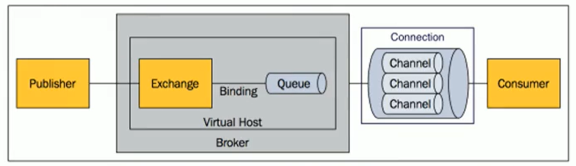


#####                       2. 运行机制

​							AMQP中的消息路由与JSM存在差异，AMQP增加了Exchange和Binding的角色。**生产者**把消息发布到**Exchange**上，消息到达**queue**并被**消费者**接收，而Binding决定交换器的消息应该发送到哪个队列上。

​                          **Exchange**分发消息时3根据类型的不同使用不同的**策略**：**direct 、fanout、topic、headers**。【headers方式匹配消息的消息头而不是路由键，其他跟direct方式完全一致，但性能差很多，目前很少使用】

​                         	**1) direct 类型**：路由键完全匹配正确时会将消息存储到该队列。

​						 	**2) fanout类型**：不匹配路由键，采取广播的方式将消息分发给该交换器下所有的队列，该类消息的转发消息速度最快。

​                        	 **3) Topic类型**： 通过模糊匹配路由键分发消息，此时队列需要绑定一个模式上。将消息的路由键与队列的模式进行模糊匹配，成功则加入队列。模式串组成：点【.】、单词、通配符 ；通配符：**#**【0个或多个单词】和 *****【一个单词】。模式串举例：work.#.*


##### 3. 使用

​     **RabbitAutoConfiguration自动配置类原理**

​         搭载**RabbitProperties**配置属性类；

​         装配了连接工厂**RabbitConnectionFactoryCreator**；

​         装配**RabbitTemplateConfiguration**，其中包括**rabbitTemplate**用于发送、接收消息的处理类，以及**AmqpAdmin**后台管理组件；

###### 	1、服务器启动rabbitmq

​      docker命令启动时需要制定两个端口，运行端口5671，后台管理端口15672【在服务器安全组上开启该端口】

######     2、修改配置

```java
@Configuration
public class RabbitConfig {
    /**
     * 原类型为javax-serializse
     * 更换消息转化器为json类型
     * @return
     */
    @Bean
    public MessageConverter messageConverter(){
        return new Jackson2JsonMessageConverter();
    }
}
```

###### 	3、编写rabbitmq工具类

```java
@Component
public class RabbitmqUtil {

    @Autowired
    RabbitTemplate template;
    // 发送消息
    public void sendMessage(String exchange,String routingKey,Object message){
        template.convertAndSend(exchange,routingKey,message);
    }
    //接收消息
    public Object getMessage(String queueName,String routingkey){
        Object obj=template.receiveAndConvert(queueName);
        return obj;
    }
}
```

######    4、监听消息

```java
@Service
public class BookServiceImp {
    //自动接收消息
    @RabbitListener(queues = "four")
    public void getMessage(Message message){
        System.out.println("收到消息"+message);
    }
}
```

###### 5、AmqpAdmin

 创建删除**exchange**、**queue**、**binding**

```java
@Autowired
AmqpAdmin amqpAdmin;

//创建交换器
public void creatExchange(){
    amqpAdmin.declareExchange(new DirectExchange("newExchange"));
}
//创建队列
public void creatQueue(){
    amqpAdmin.declareQueue(new Queue("newQueue"));
}
//创建绑定
public void createBinding(){
    amqpAdmin.declareBinding(new Binding("newQueue",
            Binding.DestinationType.QUEUE,"newExchange","newQueue",null));
}
```


### 七、检索

####     1、简介与安装

#####             1）简介

​                 全文搜索引擎的首选**elasticSearch**,具有快速**存储，搜索、分析海量数据**的功能。SpringBoot通过整合**Data** **ELasticSearch** 为为我们提供了非常便捷的检索功能支持，

​                 elasticSearch是一个分布式搜索服务，提供Restful API，底层采用Lucene，采用多分片的方式保证数据的安全，并且提供resharding功能，github等大型的站点也采用了该服务作为搜索服务。

ES的基本知识:

          mysql数据库可以分为:数据库(database) ->表(table) -> 行(row)->列(column)
    
          es相应也分为:  索引(index)->类型(type)->文档(document)->字段(field)

##### 2）安装【配置】

https://blog.csdn.net/qq_32101993/article/details/100021002

#### 2、中文文档

https://es.xiaoleilu.com/

https://es.xiaoleilu.com/010_Intro/25_Tutorial_Indexing.html

#### 3、整合

引入依赖

```xml
<dependency>
    <groupId>org.springframework.boot</groupId>
    <artifactId>spring-boot-starter-data-elasticsearch</artifactId>
</dependency>
```


​         


### 八、任务

####        1、异步任务

​         springboot另外在线程池中开辟线程执行任务。

​          主程序标注 **@EnableAsync** 开启异步服务注解，服务方法标注**@Async**即可


####        2、定时任务

​         	spring提供了异步执行任务调度的方式，提供**TaskExecutor**、**TaskScheduler**接口。场景举例：每天凌晨日志分析

​			主程序标注**@EnableScheduling**开启定时服务注解，服务方法标 **@Scheduled** 

Cron表达式：

IV`SL.png)

​       

```java
/**
 * 秒 分 时 日 月 周几  空格分隔
 */
@Scheduled(cron = "1-4 * * ? * 3")
public void sayHello(){
    System.out.println("Hello 定时任务");
}
```

####        3、邮件任务

​          **引入依赖**

```java
<dependency>
    <groupId>org.springframework.boot</groupId>
    <artifactId>spring-boot-starter-mail</artifactId>
</dependency>
```

**配置发送方信息**

```properties
spring.mail.username=2550951101@qq.com//发送方地址
spring.mail.password=mfssncxxofuudigg//发送方邮箱第三方登录授权码
spring.mail.host=smtp.qq.com//发送方SMTP服务器地址
spring.mail.properties..mail.smtp.ssl.enable=true//开启ssl安全连接
```

  使用**JavaMailSenderImpl**工具类

```java
@Service
public class EmailService {
    @Autowired
    JavaMailSenderImpl mailSender;
    //简单邮件发送
    public void sendSimpleMail(String tile ,String body,String sender, String rececvier){
        SimpleMailMessage message=new SimpleMailMessage();
        message.setSubject(tile);
        message.setText(body);
        message.setTo(rececvier);
        message.setFrom(sender);
        mailSender.send(message);
    }

    // 带附件的邮件发送
    public  void sendEmali(String tile ,String body,String sender, String rececvier) throws  Exception{
        MimeMessage message=mailSender.createMimeMessage();
        MimeMessageHelper helper=new MimeMessageHelper(message,true);
        helper.setSubject(tile);//设置标题
        helper.setText("<h1>我爱你你知道吗<h1> " ,true);//是否为html
        helper.setTo(rececvier);//发送方
        helper.setFrom(sender);//接收方
        helper.addAttachment("这是证据.jpg",new File("C:\\Users\\NZH\\Desktop\\文件文档\\images\\7.jpg"));//添加附件 可以文件或者文件流
        mailSender.send(message);
    }
}
```


### 九、安全

#### 1、场景依赖引入

```xml
<dependency>
    <groupId>org.springframework.boot</groupId>
    <artifactId>spring-boot-starter-security</artifactId>
</dependency>
```

#### 2、配置类继承适配器

```java
@EnableWebSecurity
public class SecurityConf  extends WebSecurityConfigurerAdapter {

    @Override
    protected void configure(HttpSecurity http) throws Exception {
//        super.configure(http);
        http.authorizeRequests().antMatchers("/").permitAll()//允许所有访问路径
                .antMatchers("/tables").hasRole("vip1")//路径角色访问
                .antMatchers("/charts").hasRole("vip1")
                .antMatchers("/forms").hasRole("vip2");
        http.formLogin();//开启访问失败登录
        http.csrf().disable();//关闭默认；防止csrf攻击
    }

    @Override
    protected void configure(AuthenticationManagerBuilder auth) throws Exception {
//        super.configure(auth);
        auth.inMemoryAuthentication().passwordEncoder(new SecurityPassowrdEncoder()).withUser("nzh").password("123456").roles("vip1");
    }

    @Override
    public void configure(WebSecurity web) throws Exception {
//        super.configure(web);
        //配置不拦截路径
        web.ignoring().mvcMatchers("/js/**","/css/**","/images/**");
    }
}

```


**配置密码匹配方式**

```java
@Component
public class SecurityPassowrdEncoder implements PasswordEncoder {
    @Override
    public String encode(CharSequence charSequence) {
        return charSequence.toString();
    }

    @Override
    public boolean matches(CharSequence charSequence, String s) {
        return charSequence.toString().equals(s);
    }
}
```


**前端使用认证**

<html xmlns:th="http://www.thymeleaf.org"      xmlns:sec="http://www.thymeleaf.org/extras/spring-security">

```html
<!--没有认证时显示-->
<div sec:authorize="!isAuthenticated()" class="title">
  <h1 class="h4">游客</h1>
  <p><a th:href="@{/login}"><span>去登录</span></a></p>
</div>
<!--认证过显示-->
<div sec:authorize="isAuthenticated()" class="title">
  <h1 sec:authentication="name" class="h4"></h1>
  <p>
    角色：<span sec:authentication="principal.authorities"></span>
  </p>
  <p><a th:href="@{/logout}"><span>去注销</span></a></p>
</div>
```

​         

### 十、分布式

#### 1、简介

​     在分布式的系统中，**国内常用zookeeper+dubbo组合**；而springboot推荐使用全栈的是spring、springBoot+springCloud；

​    


#### 2、**zookeeper+dubbo**


#####   1. zookeeper

​		是一个分布式的，开源的的分布式应用程序协调服务。它是一个为分布式应用提供一个一致性服务的软件，提供的功能包括：配置维护、域名服务、分布式同步、组服务等。

#####    2.Dubbo

​		是Alibaba开源的分布式服务框架，它最大的特点是按照分层的方式来架构，使用这种方式可以使得各个层之间可以充分解耦【松耦】，从服务模型来看，它采用的是一种非常简单的模式，要么是提供服务的生产者，要么是消费服务的消费者，所有抽象出服务提供方【provider】和服务消费者【consumer】

**dubbo结构图**

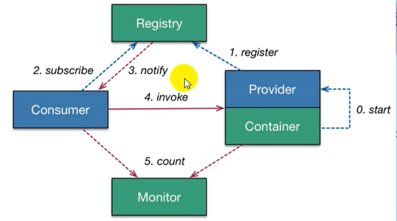


##### 1、实列

服务器docker启动zookeeper镜像

docker run --name myzk  -p 2181:2181 --restart always  -d +容器id；

新建一个空工程，springboot初始化两个新的modul，分别充当生产者和消费者。

生产者将服务发布到注册中心，消费者远程调用服务。

######  1）、依赖引入

```xml
<dependency>
    <groupId>org.apache.dubbo</groupId>
    <artifactId>dubbo-spring-boot-starter</artifactId>
    <version>2.7.5</version>
</dependency>


<!--zookeeper客户端-->
<dependency>
    <groupId>com.101tec</groupId>
    <artifactId>zkclient</artifactId>
</dependency>

<dependency>
    <groupId>org.apache.curator</groupId>
    <artifactId>curator-framework</artifactId>
    <version>4.2.0</version>
</dependency>

<dependency>
    <groupId>org.apache.curator</groupId>
    <artifactId>curator-recipes</artifactId>
    <version>2.8.0</version>
</dependency>
```


###### 2）、配置

```properties
#服务提供方
dubbo.application.name=service_curd
#zookeeper镜像地址
dubbo.registry.address=zookeeper://193.112.195.243:2181
#服务扫描包
dubbo.scan.base-packages=com.cqlxnb.demo.service 
#连接等待时间默认为3000毫秒，适当增加
dubbo.config-center.timeout=10000 
```

```properties
#服务消费
dubbo.application.name=service_user
dubbo.registry.address=zookeeper://193.112.195.243:2181
```

启动类使用@**EnableDubbo**注解

###### 3）、服务生产者

按接口实现并发布

```java
import org.apache.dubbo.config.annotation.Service;
import org.springframework.stereotype.Component;
@Component
@Service //dubbo下service注解；将服务发布出去
public class CurdServiceImpl implements CurdService{
    @Override
    public String getAllInfo() {
        return "成功获取所有用户信息";
    }
}
```


###### 4）、服务消费者

使用 **@Reference**远程按接口【复制生产者的接口】调用

```java
import org.apache.dubbo.config.annotation.Reference;
import org.springframework.stereotype.Service;

@Service
public class UserServiceImp implements IUserService {

     @Reference//远程调用
     CurdService curdService;
     
    @Override
    public String getAllInfo() {
        System.out.println("测试分布式服务"+curdService.getAllInfo());
        return curdService.getAllInfo();
    }
}
```


#### 3、Spring Cloud

#####   1、简介

​				spring Cloud是一个分布式的整体解决方案。为开发者提供了在分布式系统【 配置管理、服务发现、熔断、路由、微代理、控制总线、一次性token、全局锁、leader选举、分布式session、集群状态】中快速构建 的工具，使用spring Cloud的开发者可以快速的启动服务构建应用、同时能够快速和云平台资源进行对接。


​        **常用的五大组件**

 			服务发现——Netflix Eureka

 			客服端负载均衡——Netflix Ribbon

​			断路器——Netflix Hystrix

​			服务网关——NetFlix Zuul

​			分布式配置——Spring Cloud Config

​        

##### 2、实例

​     一个空工程，三个modul，分别充当**eureka注册中心**，**服务提供者**，**服务消费者**；服务消费者通过http请求调用服务提供者；

######    1. **eureka注册中心**

​		**依赖**

```xml
<parent>
    <groupId>org.springframework.cloud</groupId>
    <artifactId>spring-cloud-starter-parent</artifactId>
    <version>Camden.SR7</version>
</parent>
<dependency>
    <groupId>org.springframework.cloud</groupId>
    <artifactId>spring-cloud-starter-eureka-server</artifactId>
</deendency>
```

​      **配置**

```properties
#eureka注册中心
server.port=8761
#eureka实例的主机名
eureka.instance.hostname=localhost
#不注本模块的服务到eureka上
eureka.client.register-with-eureka=false
#不从eureka上获取服务的注册信息
eureka.client.fetch-registry=false
#默认地址
eureka.client.service-url.defaultZone=http://localhost:8761/eureka/
```

使用**@EnableEurekaServer**标注启动类

###### 2. 服务提供者

​	**依赖**

```xml
<parent>
        <groupId>org.springframework.cloud</groupId>
        <artifactId>spring-cloud-starter-parent</artifactId>
        <version>Camden.SR7</version>
</parent>

<dependency>
    <groupId>org.springframework.cloud</groupId>
    <artifactId>spring-cloud-starter-netflix-eureka-client</artifactId>
    <version>2.0.0.RELEASE</version>
</dependency>
```

​	**配置**

此处配置文件为bootstrap.yml 而不用的application.yml；bootstrap.yml加载具有优先权

具体原因详见https://www.cnblogs.com/BlogNetSpace/p/8469033.html二者的区别

```yml
#提供者
eureka:
  client:
    service-url:
      defaultZone: http://localhost:8761/eureka/
spring:
  application:
    name: jilinwula-springcloud-feign-server #服务名称，可以按照此名称调用
server:
  port: 8002
```

​	controller暴露的http接口，启动类标注**@EnableEurekaClient**注解

```java
@RestController
@RequestMapping("/server")
public class Controller {

    @Value("${server.port}")//获取配置的接口
    private String port;

    @GetMapping("/get")
    public Object get() {
        System.out.println("调用服务 "+port);
        Map<String, String> map = new HashMap<>();
        map.put("code", "0");
        map.put("msg", "success");
        map.put("data", "吉林乌拉");
        return map;
    }
}
```


###### **3.服务消费者**

​    依赖与提供者modul依赖相同；

​    **配置**

```yml
#消费者
eureka:
  client:
    service-url:
      defaultZone: http://localhost:8761/eureka/
spring:
  application:
    name: jilinwula-springcloud-feign-client
server:
  port: 8001
```

   使用RestTemplate进行通信；**@EnableDiscoveryClient** 开启发现服务；

**@LoadBalanced** ：完成三件事

  第一件：从负载均衡器中选一个对应的服务实例，所有的服务名实例都放在**负载均衡器中的serverlist**。

  第二件：从第一件事情挑选的实例中去请求内容。

  第三件：由**服务名转为真正使用的ip地址**

```java
@EnableDiscoveryClient//开启发现服务
@SpringBootApplication
public class DemoApplication {
    public static void main(String[] args) {
        SpringApplication.run(DemoApplication.class, args);
    }

    @Bean
    @LoadBalanced 
    public RestTemplate getRestTemplate() {
        HttpComponentsClientHttpRequestFactory httpRequestFactory = new HttpComponentsClientHttpRequestFactory();
        httpRequestFactory.setConnectionRequestTimeout(30 * 1000);
        httpRequestFactory.setConnectTimeout(30 * 3000);
        httpRequestFactory.setReadTimeout(30 * 3000);
        return new RestTemplate(httpRequestFactory);
    }
}
```

**controller**

```java
@GetMapping("/getTicket")
public Object getgetTicket() {
    String url = String.format("http://%s/server/get", "jilinwula-springcloud-feign-server");
    String result = template.getForObject(url, String.class);
    return result;
}
```

###### 4. 测试

**发布服务结果**

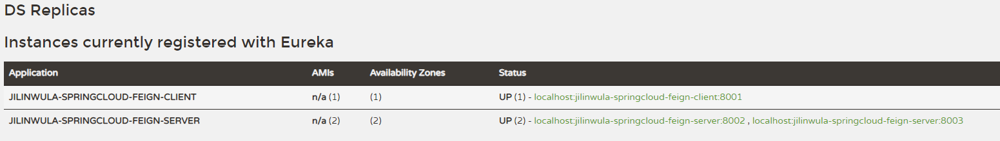

**调用结果**

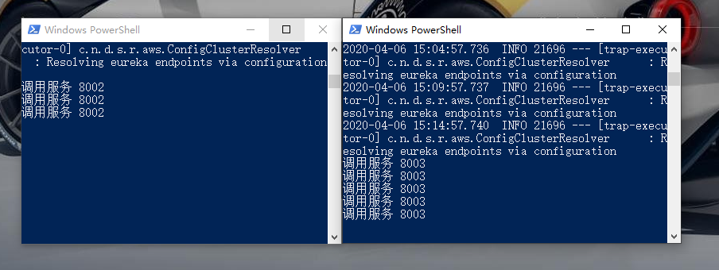

#### 4、负载均衡

