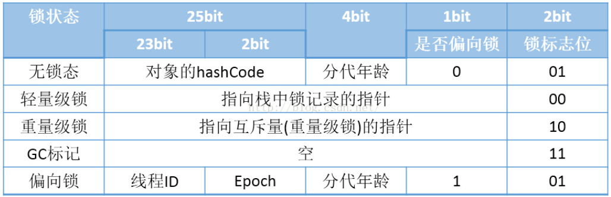

### 一、线程

#### 1、线程五态

1. **新建(NEW)**：新创建了一个线程对象。

2. **可运行(RUNNABLE)**：线程对象创建后，其他线程(比如main线程）调用了该对象的start()方法。该状态的线程位于可运行线程池中，等待被线程调度选中，获取cpu 的使用权 。

3. **运行(RUNNING)**：可运行状态(runnable)的线程获得了cpu 时间片（timeslice） ，执行程序代码。
4. **阻塞(BLOCKED)**：阻塞状态是指线程因为某种原因放弃了cpu 使用权，也即让出了cpu timeslice，暂时停止运行。直到线程进入可运行(runnable)状态，才有机会再次获得cpu timeslice 转到运行(running)状态。阻塞的情况分三种： 

> (一). 等待阻塞：运行(running)的线程执行o.wait()方法，JVM会把该线程放入**等待队列**(waitting queue)中。
> (二). 同步阻塞：运行(running)的线程在获取对象的同步锁时，若该同步锁被别的线程占用，则JVM会把该线程放入**锁池**(lock pool)中。
> (三). 其他阻塞：运行(running)的线程执行Thread.sleep(long ms)或t.join()方法，或者发出了I/O请求时，JVM会把该线程置为阻塞状态。当sleep()状态超时、join()等待线程终止或者超时、或者I/O处理完毕时，线程重新转入可运行(runnable)状态。
>
> wait是Object的方法，sleep是Thread类的方法；
>
> wait让出CPU资源的同时会放弃锁，sleep让出CPU资源的同时不会释放锁；
>
> wait需要notify或者notifyall来唤醒，sleep在沉睡指定时间后，会自动进入就绪状态；
>
> **调用t.join()方法,会使得调用t.join方法的线程挂起，等待t线程执行完成后调用t.join 的线程会被唤醒，这期间不影响其他线程的运行。**
>
> **yield方法会将该线程从运行状态改变为可运行状态，但不一定还成功。**

5. **死亡(DEAD)**：线程run()、main() 方法执行结束，或者因异常退出了run()方法，则该线程结束生命周期。死亡的线程不可再次复生。


#### 2、线程池

##### 1. 线程池的优势

 （1）、降低系统资源消耗，通过重用已存在的线程，降低线程创建和销毁造成的消耗；
 （2）、提高系统响应速度，当有任务到达时，通过复用已存在的线程，无需等待新线程的创建便能立即执行；
 （3）、方便线程并发数的**管控**。因为线程若是无限制的创建，可能会导致内存占用过多而产生OOM，并且会造成cpu过度切换（**cpu切换线程是有时间成本**的（需要保持当前执行线程的现场，并恢复要执行线程的现场））。
 （4）、提供更强大的功能，延时定时线程池。

##### 2. 线程池参数

```java
public ThreadPoolExecutor(int corePoolSize, int maximumPoolSize, long keepAliveTime, TimeUnit unit, BlockingQueue<Runnable> workQueue) {
    this(corePoolSize, maximumPoolSize, keepAliveTime, unit, workQueue,
         Executors.defaultThreadFactory(), defaultHandler);
}
```


**corePoolSize：**当向线程池提交一个任务时，若线程池已创建的线程数小于corePoolSize，即便此时存在空闲线程，也会通过创建一个新线程来执行该任务，直到已创建的线程数大于或等于corePoolSize时，（除了利用提交新任务来创建和启动线程（按需构造），也可以通过 prestartCoreThread() 或 prestartAllCoreThreads() 方法来提前启动线程池中的基本线程。）

**maximumPoolSize：**线程池所允许的最大线程个数。当队列满了，且已创建的线程数小于maximumPoolSize，则线程池会创建新的线程来执行任务。另外，对于无界队列，可忽略该参数。

**keepAliveTime：**负责控制非核心线程的空闲生存时间，超时则销毁。

**unit：**时间单位。

**workQueue（阻塞队列）：**用于传输和保存等待执行任务的**阻塞**队列。

  使用阻塞队列的原因

> 1、因为线程若是无限制的创建，可能会导致内存占用过多而产生OOM，并且会造成cpu过度切换。

>  2、创建线程池的消耗较高。

**threadFactory：**用于创建新线程。threadFactory创建的线程也是采用new Thread()方式，threadFactory创建的线程名都具有统一的风格：pool-m-thread-n（m为线程池的编号，n为线程池内的线程编号）。

**defaultHandler：**线程饱和策略，当线程池和队列都满了，再加入线程会执行此策略。


##### 3. 执行流程


核心线程已满就判断任务队列是否满，满就判断线程的最大数是否已满，已满则执行饱和策略。

##### 4. 四种饱和策略

**RejectedExecutionHandler处理器有4种饱和策略**：
1）**Abort**：
默认的饱和策略，直接抛出异常，程序停止，阻止系统工作；

2）**CallerRuns**：
只要线程池未关闭，该策略直接在调用者线程中运行当前被丢弃的任务，调用者线程性能可能急剧下降；

3）**Discard**：
不做任何处理，直接丢弃该任务

3）**DiscardOldest**：
丢弃队列里最近的一个任务，执行当前任务；


##### 5. 常见的线程池

​	**CachedThreadPool：**可缓存的线程池，该线程池中没有核心线程，非核心线程的数量为Integer.max_value，就是无限大，当有需要时创建线程来执行任务，没有需要时回收线程，适用于**耗时少，任务量大的情况。**

​	**FixedThreadPool:**  定长的线程池，有核心线程，核心线程的即为最大的线程数量，没有非核心线程。

​	**SecudleThreadPool：**周期性执行任务的线程池，按照某种特定的计划执行线程中的任务，有核心线程，但也有非核心线程，非核心线程的大小也为无限大。适用于执行周期性的任务。

​	**SingleThreadPool:**   只有一条线程来执行任务，适用于有顺序的任务的应用场景。


##### 6.关闭线程池

可以通过调用线程池的shutdown或shutdownNow方法来关闭线程池。它们的原理是遍历线程池中的工作线程，然后逐个调用线程的interrupt方法来中断线程，所以无法响应中断的任务可能永远无法终止；

​	但是它们存在一定的区别，shutdownNow首先将线程池的状态设置成STOP，然后尝试停止所有的正在执行或暂停任务的线程，并返回等待执行任务的列表，而shutdown只是将线程池的状态设置成SHUTDOWN状态，然后中断所有没有正在执行任务的线程。
​	只要调用了这两个关闭方法中的任意一个，isShutdown方法就会返回true。当所有的任务都已关闭后，才表示线程池关闭成功，这时调用isTerminaed方法会返回true。至于应该调用哪一种方法来关闭线程池，应该由提交到线程池的任务特性决定，通常调用shutdown方法来关闭线程池，如果任务不一定要执行完，则可以调用shutdownNow方法。

### 二、java锁

##### 	1、基本锁概念


##### 2、悲观锁

​    认为在使用数据的时候一定会有其他线程来修改数据，在获取数据的时候回先先加锁，确保不会被其他线程修改。、

​    锁实现：关键字synchronized、lock【RetreenLock】的实现类   使用场景：写操作多。

##### 3、乐观锁

​    认为在操作数据的时候不会被其他线程修改数据，所有不会加锁，只是在更新数据时会去判断有没有其他线程更新了这个数据；   

​    锁实现：CAS（compare and swap）算法、自旋锁     使用场景：读操作较多，不加锁性能有所大幅度提高。

##### 4、自旋锁

​     线程在获取锁失败时，不会进行阻塞，而是循环等待（自旋），不断尝试判断能否获取成功，自旋直到获取锁才会退出循环，自旋锁一般拥有一个最大自旋次数，达到后将放弃；

##### **5、适应性自旋锁**

​             在jdk1.6引入了适应性自旋锁，根据一定算法获取上次自旋成功的次数进行调整最大自旋次数。不会存在死锁的情况。

1. 如果平均负载小于CPUs则一直自旋
2. 如果有超过(CPUs/2)个线程正在自旋，则后来线程直接阻塞
3. 如果正在自旋的线程发现Owner发生了变化则延迟自旋时间（自旋计数）或进入阻塞
4. 如果CPU处于节电模式则停止自旋
5. 自旋时间的最坏情况是CPU的存储延迟（CPU A存储了一个数据，到CPU B得知这个数据直接的时间差）
6. 自旋时会适当放弃线程优先级之间的差异

​    **为什么会进行自旋**

阻塞与唤醒线程需要保持和恢复现场，系统会切换cpu的状态，从用户态度到核心态。需要消耗资源和时间。

而自旋时同步代码块逻辑简单，执行时间更短。


##### 6、CAS算法

CAS: compare  and swap，比较和交换，CAS有3个操作数，内存值V，旧的预期值A，要修改的新值B。当且仅当预期值A和内存值V相同时，将内存值V修改为B，否则什么都不做；

​     

该算法存在的问题：ABA问题（版本控制） 循环开销大（） 只能保证一个共享变量的原子操作。

1. ABA问题
    因为CAS会检查旧值有没有变化，这里存在这样一个有意思的问题。比如一个旧值A变为了成B，然后再变成A，刚好在做CAS时检查发现旧值并没有变化依然为A，但是实际上的确发生了变化。解决方案可以沿袭数据库中常用的乐观锁方式，添加一个版本号可以解决。原来的变化路径A->B->A就变成了1A->2B->3C。
2. 自旋时间过长

使用CAS时非阻塞同步，也就是说不会将线程挂起，会自旋（无非就是一个死循环）进行下一次尝试，如果这里自旋时间过长对性能是很大的消耗。如果JVM能支持处理器提供的pause指令，那么在效率上会有一定的提升。


##### **7、Monitor**

​    每一个对象都有一把看不见的锁，称为内部锁或者Monitor锁。Monitor是线程私有的数据结构，**每个线程都有一个可用的Monitor  Record列表**。同时还有一个全局的可用列表。每一个被锁住的对象都会和一个Monitor关联，同时monitor中有一个Owner字段用于存放拥有该锁线程的唯一ID。

##### 8、锁状态

锁的四种状态：**无锁状态**，**偏向锁状态**，**轻量级锁状态**和**重量级锁状态**，这几个状态会随着竞争情况逐渐升级，锁可以升级但不能降级；

**补充**：Mark Word是对象头的一部分；每个线程都拥有自己的线程栈（虚拟机栈），记录线程和函数调用的基本信息。二者属于JVM的基础内容，此处不做介绍。




**无锁：**

​       无锁的特点每个线程的修改操作会不断、不定进行，没有冲突就修改成功，否则会不断循环尝试，直到修改成功。/不安全。

**偏向锁**：

​		“偏向”的意思是，*偏向锁**假定**将来**只有第一个申请锁的线程**会使用锁*（不会有任何线程再来申请锁），因此，只需要在Mark Word中**CAS记录owner**（本质上也是更新，但初始值为空），如果**记录成功，则偏向锁获取成功**，记录锁状态为偏向锁，下次这个线程等于owner就可以零成本的直接获得锁；否则，说明有其他线程竞争，膨胀为轻量级锁。

锁的撤销：使用了一种等待竞争出现才释放锁的机制，置换 ThreadID 的时候依赖一次 CAS 原子指令即可。

偏向锁在 JDK 6 及之后版本的 JVM 里是默认启用的。可以通过 JVM 参数关闭偏向锁：-XX:-UseBiasedLocking=false，关闭之后程序默认会进入轻量级锁状态。

**轻量级锁**： 

​		 自旋锁的目标是降低线程切换的成本。如果锁竞争激烈，我们不得不依赖于重量级锁，让竞争失败的线程阻塞；如果完全没有实际的锁竞争，那么申请重量级锁都是浪费的。**轻量级锁的目标是，减少无实际竞争情况下，使用重量级锁产生的性能消耗**，包括系统调用引起的内核态与用户态切换、线程阻塞造成的线程切换等。

​        加锁：线程在执行同步块之前，JVM会在当前线程的栈帧【方法】中创建用于存储锁记录的空间【Lock Record】，并将对象头的markword复制到Lock Record中，线程尝试使用**CAS原子操作**尝试将对象的 Mark Word 更新为指向 Lock Record 的指针，并将 Lock Record 里的 owner 指针指向对象的 Mark Word；如果成功，则当前线程获得锁，如果失败，表示其他线程竞争锁，当前线程便尝试使用自旋来获取锁

​        解锁：会使用原子的CAS操作将Displaced markword替换回对象头，如果成功，则表示没有竞争发生，如果失败，表示当前锁存在竞争，锁就会膨胀成重量级锁

**重量级锁：**

​        重量级锁是指当一个线程获得锁之后，其余所有等待获取该锁的线程都会处于阻塞状态；实现是通过对象内部的监视器，而其中monitor的本质是依赖底层操作系统的Mutex Lock实现。操作系统实现线程之间的切换需要切换cpu的状态【用户态和内核态】，切换成本是非常高，导致消耗大量的系统资源，性能下降。

**不同级别锁的比较**


##### 7、lock

​        特点：持续等待，立即返回，限时等待，中断；

**注意：**

​				唤醒线程前必须获取某一资源，否则抛出异常 **IllegalMonitorStateException**；

​				lock.unlock()方法最好写在finally模块中，否则容易造成死锁。

Lock重要的实现类：
	**ReentrantLock** ：重入锁(实现了AQS) 支持公平锁和非公平锁。
	**ReentrantReadWriteLock**中的静态类**ReadLock**和**WriteLock**：同ReentrantLock 在基础上支持**读写分离**适合**多读少**写的场景
	**Condition**：是需要与Lock配合使用的，**提供多个等待集合**，更精确的控制(底层是park/unpark机制)


**ReentrantLock**实现**lock**接口，可实现公平锁和非公平锁。公平锁即让等待时间最长的线程获取锁资源。

  类结构图


  lock提供了**lock**()、**tryLock**()、**tryLock**(long timeout, TimeUnit unit)、lock.**lockInterruptibly**()。

​	**lock**：	该种方式获取锁不可中断，如果获取不到则一直休眠等待。

​	**tryLock**： 当获取锁时，只有当该锁资源没有被其他线程持有才可以获取到，并且返回true，同时设置持有count为1；
当获取锁时，当前线程已持有该锁，那么锁可用时，返回true，同时设置持有count加1；
当获取锁时，如果其他线程持有该锁，无可用锁资源，直接返回false，这时候线程不用阻塞等待，可以先去做其他事情；

​	**tryLock(long timeout, TimeUnit unit)**：获取锁成功或者超时之后返回。而且在公平锁和非公平锁的场景下都可以使用，只是会增加对中断事件的监测。
当获取锁时，锁资源在超时时间之内变为可用，并且在等待时没有被中断，那么当前线程成功获取锁，返回true，同时当前线程持有锁的count设置为1.
当获取锁时，在超时时间之内没有锁资源可用，那么当前线程获取失败，不再继续等待，返回false.
当获取锁时，在超时等待时间之内，被中断了，那么抛出InterruptedException，不再继续等待.
当获取锁时，在超时时间之内锁可用，并且当前线程之前已持有该锁，那么成功获取锁，同时持有count加1.

​	**lockInterruptibly**：获取锁是以排他的模式获取，一旦被中断就放弃等待获取。在等待开始时首先检测中断状态，然后至少调用一次tryAcquire，成功获取就返回true。否则当前线程就开始排队，并且不断的被blocking、unblocking、invoking tryAcquire 直到获取成功或者被中断为止


#####     8、synchronized

​       特点：简单，自动解锁。

​          死等加锁资源。

  在加锁代码中主动释放锁使用.wait()方法。

在JDK1.5之前都是使用synchronized关键字保证同步的，Synchronized的作用相信大家都已经非常熟悉了；

它可以把任意一个非NULL的对象当作锁。

1. 作用于方法时，锁住的是对象的实例(this)；
2. 当作用于静态方法时，锁住的是Class实例，又因为Class的相关数据存储在永久带PermGen（jdk1.8则是metaspace），永久带是全局共享的，因此静态方法锁相当于类的一个全局锁，会锁所有调用该方法的线程；
3. synchronized作用于一个对象实例时，锁住的是所有以该对象为锁的代码块。


​       

##### 9、产生死锁的条件

        1. **互斥条件**：一个资源每次只能被一个进程使用。
        2. **请求与保持条件**：一个进程因请求资源而阻塞时，对已获得的资源保持不放。
        3. **不剥夺条件**:进程已获得的资源，在末使用完之前，不能强行剥夺。
        4. **循环等待条件**:若干进程之间形成一种头尾相接的循环等待资源关系。

### 三、基础知识

####   1、字符串

String类声明为final，不可被继承。实现了Serializable接口支持序列化，实现Comparable接口支持比较大小；在JDk1.8及以前内部定义char[]数组用于存储数据，JDK9时改为byte[]。一个char需要占用两个字节的存储单位。据说是JDK的开发人员经过调研了成千上万的应用程序的heap dump信息，然后得出了一个结论：大部分的String都是以Latin-1字符编码来表示的，只需要一个字节存储就够了，两个字节完全是浪费。

**String**的值是不可变的，这就导致每次对String的操作都会生成**新的String对象**，不仅效率低下，而且大量浪费有限的内存空间。字面量	` String test="abc"`赋值，此时的字符串声明在字符串常量池中【StringTable】，new 的形式则在堆创建一个对象,字符串常量池也会创建一个对象。

```java
1.面试
String s1=new String("a");// new 一个常量池中不存在的字符，会在堆空间创建一个对象，然后再在常量池放入‘a’对象，实际上创建了两个对象。
s1.intern();//常量池中已经存在‘a’，返回‘a’的引用地址。
String s2="a";
System.out.print(s1==s2);//jdk6：false  jdk7/8：false

2.

String s3=new String("a")+new String("b");//s3的地址为：new String("ab");
//先创建StringBuffer对象，在创建两个String对象，a，b字符入池，五个对象。最后toString("ab")——>new String("ab");
// StringBuilder的toString方法不同在于"ab"并未入池,
s3.intern();//将s3对象放入字符池
String s4="ab";
//jdk6：常量池在永久代中，常量池中会创建“ab”对象；
//jdk7/8：常量池在堆中，由于字符”ab“对象存在于堆中，故常量池中不会创建”ab“对象，而是引用堆中”ab“对象的地址。
System.out.print(s3==s4);//jdk6：false  jdk7/8:true;
```

**注意**     

​        a、 常量与常量的拼接结果放入常量池，在编译器会进行优化【包括final修饰的变量】。

​        b、变量拼接的原理是创建一个StringBuilder对象,然后调用append方法，最后调用toString方法【jdk1.5之前使用的是StringBuffer】。

​        c、调用String的intern方法，将该字符放入常量池【未存在】，返回此对象地址。

StringBuffer 和 StringBuilder 类的对象能够被多次的修改，并且**不产生新的未使用对象**；

**三者继承关系**


**StringBuffer ：** 应用程序要求线程安全的情况下，则必须使用 StringBuffer 类。所有方法由synchronize修饰。

**StringBuilder ：**方法不是线程安全的（不能同步访问）。 相较于 StringBuffer 有速度优势。

**小结：**

（1）如果要操作少量的数据用 String；

（2）多线程操作字符串缓冲区下操作大量数据 StringBuffer；

（3）**单线程操作字符串缓冲区下操作大量数据 StringBuilder**；

   (4)   开发过程中，若基本确定系统添加的字符个数不高于某个阈值，建议构造时指定大小。防止不断扩容带来的性能影响。

#### 2、map

#####   1. hashMap

- 底层数组+链表实现，可**以存储null键和null值**，线程**不安全**
- 初始size为**16**，扩容：newsize = oldsize*2，size一定为2的n 次幂
- 扩容针对整个Map，每次扩容时，原来数组中的元素依次重新计算存放位置，并重新插入
- 插入元素后才判断该不该扩容，有可能无效扩容（插入后如果扩容，如果没有再次插入，就会产生无效扩容）
- 当Map中元素总数超过Entry数组的75%，触发扩容操作，为了减少链表长度，元素分配更均匀
- 计算index方法：index = hash & (tab.length – 1)

######      1）时间复杂度对比

​			 **数组**：采用一段连续的存储单元来存储数据。对于指定下标的查找，时间复杂度为O(1)；通过给定值进行查找，需要遍历数组，逐一比对给定关键字和数组元素，时间复杂度为O(n)，当然，对于有序数组，则可采用二分查找，插值查找，斐波那契查找等方式，可将查找复杂度提高为O(logn)；对于一般的插入删除操作，涉及到数组元素的移动，其平均复杂度也为O(n)

​			**线性链表**：对于链表的新增，删除等操作（在找到指定操作位置后），仅需处理结点间的引用即可，时间复杂度为O(1)，而查找操作需要遍历链表逐一进行比对，复杂度为O(n)

​			**二叉树**：对一棵相对平衡的有序二叉树，对其进行插入，查找，删除等操作，平均复杂度均为O(logn)。

​			**哈希表**：相比上述几种数据结构，在哈希表中进行添加，删除，查找等操作，性能十分之高，不考虑哈希冲突的情况，仅需一次定位即可完成，**时间复杂度为O(1)**.


###### **2）哈希冲突**

​      所谓的**哈希冲突**，也叫**哈希碰撞**：**两个不同的元素，通过哈希函数得出的实际存储地址相同**；HashMap使用链表来解决碰撞问题，当发生碰撞时，对象将会储存在链表的下一个节点中。HashMap在每个链表节点中储存键值对对象。当两个不同的键对象的hashcode相同时，它们会储存在同一个bucket位置的链表中，可通过键对象的equals()方法来找到键值对。

​      **解决方案：**有多种:**开放定址法**（发生冲突，继续寻找下一块未被占用的存储地址），**再散列函数法**，**链地址法**，而HashMap即是采用了**链地址法**，也就是**数组+链表**的方式。

​       **开放定址法：**基本思想是：当关键字key的哈希地址p=H（key）出现冲突时，以p为基础，产生另一个哈希地址p1，如果p1仍然冲突，再以p为基础，产生另一个哈希地址p2，…，直到找出一个不冲突的哈希地址pi ，将相应元素存入其中。
​       **再哈希法**：这种方法是同时构造多个不同的哈希函数：Hi=RH1（key） i=1，2，…，k当哈希地址Hi=RH1（key）发生冲突时，再计算Hi=RH2（key）……，直到冲突不再产生。这种方法不易产生聚集，但增加了计算时间。
​       **链地址法：**这种方法的基本思想是将所有哈希地址为i的元素构成一个称为同义词链的单链表，并将单链表的头指针存在哈希表的第i个单元中，因而查找、插入和删除主要在同义词链中进行。链地址法适用于经常进行插入和删除的情况

###### 3）变量值

​	**size**：实际存储的key-value键值对的个数

​	**modCount**：记录hashmap内部结构变化的次数

​	**threshold**：容纳键值对的临界值，值为数组长度乘以loadFactor

​	**loadFactor**：负载因子，默认值为0.75


###### 4）扩容

​	  当发生哈希冲突并且size大于阈值的时候，需要进行数组扩容，扩容时，需要新建一个长度为之前数组2倍的新的数组，然后将当前的Entry数组中的元素全部传输过去，扩容后的新数组长度为之前的2倍，所以扩容相对来说是个耗资源的操作。

###### **5）改进**

​		DK1.8在JDK1.7的基础上针对增加了**红黑树**来进行优化。即**当链表超过8时，链表就转换为红黑树**，利用红黑树快速增删改查的特点提高HashMap的性能，其中会用到红黑树的插入、删除、查找等算法。长度降到6时就转成链表。

链表的时间复杂度：o(n)            红黑数的时间复杂度：o(1)  

结构为：数组(哈希桶)+链表+红黑树


###### 6）注意

​      在HashMap中，null可以作为键，这样的键只有一个，但可以有一个或多个键所对应的值为null。**当get()方法返回null值时，即可以表示HashMap中没有该key，也可以表示该key所对应的value为null**。因此，在HashMap中不能由get()方法来判断HashMap中是否存在某个key，应该用**containsKey()**方法来判断。而在Hashtable中，无论是key还是value都不能为null


**`haspMap` 插入流程**

​                           

1. 判断数组是否为空，为空进行初始化;

2. 不为空，计算 k 的 hash 值，通过`(n - 1) & hash`计算应当存放在数组中的下标 index;

3. 查看 table[index] 是否存在数据，没有数据就构造一个Node节点存放在 table[index] 中；

4. 存在数据，说明发生了hash冲突(存在二个节点key的hash值一样), 继续判断key是否相等，相等，用新的value替换原数据(onlyIfAbsent为false)；

5. 如果不相等，判断当前节点类型是不是树型节点，如果是树型节点，创造树型节点插入红黑树中；(如果当前节点是树型节点证明当前已经是红黑树了)

6. 如果不是树型节点，创建普通Node加入链表中；判断链表长度是否大于 8并且数组长度大于64， 大于的话链表转换为红黑树；

7. 插入完成之后判断当前节点数是否大于阈值，如果大于开始扩容为原数组的二倍。

   

8. ```java
   final V putVal(int hash, K key, V value, boolean onlyIfAbsent,//插入源码
                  boolean evict) {
       Node<K,V>[] tab; Node<K,V> p; int n, i;
       if ((tab = table) == null || (n = tab.length) == 0)
           n = (tab = resize()).length;
       if ((p = tab[i = (n - 1) & hash]) == null)
           tab[i] = newNode(hash, key, value, null);
       else {
           Node<K,V> e; K k;
           if (p.hash == hash &&
               ((k = p.key) == key || (key != null && key.equals(k))))
               e = p;
           else if (p instanceof TreeNode)
               e = ((TreeNode<K,V>)p).putTreeVal(this, tab, hash, key, value);
           else {
               for (int binCount = 0; ; ++binCount) {
                   if ((e = p.next) == null) {
                       p.next = newNode(hash, key, value, null);
                       if (binCount >= TREEIFY_THRESHOLD - 1) // -1 for 1st
                           treeifyBin(tab, hash);
                       break;
                   }
                   if (e.hash == hash &&
                       ((k = e.key) == key || (key != null && key.equals(k))))
                       break;
                   p = e;
               }
           }
           if (e != null) { // existing mapping for key
               V oldValue = e.value;
               if (!onlyIfAbsent || oldValue == null)
                   e.value = value;
               afterNodeAccess(e);
               return oldValue;
           }
       }
       ++modCount;
       if (++size > threshold)
           resize();
       afterNodeInsertion(evict);
       return null;
   }
   ```

****

**`hashMap`扩容**

   JDK1.8扩容经过优化，不需要重新计算hash值，只需要看看原来的hash值新增的那个bit是1还是0就好了，是0的话索引没变，是1的话索引变成“原索引+oldCap”


**`HashMap`设定初始容量大小**

​           在new一个hashMap的时候可以传一个容量参数或负载因子【容量默认是16，负载因子默认是0.75】。传入的参数需要经过`tableSizeFor()`进行处理【为了容量一定是2的整数幂次方】。处理结果为得到一个大于且最接近容量参数的2的整幂次数。

```java
static final int tableSizeFor(int cap) {//50 经过处理得到 64  
    int n = cap - 1;
    n |= n >>> 1;
    n |= n >>> 2;
    n |= n >>> 4;
    n |= n >>> 8;
    n |= n >>> 16;
    return (n < 0) ? 1 : (n >= MAXIMUM_CAPACITY) ? MAXIMUM_CAPACITY : n + 1;
}
```

进行位运算，设计的非常巧妙。


**`HashMap`哈希函数的设计**【扰动函数】

​         hash函数是先拿到 key 的hashcode，是一个32位的int值，然后让hashcode的高16位和低16位进行异或操作。得出的hash值再进行处理【hash & (n-1)】n为容量；最后得到值为桶的下标值。

好处：

​          1. 尽可能降低hash碰撞，越分散越好；

​          2. 算法一定要尽可能高效，因为这是高频操作, 因此采用位运算

```java
static final int hash(Object key) {
    int h;
    return (key == null) ? 0 : (h = key.hashCode()) ^ (h >>> 16);
}
//注释翻译
计算key.hashCode()并扩展(XORs)更高的哈希位降低。由于表使用幂- 2屏蔽，因此设置为仅在当前掩码上方变化位的哈希值将会改变总是发生碰撞。(在已知的例子中有一组浮点键在小表中保存连续的整数。)所以我们应用一种变换来扩展更高位的影响向下。在速度、效用和bit-spreading质量。因为有很多常见的散列已经合理地分配了(所以不能从因为我们用树木来处理大量的箱子里的碰撞，我们只是XOR的一些移位减少系统损失的最便宜的可能的方法，以及合并最高位的影响，否则由于表的边界，永远不要在索引计算中使用
```

**`JDK1.8`三点主要的优化**

1. 数组+链表改成了数组+链表或红黑树；【防止发生hash冲突，链表长度过长，将时间复杂度由`O(n)`降为`O(logn)`;】

2. 链表的插入方式从头插法改成了尾插法，简单说就是插入时，如果数组位置上已经有元素，1.7将新元素放到数组中，原始节点作为新节点的后继节点，1.8遍历链表，将元素放置到链表的最后；

   

3. 扩容的时候1.7需要对原数组中的元素进行重新hash定位在新数组的位置，1.8采用更简单的判断逻辑，位置不变或索引+旧容量大小；

4. 在插入时，1.7先判断是否需要扩容，再插入，1.8先进行插入，插入完成再判断是否需要扩容；【产生无效扩容】

**有序的Map**

  `LinkedHashMap` 和 `TreeMap`

`LinkedHashMap` ：内部维护了一个单链表，有头尾节点，同时`LinkedHashMap`节点Entry内部除了继承`HashMap`的Node属性，还有before 和 after用于标识前置节点和后置节点。可以实现按插入的顺序或访问顺序排序。

`TreeMap`：TreeMap是按照Key的自然顺序或者Comprator的顺序进行排序，内部是通过红黑树来实现。所以要么key所属的类实现Comparable接口，或者自定义一个实现了Comparator接口的比较器，传给TreeMap用于key的比较。


##### 2.`ConcurrentHashMap`

- 底层采用**分段**的数组+链表实现，线程**安全**

- 通过把整个Map分为N个Segment，可以提供相同的线程安全，但是效率提升N倍，默认提升16倍。(读操作不加锁，由于HashEntry的value变量是 **volatile**的，也能保证读取到最新的值。)

- Hashtable的synchronized是针对整张Hash表的，即每次锁住整张表让线程独占，ConcurrentHashMap允许多个修改操作并发进行，其关键在于使用了锁分离技术

- 有些方法需要跨段，比如size()和containsValue()，它们可能需要锁定整个表而而不仅仅是某个段，这需要按顺序锁定所有段，操作完毕后，又按顺序释放所有段的锁

- 扩容：段内扩容（段内元素超过该段对应Entry数组长度的75%触发扩容，不会对整个Map进行扩容），插入前检测需不需要扩容，有效避免无效扩容

  

  ###### 1）锁分段技术

  首先将数据分成一段一段的存储，然后给每一段数据配一把锁，当一个线程占用锁访问其中一个段数据的时候，其他段的数据也能被其他线程访问。 

  ConcurrentHashMap提供了与Hashtable和SynchronizedMap不同的锁机制。Hashtable中采用的【synchronized】锁机制是一次锁住整个hash表，从而在同一时刻只能由一个线程对其进行操作；而ConcurrentHashMap中则是一次锁住一个桶。

  ConcurrentHashMap默认将hash表分为16个桶，诸如get、put、remove等常用操作只锁住当前需要用到的桶。这样，原来只能一个线程进入，现在却能同时有16个写线程执行，并发性能的提升是显而易见的。

  

##### 3. hashTable

- 底层数组+链表实现，无论key还是value都**不能为null**，线程**安全**，实现线程安全的方式是在修改数据时锁住整个HashTable，效率低，ConcurrentHashMap做了相关优化

- 初始size为**11**，扩容：newsize = oldsize*2+1

- 计算index的方法：index = (hash & 0x7FFFFFFF) % tab.length

  
##### 4. 面试问题

​    1）`haspMap`扩容是怎样扩容的，为什么都是2的N次幂的大小；

​          在`haspMap`添加、扩容方法中会涉及到 **(n - 1) & hash** 的运算，，不同的hash值，和(n-1)进行位运算后，能够得出不同的值，使得添加的元素能够均匀分布在集合中不同的位置上，避免hash碰撞。

```java
final V putVal(int hash, K key, V value, boolean onlyIfAbsent,
               boolean evict) {
    Node<K,V>[] tab; Node<K,V> p; int n, i;
    if ((tab = table) == null || (n = tab.length) == 0)
        n = (tab = resize()).length;
    if ((p = tab[i = (n - 1) & hash]) == null)
        tab[i] = newNode(hash, key, value, null);
    else {
    。。。。。。。。。
```

```java
/**    
   HashMap的容量为什么是2的n次幂，和这个(n - 1) & hash的计算方法有着千丝万缕的关系，符号&是按位与的计算，这是位运算，计算机能直接运算，特别高效，按位与&的计算方法是，只有当对应位置的数据都为1时，运算结果也为1，当HashMap的容量是2的n次幂时，(n-1)的2进制也就1111111*这样形式的，这样与添加元素的hash值进行位运算时，能够充分的散列，使得添加的元素均匀分布在HashMap的每个位置上，减少hash碰撞；ashMap的初始容量是2的n次幂，扩容也是2倍的形式进行扩容，是因为容量是2的n次幂，可以使得添加的元素均匀分布在HashMap中的数组上，减少hash碰撞，避免形成链表的结构，使得查询效率降低！
    
```
2）HashMap在高并发下如果没有处理线程安全会有怎样的安全隐患，具体表现是什么；

```java
/**
   jdk1.7有可能链表会形成死循环，CUP占用到100%；jdk1.8会造成数据的脏读
   JDK1.7 具体表现:是在当两个或多个线程同时扩容时，当一个扩容完成，而另外一个挂起，回来继续执行扩容操作时，因为使用的是头插法，会反序，在链表上就会成环。当执行查询get方法时当hash值刚好在有环形链表的桶时程序就会进入死循环
```

 3）加载因子为什么是 0.75？

​    因为如果加载因为接近于1的时候，那么浪费的空间就比较少，但是每次在添加的时候hash碰撞的几率就会很大，很影响插入的性能，而且容易导致链表/红黑树的查找时间增大。过小的话，虽然减少了hash碰撞的几率，那么就会导致频繁的扩容，扩容时一个耗时且消耗性能的操作，也会浪费空间。所有取了一个折中的因子0.75。

#### 3、List

##### 1）面试  

1）一个ArrayList在循环过程中删除，会不会出问题，为什么；

​    

```java
/**
  从头遍历删除会出现无法删除连续满足条件的元素：list是一个动态数组，在从头遍历循环删除过程中，当删除一个满足条件的item项时，该item项之后的元素会向前移动一位，最后一位置为null，然后移动后的下标已经移动到被删除项的下一位，而真正的下一个元素已经移动到前一个职位了，如果下一个元素也是满足删除条件的，则无法删除。【解决方案：采用从数组尾部开始遍历删除】
  采用迭代器调用list的remove方法进行删除时，会抛出ConcurrentModificationException异常【并发修改异常】，这是因为list内部变量modCount【修改次数】以及迭代器中变量expectedModCount。迭代器默认modCount==expectedModCount，在迭代器next方法中会调用一个检查二者是否相等方法，不相等则抛出会抛出ConcurrentModificationException异常，当调用list本身的remove方法时，并未同步二者，所以会抛出并发异常。【解决方案：调用迭代器本身的remove方法进行删除，内部进行了modCount、expectedModCount同步】
  
```

  

```java
/**
*List迭代器方法
*/
public E next() {
            checkForComodification();//检查修改次数是否相等
            int i = cursor;
            if (i >= size)
                throw new NoSuchElementException();
            Object[] elementData = ArrayList.this.elementData;
            if (i >= elementData.length)
                throw new ConcurrentModificationException();
            cursor = i + 1;
            return (E) elementData[lastRet = i];
        }

public void remove() {
            if (lastRet < 0)
                throw new IllegalStateException();
            checkForComodification();

            try {
                ArrayList.this.remove(lastRet);
                cursor = lastRet;
                lastRet = -1;
                expectedModCount = modCount;//同步modCount、expectedModCount
            } catch (IndexOutOfBoundsException ex) {
                throw new ConcurrentModificationException();
            }
        }


final void checkForComodification() {
    if (modCount != expectedModCount)
        throw new ConcurrentModificationException();
}
```

#### 4、volatile

（用来修饰被不同线程访问和修改的变量）

**（1）原理**

​     Java语言提供了一种稍弱的同步机制，即volatile变量，用来确保将变量的更新操作通知到其他线程。当把变量声明为volatile类型后，编译器与运行时都会注意到这个变量是共享的，因此不会将该变量上的操作与其他内存操作一起重排序。volatile变量不会被缓存在寄存器或者对其他处理器不可见的地方，因此在读取volatile类型的变量时总会返回最新写入的值。

​     缓存一致性协议：每个处理器通过嗅探在总线上传播的数据来检查自己缓存的值是不是过期了，当处理器发现自己缓存行对应的内存地址被修改，就会将当前处理器的缓存行设置成无效状态，当处理器要对这个数据进行修改操作的时候，会强制重新从系统内存里把数据读到处理器缓存里。

​     所以，如果一个变量被volatile所修饰的话，在每次数据变化之后，其值都会被强制刷入主存。而其他处理器的缓存由于遵守了缓存一致性协议，也会把这个变量的值从主存加载到自己的缓存中。这就保证了一个volatile在并发编程中，其值在多个缓存中是可见的

　　在访问volatile变量时不会执行加锁操作，因此也就不会使执行线程阻塞，因此volatile变量是一种比sychronized关键字更轻量级的


##### 1）内存可见性

​    某线程对 volatile 变量的修改，对其他线程都是可见的。即获取 volatile 变量的值都是最新的。Java 中存在一种原则——先行发生原则（happens-before）。其表示两个事件结果之间的关系：如果一个事件发生在另一个事件之间，其结果必须体现。volatile 的内存可见性就体现了       	该原则:对于一个 volatile 变量的写操作先行发生于后面对这个变量的读操作。

例：

volatile static int a = 0;
//线程 A 在其工作内存中写入变量 a 的新值 1
a = 1 ;

//线程 B 在主内存中读取变量 a 的值输出
System.out.println(a);
需要注意的是 volatile 能保证内存的可见性，但不能保证变量的原子性。

某一线程从主内存获取到共享变量的值，当其修改完变量值重新写入主内存时，并没有去判断主内存的值是否发生改变，有可能会出现意料之外的结果。

所以要使用 volatile 的内存可见性特性的话得满足两个条件：

​                        1、能确保只有单一的线程对共享变量的只进行修改。【唯一线程的写操作，保证了值的正确性】
​                        2、变量不需要和其他状态变量共同参与不变的约束条件。【】

##### 2）禁止指令重排【有序性】

指令重排：JVM 在编译 Java 代码时或 CPU 在执行 JVM 字节码时，对现有指令顺序进行重新排序，优化程序的运行效率。（在不改变程序执行结果的前提下）；指令重排虽说可以优化程序的执行效率，但在多线程问题上会影响结果。那么有什么解决办法呢？答案是内存屏障。内存屏障是一种屏障指令，使 CPU 或编译器对屏障指令之前和之后发出的内存操作执行一个排序的约束。

**内存屏障**

四种类型：LoadLoad 屏障、StoreStore 屏障、LoadStore 屏障、StoreLoad 屏障。（Load 代表读取指令、Store 代表写入操作）

在 volatile 变量上的体现：（JVM 执行操作）

在每个 volatile 写入操作前插入 StoreStore 屏障；
在写操作后插入 StoreLoad 屏障；
在读操作前插入 LoadLoad 屏障；
在读操作后插入 LoadStore 屏障；

##### 3）非原子性

​    只能保证获取的是最新的值，不能保证修改的正确性。   

#### 5、transient

java 的transient关键字为我们提供了便利，你只需要实现Serilizable接口，将不需要序列化的属性前添加关键字transient，序列化对象的时候，这个属性就不会序列化到指定的目的地中。像银行卡、密码等等这些数据。这个需要根据业务情况了。

#### 6、Thread Local

Thread Local 和Synchronized都是为了解决多线程中相同变量的访问冲突问题，不同的点是

- Synchronized是通过线程**等待**，**牺牲时间来解决访问冲突**
- Thread Local 是通过每个线程单独一份**存储空间**，**牺牲空间来解决冲突**，并且相比于Synchronized，Thread Local具有线程隔离的效果，只有在线程内才能获取到对应的值，线程外则不能访问到想要的值。

正因为Thread Local的线程隔离特性，使他的应用场景相对来说更为特殊一些。在android中Looper、Activity Thread以及AMS中都用到了Thread Local。当某些数据是以线程为作用域并且不同线程具有不同的数据副本的时候，就可以考虑采用Thread Local。

在每个线程Thread内部有一个ThreadLocal.ThreadLocalMap类型的成员变量**threadLocals**，这个threadLocals就是用来存储实际的变量副本的，键值为当前ThreadLocal变量，value为变量副本（即T类型的变量）。 初始时，在Thread里面，threadLocals为空，当通过ThreadLocal变量调用get()方法或者set()方法，就会对Thread类中的threadLocals进行初始化，并且以当前ThreadLocal变量为键值，以ThreadLocal要保存的副本变量为value，存到threadLocals。 然后在当前线程里面，如果要使用副本变量，就可以通过get方法在threadLocals里面查找。

1. 实际的通过ThreadLocal创建的副本是存储在每个线程自己的threadLocals中的；
2. 为何threadLocals的类型ThreadLocalMap的键值为ThreadLocal对象，因为每个线程中可有多个threadLocal变量，就像上面代码中的longLocal和stringLocal；
3. 在进行get之前，必须先set，否则会报空指针异常；如果想在get之前不需要调用set就能正常访问的话，必须重写initialValue()方法。 因为在上面的代码分析过程中，我们发现如果没有先set的话，即在map中查找不到对应的存储，则会通过调用setInitialValue方法返回i，而在setInitialValue方法中，有一个语句是T value = initialValue()， 而默认情况下，initialValue方法返回的是null。

```java
//ThreadLocal类中提供了几个方法：
//get()方法是用来获取ThreadLocal在当前线程中保存的变量副本，，
1.public T get() { }
//set()用来设置当前线程中变量的副本
2.public void set(T value) { }
//remove()用来移除当前线程中变量的副本
3.public void remove() { }
//initialValue()是一个protected方法，一般是用来在使用时进行重写的，它是一个延迟加载方法
4.protected T initialValue(){ }
```

```java
public class MyThreadLocal {
    public static void main(String[] args) {
        ThreadTest myThreadLocal = new ThreadTest();
        Thread t1=new Thread(myThreadLocal);
        Thread t2=new Thread(myThreadLocal);
        t1.start();
        t2.start();
    }
    static class ThreadTest implements Runnable{
        private ThreadLocal threadLocal=new ThreadLocal();
        @Override
        public void run() {
            threadLocal.set(Math.random()*100D);
            try {
                Thread.sleep(2000);
            } catch (InterruptedException e) {
                e.printStackTrace();
            }
            System.out.println("线程变量值："+ threadLocal.get());
        }
    }
}
```


### 四、Java高级

##### 1、异常

######     1）结构


######   2）Error

​       错误，对于所有的编译时期的错误以及系统错误都是通过Error抛出的。这些错误表示故障发生于虚拟机自身、或者发生在虚拟机试图执行应用时，如Java虚拟机运行错误（Virtual MachineError）、类定义错误（NoClassDefFoundError）等。这些错误是不可查的，因为它们在应用程序的控制和处理能力之 外，而且绝大多数是程序运行时不允许出现的状况。对于设计合理的应用程序来说，即使确实发生了错误，本质上也不应该试图去处理它所引起的异常状况。在 Java中，错误通过Error的子类描述。

######   3）Exception

​    另外一个非常重要的异常子类。它规定的异常是程序本身可以处理的异常。异常和错误的区别是，异常是可以被处理的，而错误是没法处理的。

##### 2、反射

######      1）概述

​			 JAVA反射机制是在**运行状态中**，对于任意一个类，都能够知道这个类的所有属性和方法；对于任意一个对象，都能够调用它的任意方法和属性；这种动态获取信息以及动态调用对象方法的功能称为java语言的反射机制。

######      2）应用

​			在日常的第三方应用开发过程中，经常会遇到某个类的某个成员变量、方法或是属性是私有的或是只对系统应用开放，这时候就可以利用Java的反射机制通过反射来获取所需的私有成员或是方法。当然，也不是所有的都适合反射，之前就遇到一个案例，通过反射得到的结果与预期不符。阅读源码发现，经过层层调用后在最终返回结果的地方对应用的权限进行了校验，对于没有权限的应用返回值是没有意义的缺省值，否则返回实际值起到保护用户的隐私目的。

##### 3、动态代理

​     代理模式（Proxy）是通过代理对象访问目标对象，这样可以在目标对象基础上增强额外的功能，如添加权限，访问控制和审计等功能。

分为静态代理和动态代理，其中静态代理必须实现接口。动态代理的实现包含两种方式：【JDK的动态代理、CGLIB】CGLIB是通过继承的方式做的动态代理，因此如果某个类被标记为final，那么它是无法使用CGLIB做动态代理的。

######  1） JDK

1、因为利用JDKProxy生成的代理类实现了接口，所以目标类中所有的方法在代理类中都有。 
2、生成的代理类的所有的方法都拦截了目标类的所有的方法。而拦截器中invoke方法的内容正好就是代理类的各个方法的组成体。 
3、利用JDKProxy方式**必须有接口的存在**。 
4、invoke方法中的三个参数可以访问目标类的被调用方法的API、被调用方法的参数、被调用方法的返回类型。

###### 2）cglib

1、 CGlib是一个强大的,高性能,高质量的Code生成类库。它可以在运行期扩展Java类与实现Java接口。 
2、 用CGlib生成**代理类是目标类的子类**。 
3、 用CGlib生成 代理类**不需要接口** 
4、 用CGLib生成的代理类重写了父类的各个方法。 
5、 拦截器中的intercept方法内容正好就是代理类中的方法体

######  3）spring代理方式

1. 若目标对象实现了若干接口，spring使用JDK的java.lang.reflect.Proxy类代理。 
优点：因为有接口，所以使系统更加松耦合 
缺点：为每一个目标类创建接口
2. 若目标对象没有实现任何接口，spring使用CGLIB库生成目标对象的子类。 
优点：因为**代理类与目标类是继承关系**，所以不需要有接口的存在。 
缺点：因为没有使用接口，所以系统的耦合性没有使用JDK的动态代理好。


##### 4、序列化

序列化方式一： 实现Serializable接口(隐式序列化)

- 静态变量不会被序列化（ static,transient）

- 当一个父类实现序列化，子类自动实现序列化，不需要显式实现Serializable接口。

- 当一个对象的实例变量引用其他对象，序列化该对象时也把引用对象进行序列化。

  

序列化方式二：实现Externalizable接口。(显式序列化)

实现接口重写一下两个方法；写和读的顺序和调用方法名应该保存一致；需要手动指定序列化的字段，序列化可控；被序列类的无参构造方法应该是public修饰的。

```java
@Override
public void writeExternal(ObjectOutput out) throws IOException {
    out.writeObject(subject);
    out.writeFloat(score.byteValue());
}

@Override
public void readExternal(ObjectInput in) throws IOException, ClassNotFoundException {
    subject = (String)in.readObject();
    score=in.readFloat();
}
```

序列化方式三：实现Serializable接口+添加writeObject()和readObject()方法。(显+隐序列化)

- 方法必须要被private修饰                                           ----->才能被调用
- 第一行调用默认的defaultRead/WriteObject();        ----->隐式序列化非static和transient
- 调用read/writeObject()将获得的值赋给相应的值    ----->显式序列化


##### 5、克隆


### 五、JUC

#### 概述：

​    JUC是JDK5才引入的并发类库。它的基础就是AbstractQueuedSynchronizer抽象类【AQS】，Lock，CountDownLatch等的基础就是该类，而该类又用到了CAS操作。CAS之前已经介绍过。JUC在同步器的设计上有获取操作和释放操作。AbstractQueuedSynchronizer（AQS）就是一种同步器的实现。
需要满足以上两个操作，需要以下3点来支持：
   1、原子操作同步状态：CAS操作是原子的，进行状态量的改变。
   2、阻塞或者唤醒一个线程：通过LockSupport.park阻塞线程，LockSupport.unpark唤醒线程，它们都是用到Native方法调用底层。
   3、内部应该维护一个队列：采用CLH（三个人名）队列，Node节点，而线程Thread为Node节点的一个元素。


#### 1、atomic包

​        Java1.5的Atomic包名为`java.util.concurrent.atomic`。这个包提供了一系列原子类。这些类可以保证多线程环境下，当某个线程在执行atomic的方法时，不会被其他线程打断，而别的线程就像自旋锁一样，一直等到该方法执行完成，才由JVM从等待队列中选择一个线程执行。Atomic类在软件层面上是非阻塞的，它的原子性其实是在硬件层面上借助相关的指令来保证的； atomic包提高原子更新基本类型的工具类，主要有四组：

#####    1.原子更新基本类型

​     1. `AtomicBoolean`:  以原子更新的方式更新boolean。

​     2. `AtomicInteger`:    以原子更新的方式更新int。

​     3. `AtomicLong`:        以原子更新的方式更新long。

#####    2.原子更新数组类型

​     1.`AtomicIntegerArray`：原子更新整型数组中的元素。

​     2.`AtomicLongArray`：原子更新长整型数组中的元素。

​     3.`AtomicReferenceArray`：原子更新引用数组中的元素

#####    3.原子更新引用属性类型

     1. `AtomicReference<v>`：原子更新引用类型；
        2. `AtomicReferenceFieldUpdater`：原子更新引用类型里的字段；
     3. `AtomicMarkableReference`：原子更新带有标记位的引用类型；

#####    4.原子更新引用类型

   1. `AtomicIntegeFieldUpdater`：原子更新整型字段类；

   2. `AtomicLongFieldUpdater`：原子更新长整型字段类；

   3. `AtomicStampedReference`：原子更新引用类型，这种更新方式会带有版本号。而为什么在更新的时候会带有版本号，是为了解决CAS的ABA

      说明：源码中实际上是调用了unsafe实例的getAndAddInt方法，unsafe实例的获取时通过UnSafe类的静态方法getUnsafe获取；核心方法是`compareAndSet()`方法;

      ```java
      private static final Unsafe unsafe = Unsafe.getUnsafe();
      
      public final boolean compareAndSet(V expect, V update) {
          return unsafe.compareAndSwapObject(this, valueOffset, expect, update);//CAS操作
      }
      ```

​         

#### 2、locks包

#### 3、并发容器

#### 4、执行框架与线程池

#### 5、并发工具类

### 六、JMM

####   概述：

​               JMM即为JAVA 内存模型（java memory model）。因为在不同的硬件生产商和不同的操作系统下，内存的访问逻辑有一定的差异，结果就是当你的代码在某个系统环境下运行良好，并且线程安全，但是换了个系统就出现各种问题。Java内存模型，就是为了屏蔽系统和硬件的差异，让一套代码在不同平台下能到达相同的访问结果。JMM从java 5开始的JSR-133发布后，已经成熟和完善起来。

​        Java虚拟机规范中定义了Java内存模型（Java Memory Model，JMM），用于屏蔽掉各种硬件和操作系统的内存访问差异，以实现让Java程序在各种平台下都能达到一致的并发效果，JMM规范了Java虚拟机与计算机内存是如何协同工作的：规定了一个线程如何和何时可以看到由其他线程修改过后的共享变量的值，以及在必须时如何同步的访问共享变量。原始的Java内存模型存在一些不足，因此Java内存模型在Java1.5时被重新修订。这个版本的Java内存模型在Java8中仍然在使用。

​            


### 七、阻塞队列

### 八、进程、线程

#### 1、进程

#####        1、进程通信方式：

​            **1.管道(pipe)及有名管道(named pipe)：**

​               管道可用于具有亲缘关系的父子进程间的通信，有名管道除了具有管道所具有的功能外，它还允许无亲缘关系进程间的通信。

​            **2.信号(signal)：**

​               信号是在软件层次上对中断机制的一种模拟，它是比较复杂的通信方式，用于通知进程有某事件发生，一个进程收到一个信号与处理器收到一个中断请求效果上可以说是一致的。

​            **3.消息队列(message queue)：**

​               消息队列是消息的链接表，它克服了上两种通信方式中信号量有限的缺点，具有写权限得进程可以按照一定得规则向消息队列中添加新信息；对消息队列有读权限得进程则可以从消息队列中读取信息。

​            **4.共享内存(shared memory)：**

​               可以说这是最有用的进程间通信方式。它使得多个进程可以访问同一块内存空间，不同进程可以及时看到对方进程中对共享内存中数据得更新。这种方式需要依靠某种同步操作，如互斥锁和信号量等。

​            **5.信号量(semaphore)：**

​                主要作为进程之间及同一种进程的不同线程之间得同步和互斥手段。

​            **6.套接字(socket)；**

​                这是一种更为一般得进程间通信机制，它可用于网络中不同机器之间的进程间通信，应用非常广泛。


##### 线程

###### 1.1 线程之间的通信

​       线程的通信是指线程之间以何种机制来交换信息。在编程中，线程之间的通信机制有两种，共享内存和消息传递。
​       在**共享内存**的并发模型里，线程之间共享程序的公共状态，线程之间通过写-读内存中的公共状态来隐式进行通信，典型的共享内存通信方式就是通过共享对象进行通信。
​       在**消息传递**的并发模型里，线程之间没有公共状态，线程之间必须通过明确的发送消息来显式进行通信，在java中典型的消息传递方式就是wait()和notify()。


