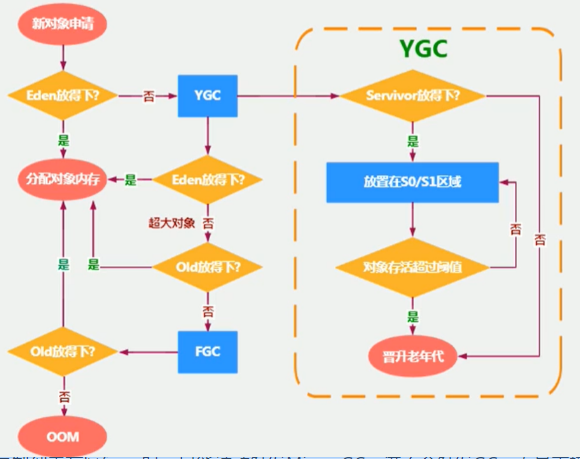
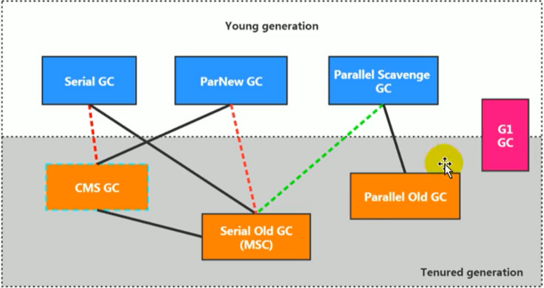

### 一、概述

[虚拟机官方文档](https://docs.oracle.com/javase/specs/jvms/se9/html/index.html )  

[虚拟机参数官方文档](https://docs.oracle.com/javase/8/docs/technotes/tools/unix/java.html)

#### 1. 虚拟机

​        虚拟机就是一台虚拟的计算机，是一款软件，用来执行一系列虚拟的计算机指令。大体上，虚拟机可以分为**系统虚拟机**和**程序虚拟机**。

​        系统虚拟机如Visual Box、VMware ，他们是对物理计算机的仿真，提供了一个完整的可运行的操作系统的软件平台。

​        程序虚拟机的典型代表就是java虚拟机，他专为执行当个计算机程序而设计，在java虚拟机中执行的指令我们称为**Java字节码**

 无论是系统虚拟机还是程序虚拟机，在上面运行的软件都是被限制于虚拟机提供的资源中。

#### 2. java虚拟机

​    **java虚拟机**是一台通过类加载器子系统加载执行java字节码的虚拟计计算机，他拥有独立运行机制，其他运行的字节码也必须又遵守Jvm规范编译而成。

​       JVM平台的各种语言可以共享Java虚拟机带来的跨平台性、优秀的垃圾回收器，以及可靠的即时编译器。Java技术的核心就是Java虚拟机，因为所有的Java程序都是在运行在Java虚拟机内部。

**特点**

- 一次编译到处运行
- 自动内存管理
- 自动垃圾回收功能


### 二、类加载器子系统

####    1、描述

​         类加载器子系统负责从文件系统或网络中加载字节码文件，class文件开头有特定的标识【】；类加载器负责读取 Java 字节代码，并转换成**java.lang.Class**类的一个实例；通过此实例的 `newInstance()`方法就可以创建出该类的一个对象；类加载器只负责字节码文件的加载，是否可以运行则由**Executing Engine**决定。加载类的信息存放在一块称为方法区的内存空间中，其中包括运行常量池信息，以及字符串字面量和数字量；

【类的加载指的是将类的.class文件中的二进制数据读入到内存中，将其放在运行时数据区的方法区内，然后在堆区创建一个 java.lang.Class对象，用来封装类在方法区内的数据结构】

####     2、三个阶段

#####         1）加载

​                   通过类的全限定名获取此类的二进制字节流，通过**类名+包名+ClassLoader实例ID**来标识被加载的类；

 加载后在**堆区创建一个java.lang.Class对象**，**用来封装类在方法区中的数据结构**；

#####         2）链接

​                   链接过程主要负责对二进制字节码的格式进行校验、解析。校验是为了防止不合法的字节码文件，然后解析类中属性、方法、对应权限等。会造成NOSuchMehtodError、NoSuchFieldError等错误信息。

​                   **a、验证：** 确保被加载类的正确性；可以使用-Xverfity:none来关闭大部分的验证

​                   **b、准备：**类变量（static）会分配内存，但是实例变量不会，实例变量主要随着对象的实例化一块分配到java堆中，静态变量在JAVA 1.6中分配在永久代中，1.7以后分配在堆中。数据类型默认值赋值。

​                                                                       

​                   **c、解析：**将常量池中的符号引用转化为直接引用的过程。

#####         3）初始化

​                   初始化过程即为执行类中的静态初始化代码块、构造器、以及静态变量的赋值，此时为非静态变成员分配内存。只有当对类的主动使用的时候才会导致类的初始化，类的主动使用包括以下六种：

​                   **初始化被触发的四种情况：**

​                                  a、 调用new关键字；

​                                  b、反射调用类中的方法；

​                                  c、子类调用初始化【先父类静态代码和静态变量—>子类静态代码和静态变量—>父类构造—>子类构造】；                        

​                                  d、jvm启动过程中指定的初始化类；

​                                  e、访问某个类或接口的静态变量，或者对该静态变量赋值

​                                  f、调用类的静态方法

#### 3、类加载器

​          JVM支持两种类型的类加载器，分为引导类加载器【bootstrap classLoader】和自定义类加载器；

 JVM规范中规定所有派生与抽象类ClassLoader的类加载器都属于自定义类加载器；

​        程序中常见的三个类加载器：

​                      **BootstrapClassLoader ：**

​                                 引导类加载器，由C/C++实现，嵌套在JVM内部；并不继承Classloader，没有上层加载器；用于加载Java的核心库，只加载包名为java、javax、sun等开头的类；作为扩展类加载器和应用/系统类加载器的上层加载器。

​                      **ExtClassLoader：**

​                                  扩展类加载器，由Java语言实现，继承于ClassLoader;上层加载器为引导类加载器。从java.ext.dirs系统属性所指定的目录中加载类库，或JDK的安装目录jre/lib/ext子目录下加载类库。用户引用的jar包放在此目录下，也会由该加载器加载；

​                     **AppClassLoader：**

​                                  系统/应用程序类加载器，由Java语言编写，AppClassLoader类实现；继承于ClassLoader；上层加载器为扩展类加载器。它负责加载环境变量classpath或系统属性，java.class.path指定路径下的类库，程序开发中默认的加载器，一般Java应用类都是由他进行加载。

​        

#####       1）**用户自定义加载器**

​            在Java的开发中，类的加载基本是以上三种加载器相互配合使用，但在某些特殊场景需要自定义类加载器，来定制类的加载方式。

​            **作用：**

​                   a、隔离加载

​                   b、修改类的加载方式

​                   c、扩展加载源

​                   d、加密防止源码泄露

​           **步骤：**

​                   继承**Java.lang.ClassLoader**重写findClass()方法；该方法一般为描述自定义类的加载逻辑。或者需求不复杂时，可以直接继承URLClassLoader类，这样就可以避免findClass方法的编写以及获取字节流的方式，使得自定义类加载器更加简单；

​         **获取方式：**

```java
                  //a、获取当前类的ClassLoader
​                       clazz.getClassLoader();
​                  //b、获取当前线程上下文的ClassLoader
​                       Thread.CurrentThread().getContextClassLoader();
​                 //c、获取系统的ClassLoader
​                        ClassLoader.getSystemClassLoader();
​                //d、获取调用者的cClassLoader
​                        DriverManager.getCallerClassLoder();
```


##### 2）双亲委派机制

​             Java虚拟机对字节码文件采用**按需加载**的方式，而加载虚假的某个字节码文件时对于加载器的选择策略采用**双亲委派模式**，即把待加载的类交由上层加载器处理，逐层向上，直到加载或无法加载再交由逐层向下进行加载。

​           **具体流程**

​               a、当一个类加载器收到类加载请求，会将这个请求交由它的上层加载器去执行。

​               b、当此时的类加载器还存在上层加载器，则进行进一步的委托，依次递归，请求最终到达顶层的引导类加载器。

​               c、如果顶层加载器能完成类加载，加载后进行返回，若无法完成，其下层加载器才会去尝试自己加载。


​           **机制优势：**

​                      a、避免类的重复加载

​                      b、保存程序安全、防止核心API被随意篡改

​       ps：在JVM中多个class对象是否同为一个类的必要条件：

​                             类的完整类名必须一致。

​                             加载类的类加载器必须相同。 

###    三、运行时数据区

####   1、**整体结构图**


#####     1）程序计数器

​                 线程私有、内存空间极小、运行速度快、生命周期和线程一致；**程序计数器会存储当前线程正在执行的当前方法的JVM指令地址**；再由执行引擎读取执行。工作就是通过改变计数器的值来选取下一条需要执行的字节码指令；执行Java方法计数器的值就是字节码指令的地址，如果执行的是native方法，值则为Undefined。此区域是唯一一个没有规定OOM情况的【没有Error，也没有GC】。


​               

#####     2）Java虚拟机栈

######              1、描述

​                  线程私有，生命周期和线程一致，描述的是Java方法执行的内存模型：每个方法执行时都会创建一个**栈帧**【Stack Frame】用于存储局部**变量表、操作数栈、动态链接、方法出口**等。每当调用一个方法时就会创建栈帧然后入栈，执行完就出栈，简而言之就是每一个方法从调用到结束，对应着一个栈帧的入栈出栈过程。【不存在GC】

​                 **作用：**主管Java程序的运行，保存方法的局部变量【八种基本数据类型、对象的引用地址、部分结果、参数与方法的调用和返回】

######                2、 **栈帧**

 

​                           **局部变量表：**

​                                   数字数组，存放编译期确定的各种基本数据类型、对应引用和returnAddress类型【指向一条字节码指令地址】；运行期间不改变大小；方法调用执行结束后就销毁。基本存储单元是Slot【变量槽】；除64位long和double占用两个连续的slot，其余数据类型占用一个slot，jvm为每个slot分配一个索引，从0开始，在非静态方法中0位置一般存储**this引用**，其余按照上下顺序排列；

​                                  局部变量表中的变量也是重要的**垃圾回收根节点**，只要被局部变量表直接或间接引用的对象都不会被回收。

​                                  局部变量表中的槽位是可以重复利用的，当一个方法中局部变量过了其作用域，那么在作用域之后申请新的局部变量就很可能重复使用过期局部变量的槽位；


​                                        

​                          **操作数栈：**在方法执行过程中，根据字节码指令往栈中写入数据或提取数据【压栈或出栈】；比如执行复制、交换、求和等操作；解释引擎时基于栈的执行引擎，其中的栈就是指的操作数栈。


​                          **动态链接：** 在程序运行期间，指向运行时常量池中所属方法的引用，作用是为了将常量池中的符号引用转化为调用方法的直接引用。

​                             相关概念：

​                                      静态链接，在编译期间可知，且运行期保持不变，可以将方法的符号引用转化为直接引用。

​                                      非虚方法，在编译期就确定了具体的调用版本，运行时不可变。【静态方法、私有方法、final方法、实例构造器、父类方法】，除此之外，其他方法称为虚方法。

​                                      虚方法表：每个类都有一个虚方法表，存放着各个”虚方法“的实际入口。该表在类加载的链接阶段创建，在类变量初始化完成后。【动态分配】

​                            方法调用指令：

​                                     普通调用指令：

​                                           a、invokestatic ：调用静态方法，解析阶段确定唯一版本

​                                           b、invokespecial ：调用构造器方法、私有方法、父类方法，解析阶段确认唯一版本

​                                           c、invokevirtual ：调用系统认定的所有虚方法

​                                           d、invokeinterface：调用接口方法

​                                     动态调用指令【jdk7后新增】         

​                                           e、invokedynamic ：动态解析出需要调用的方法，然后执行【Lambd表达式，jdk8的新特性】。

​                                     普通方法调用指令在虚拟机内部，方法的调用执行不可干预；动态调用指令则支持由用户确定方法版本，invokestatic 和invokespecial 调用的方法一定是非虚方法，invokevirtual 则不一定。


​                         

​                             


  

​                          **方法返回地址：**

​                                           存放调用该方法pc寄存器的值，方法的退出：**正常退出**以及**异常退出**，本质上就是当前栈帧出栈的过程，此时需要恢复即将复位的方法的局部变量表、操作数栈等以及返回值压栈等来保证程序能够继续执行；在方法退出后都要返回到该方法被调用的位置；

​                                           方法正常退出时：**调用者的pc寄存器的值作为返回地址，即调用该方法的指令的下一条指令地址，**

​                                          异常退出：不会给上层调用者产生任何的返回值，是通过异常表来确定。

​                         **一些附加信息：**

​                    

​                

######                 3、 常见错误

​                       StackOverFlowError: 线程请求的栈深度大于虚拟机所允许的最大深度。【无出口的递归场景】

​                       OutOfMemoryError：如果虚拟机可以动态扩展栈深度，而扩展申请的无法得到足够的内存。

######                 4、调优 

​                      

```java
// 修改虚拟机栈大小： -Xss+大小+单位【k、m、g】调整虚拟机栈的大小
```


#####     3）本地方法栈

​                 与Java虚拟机栈不同的是，本地方法栈为执行Native方法服务。也有StackOverFlowError和OutOfMemeoryError；【不存在GC】         

#####     4）Java堆*

######         1、概述

​         线程共享，主要存放**对象实例和数组**。内部会划分出很多个线程私有的分配缓冲区【TLAB】。可以位于物理上不连续但**逻辑连续的空间**。这块区域是JVM所管理的最大区域。【GC的主要区域】


​        在 JDK7及之前内存逻辑上分为三部分：新生代+老年代+**永久区**

​        JDK8及以后堆内存逻辑上分为：新生代+老年代+**元空间**

```java
//设置堆初始大小                     -Xms+大小+单位【默认电脑内存/64】
//设置堆最大大小                     -Xmx+大小+单位【默认电脑内存/4】
//设置新生代与老年代的比例             —XX:NewRatio=值【老年代/新生代，默认值是2】
//设置Eden，from，to区比例           -XX:SurvivorRatio【默认值为8:1:1，实际值6:1:1，需显示设置为8】
//设置新生代的内存大小                -Xmn+大小+单位【与比例设置冲突，以大小为准】
//新生代内存动态分布开关               -XX:+-UseAdaptiveSizePolicy【】
 
//查看jvm设置参数 方式一:             -XX:+PrintGCDetails   【查询运行结束后】
//查看jvm设置参数 方式二:             控制台 jps 查询进程号  jstat -gc+进程id
//查看JVM具体参数                    控制台 jinfo -flag 参数名称 进程号
开发中建议初始大小和最大大小相同，避免扩容带来的资源消耗，以及频繁的GC。

```


###### 2、一般对象分配过程

​      创建的对象一般分配在Eden区，当大对象【超过Eden区有效内存】直接放在老年代；只有当Eden区满会触发MInor/Young GC，当复制到幸存区from时，幸存区只能被附带触发Minor GC，不足不会触发GC，而是直接将对象放入老年代。

新生代频繁发生GC，老年代很少发生GC，永久区/元空间几乎不会发生GC。

​        

###### 3、TLAB

​      【Thread Local Allocation Buffuer】

​       对象实例的创建在JVM中非常频繁，因此在**并发环境下在堆中划分内存空间是线程不安全**的，但**直接使用加锁机制会影响分配速度。**所有对Eden区进行划分，JVM为每个**线程分配**了一个私有的**缓存区域**，包含在Eden区内部，内存空间非常小，默认仅占Eden的1%。

​       JVM将TLAB作为内存分配的首选，一旦分配失败，再尝试使用加锁的机制，保证操作的原子性进行分配。这种分配方式称为**快速分配策略**，可以避免一系列的非线程安全问题，同时提升内存分配的吞吐量。所以**堆不完全是线程共享的区域**。

```java
//-XX:+-UseTLAB   开启TLAB分配方式【默认开启】
//-XX:TLABWasteTargetPercent 设置TLAB缓冲在Eden的占比
```

###### 4、栈上分配

​        “ 随着JIT编译器的发展与逃逸分析技术的逐渐成熟**，逃逸分析、锁消除、标量替换**等优化技术将会导致一些微妙的变化，所有对象都分配在堆上也变得不那么’绝对‘了”——《深入理解Java 虚拟机》

​           **锁消除/同步省略:** 我们知道线程同步锁是非常牺牲性能的，当编译器确定当前对象只有当前线程使用，那么就会移除该对象的同步锁。例如，StringBuffer 和 Vector 都是用 synchronized 修饰线程安全的，但大部分情况下，它们都只是在当前线程中用到，这样JIT编译器就会优化移除掉这些锁操作。

锁消除的 JVM 参数如下：

 ```java
//开启锁消除：-XX:+-EliminateLocks//
//锁消除在 JDK8 中都是默认开启的，并且锁消除都要建立在逃逸分析的基础上。
 ```

​          **标量替换：**基础类型和对象的引用可以理解为标量，它们不能被进一步分解。而能被进一步分解的量就是聚合量，比如：对象。对象象是聚合量，它又可以被进一步分解成标量，将其成员变量分解为分散的变量，这就叫做标量替换。

撒大   

```java
//标量替换开关：    -XX:+-EliminateAllocations
```

​         **逃逸分析：**该算法引入了连通图，用连通图来构建对象和对象引用之间的可达性关系，并在次基础上，提出一种组合数据流分析法。由于算法是上下文相关和流敏感的，并且模拟了对象任意层次的嵌套关系，所以分析精度较高，只是运行时间和内存消耗相对较大。

​        逃逸分析的 JVM 参数如下：

 ```java
  // 逃逸分析开关：-XX:+-DoEscapeAnalysis
  //显示分析结果开关：-XX:+-PrintEscapeAnalysis
  //逃逸分析技术在 Java SE 6u23+ 开始支持，并默认设置为启用状态，可以不用额外加这个参数。
 ```

​      **栈上分配：** 存在一种特殊的内存分配情况，如果经过JVM逃逸分析后发现，一个对象并没有逃逸出方法的话，该对象就可以通过**标量替换**分解成成员标量**分配在栈内存中**，和方法的生命周期一致，随着栈帧出栈时销毁，减少了 GC 压力，提高了应用程序性能。

常见的逃逸场景：给类成员变量赋值，方法返回值，实例的引用。

```java
/**
 * 栈上分配
 * —Xms1G   -Xmx1G   -XX:-DoEscapeAnalysis -XX:PrintGCDetalis
 * 堆内存分配1G,对比开启逃逸分析情况下创建一千万个对象的性能
 */
public static void testStackAllocation() throws InterruptedException{
    long sTime=System.nanoTime();
    for (int i=0;i<10000000;i++){
        creatStudent();
    }
    long eTime=System.nanoTime();
    System.out.println("消耗时间："+(eTime-sTime)/1000000);
    Thread.sleep(10000000);
}

public static void creatStudent(){
    Student student=new Student();
}
```

**结论：在平时开发过程中就要可尽可能的控制变量的作用范围了，变量范围越小越好，让虚拟机尽可能有优化的空间。**


######      5、StringTable【串池】

StringTable是一个大小固定的HashTable，JDK 6默认大小是1009，放入过多就会造成Hash冲突严重，从而导致链表过长，直接影响查找的时间复杂度，导致性能下降。

JDK 7中，默认大小是60013，JDK 8中的最小长度不可小于1009.

```javascript
//设置StringTable桶大小 -XX:StringTableSize
```


```java
/**
 * 测试字符串常量池的位置，1.6存在于永久代【方法区】 1.6以后移入heap区
 * 原因：永久代空间不足，方法区的GC效率较低，而StringTable中有大量需要回收的资源。heap区GC效率更高。
 * 修改heap区大小  -Xms+大小+单位  -Xmx+大小+单位
 */
public static void testStringTable(){
    List<String> list=new ArrayList<>();
    int j=0;
    try {
        for (int i=0;i<100000;i++,j++){
            list.add(String.valueOf(i).intern());
        }
    } catch (Exception e) {
        e.printStackTrace();
    } finally {
        System.out.println(j);
    }
}

//结果：java.lang.OutOfMemoryError: Java heap space
```

```java
//虚拟机配置  
//堆大小   开启StringTable统计打印  开启GC打印 级别为 verbose
//-Xmx20m  -XX:+PrintStringTableStatistics -XX:+PrintGCDetails -verbose:gc

//GC
[GC (Allocation Failure) [PSYoungGen: 5402K->497K(6144K)] 5402K->3545K(19968K), 0.0041615 secs] [Times: user=0.06 sys=0.00, real=0.00 secs] 


//堆区
Heap
 PSYoungGen      total 6144K, used 4230K [0x00000000ff980000, 0x0000000100000000, 0x0000000100000000)
  eden space 5632K, 66% used [0x00000000ff980000,0x00000000ffd253a0,0x00000000fff00000)
  from space 512K, 97% used [0x00000000fff00000,0x00000000fff7c530,0x00000000fff80000)
  to   space 512K, 0% used [0x00000000fff80000,0x00000000fff80000,0x0000000100000000)
 ParOldGen       total 13824K, used 3048K [0x00000000fec00000, 0x00000000ff980000, 0x00000000ff980000)
  object space 13824K, 22% used [0x00000000fec00000,0x00000000feefa010,0x00000000ff980000)
 Metaspace       used 3240K, capacity 4500K, committed 4864K, reserved 1056768K
  class space    used 350K, capacity 388K, committed 512K, reserved 1048576K
                                 
//符号表  
SymbolTable statistics:
Number of buckets       :     20011 =    160088 bytes, avg   8.000
Number of entries       :     13240 =    317760 bytes, avg  24.000
Number of literals      :     13240 =    566440 bytes, avg  42.782
Total footprint         :           =   1044288 bytes
Average bucket size     :     0.662
Variance of bucket size :     0.662
Std. dev. of bucket size:     0.814
Maximum bucket size     :         6
//StringTable  map实现                               
StringTable statistics:
Number of buckets       :     60013 =    480104 bytes, avg   8.000   桶个数
Number of entries       :    101686 =   2440464 bytes, avg  24.000   实体个数
Number of literals      :    101686 =   5674544 bytes, avg  55.805
Total footprint         :           =   8595112 bytes
Average bucket size     :     1.694
Variance of bucket size :     1.171
Std. dev. of bucket size:     1.082
Maximum bucket size     :         7


```

```java
1.面试
String s1=new String("a");// new 一个常量池中不存在的字符，会在堆空间创建一个对象，然后再在常量池放入‘a’对象，实际上创建了两个对象。
s1.intern();//常量池中已经存在‘a’，返回‘a’的引用地址。
String s2="a";
System.out.print(s1==s2);//jdk6：false  jdk7/8：false

2.
String s3=new String("a")+new String("b");//s3的地址为：new String("ab");
//先创建StringBuffer对象，在创建两个String对象，a，b字符入池，五个对象。最后toString("ab")——>new String("ab");
// StringBuilder的toString方法不同在于"ab"并未入池,
s3.intern();//s3对应字符入池
String s4="ab";
//jdk6：常量池在永久代中，常量池中会创建“ab”对象；
//jdk7/8：常量池在堆中，由于字符”ab“对象存在于堆中，故常量池中不会创建”ab“对象，而是引用堆中”ab“对象的地址。
System.out.print(s3==s4);//jdk6：false  jdk7/8:true;
```

总结String的intern()方法的使用：

​        在jdk6中：串池在永久代，尝试将字符串放入串池，若已经存在，则不放入，返回已有的串池中的对象地址；**若没有，则把此对象复制一份放入串池，并返回这个对象的地址。**

​        在jdk7开始：串池在元空间，尝试将字符串放入串池，若已经存在，则不放入，返回已有的串池中的对象地址；**若没有，则把此对象的引用地址放入串池，并返回引用地址。**

#####     5）方法区

​                线程共享，属于共享内存区域，存储已经被虚拟机**加载的类信息、常量、静态变量**【1.6在方法区，后在堆区】、**方法信息**、**即时编译**【JIT代码缓存】后的代码等数据。其中就包括**运行时常量池**：用于存放编译期生成的各种字面量和符号引用。编译期和运行期都可以将常量放入池中。内存有限，无法申请时抛出OOM的错误。【存在Error和GC】


###### 1）演变

​           原因：

​                a、永久代设置的空间大小难以确定，加载类过过很容易出现OOM。元空间存在于本地内存，默认大小只受本地内存限制。

​                b、对永久代进行调优很困难，该区域GC效果难以令人满意，部分区域的回收但又确实必要。方法区GC主要回收两部分：运行常量池中废弃的常量以及不再使用的类型。


**JDK 6**


**JDK7**


**JDK8**


###### 2）**运行时常量池**

​           常量池：是java文件编译后生成的**字节码文件中**的一部分，用于存放**编译期生成的各种字面量与符号引用**【数值，字符串值、类引用、字段引用、方法引用】。

​           JVM为每个已加载的类型【类、接口、枚举】维护一个运行期间的常量池，池中的数据项通过索引访问。其中包括编译期确定的数值字面量，更包括**运行解析后才能获得的方法或字段引用**，此时已经由符号引用转换为**真实的地址**了。相对于字节码中的常量池，具有动态性的特征。若构造运行常量池时超过方法区提供的最大内存空间会抛出OOM异常。


```java
 //修改方法区内存 -XX:MaxMetaSpaceSize=20m
```

```java
*   方法区(概念) ==>   1.6   永久代 (实现)
*                    1.7后  元空间(实现) 放入本地内存 大小只受本地内存的限制
```


 


#### 2、jvm过程

​      **启动：** 虚拟机的启动是通过引导类加载器创建一个初始类来完成，这个列是由虚拟机的具体实现指定；

​      **执行：**一个运行中的虚拟机只有一个任务，执行java程序，程序开始执行他才运行，程序结束时他就停止。

​      执行java程序的时候，其实是在执行一个叫 Java 虚拟机的进程【pid】；

​     **结束：** 结束分为以下几种情况

​                        程序正常执行结束

​                        执行过程遇到异常或错误而异常终止；

​                        操作系统出现错误而导致Java虚拟机进程终止；

​                        某线程调用api中的runtime类或system类的exit方法或直接runtime的halt方法，并且Java安全管理器也允许这次exit或halt操作；

------

#### 3、常见面试题

```java
   - JVM的内存结构，Eden区和Survivor区的比例  //8:1:1
   - JVM堆内存为什么要分成新生代、老年代、永久代。新生代为什么要分成Eden和survivor  //根据对象生存时间的差异进行分代回收
   - JVM在 Java8的时候做了什么修改，其中的内存分代改进是什么   //将方法区的实现改为元空间，并纳入本地内存；串池和static变量纳入堆中存储。
   - JVM内存分了哪几个区，每个区的作用。//虚拟机栈、本地方法栈、程序计数器、堆区、方法区
   - JVM永久代中会发生垃圾回收吗       //基本不会
   - 什么时候对象会进入老年代          //新生代大小不足或者对象的年龄大于阈值
```


### 四、执行引擎

​           当源代码转化为字节码之后，其实要运行程序，有两种选择。一种是使用 Java **解释器**解释执行字节码，另一种则是使用 JIT **编译器**将字节码转化为本地机器代码。默认情况下HotSpot采用两者并存的方式。可以进行调整：

| JVM参数 | 采用策略                                                     |
| ------- | ------------------------------------------------------------ |
| -Xint   | 完成采用解释器模式执行程序                                   |
| -Xcomp  | 采用即时编译器模式来执行程序，若即时编译出现问题，解释器还介入执行。 |
| -Xmixed | 采用解释器+即时编译器的混合模式共同执行程序                  |


####          1、解释器

​       需要逐条解释字节码，全部完成方可运行，启动时间慢。

####          2、即时编译器【JIT】

​      在程序运行过程中，将字节码转化为可在硬件上直接运行的机器码并部署至托管环境中的过程。在HotSpot VM中内嵌有两个JIT编译器，分别为Client Compiler【C1】和Server Compiler【C2】。可进行JVM参数指定

#####       1、C1 

​            -client：指定JVM运行在Client模式下，并使用c1编译器；c1编译器会对字节码进行简单和可靠的优化，耗时短，以达到更快的编译速度。

​               **优化策略**：方法内联、去虚拟化、冗余消除。

​                         方法内联：将引用的函数代码编译到引用点处，可以减少栈帧的生成，减少方法参数传递以及跳转过程。

​                         去虚拟化：对唯一的实现类进行内联。

​                         冗余消除：在运行期间把一些不会执行的代码进行折叠。

#####      2、C2

​          -server：运行在Server模式下，C2进行耗时较长的优化，以及激进优化。但优化的代码执行效率更高。优化失败可以将解释器作为执行的“逃生门”，

​               **优化策略**：在全局局面上，逃逸分析是基础。

​                        标量替换：用标量值替代聚合对象的属性值。

​                        栈上分配：对于未逃逸出方法的对象分配在栈而不是堆。

​                        同步消除：清楚同步操作，通常指synchronized。   

#####    3、热点探测

######        1） **热点探测功能**

​          **热点代码：** 多次被调用的方法或者一个方法的内部循环体。次数由一个阈值确定

​          JVM采用基于计数器的热点探测，为每个方法建立两个不同类型的计数器：方法调用计数器、回边计算器。

​                     方法代用计数器：

​                            统计方法调用的次数，在c1模式模式下1500次，在server模式在是10000。超过阈值就会触发即时编译。阈值参数可以由-XX：CompileThreshold来设定。当一个方法被调用时会先检查是否被JIT编译过，存在则直接**使用方法区的JIT缓存代码**执行，不存在则方法计数器值+1，然后判断**方法调用计数器与回边计数器值之和**是否**超过方法调用计数器的阈值**。超过则向即时编译器提交编译请求。

​                    回边计数器：用于统计循环体执行的循环次数。

​       **分层编译策略：** 开启性能监控可以出发C1编译器，加上性能监控会根据性能监控信息进行激进的优化。在Java 7以后，一旦使用“**-server**”，则默认开启 分层策略，由C1和C2编译器相互协作共同来执行编译任务。

#####   4、**热度衰减**

​                对于统计方法调用次数，默认统计的是一个相对执行的频率，即一段时间之内方法被调用的次数。如果这段时间内人无法超过阈值，那么方法的调用计算器就会减少一半，这个过程称为【方法计数器热度的衰减】，这段时间称为此方法的【半衰周期】。

​              进行热度衰减的动作是在JVM进行垃圾回收时顺便进行的，可以使用JVM参数【-XX:+-UseCounterDecay】开关进行发关闭，关闭后统计的就是方法调用的绝对次数。这样运行长时间后，大部分代码将会被编译成缓存代码。或者设置半衰周期的大小【-XX:CounterHalfLifeTime】单位是秒。

​         

#####   5、总结

         - 一般来讲，JIT编译出来的机器码性能比解释器高。
         - C2编译器启动时长比C1编译器慢，系统稳定执行以后，C2编译器执行速度远远比C1编译器快。

#### 3、AOT编译器       

​     JDK 9引进了AOT编译器【静态提前编译器，Ahead of Time Compiler】，在程序运行之前进行编译；目前具有实现性，借助了Graal编译器，将所输入的Java类文件转化为机器码，并存放至生成的动态共享库之中。

​      优点：JVM直接加载编译后的机器码，可以直接运行，不必等到即时编译器的预热。减少“第一次运行慢”的不良体验。

​      缺点：破坏了夸平台性，必须为每个不同硬件、OS编译对应的发行包，每种操作系统的机器指令不同。降低了Java链接过程的动态性，加载的代码在编译器必须全部已知。还需要持续优化，最初只支持Linux X64 系统。

​       

### 五、GC

​        垃圾的定义：垃圾是指对象在程序运行期间没有任何指针指向他，这个对象就是需要被回收的对象。

#### 1、判断回收对象

#####     1)  引用

- 强引用（Strong Reference)
- 软引用（Soft Reference)
- 弱引用（Weak Reference)
- 虚引用（Phantom Reference)
- 引用队列：引用队列可以配合软引用、弱引用及幽灵引用使用，当引用的对象将要被JVM回收时，会将引用加入到引用队列中。可以在构造引用的时候传入也一个引用队列。一般用于跟踪对象的回收情况。

​    这四种引用从上到下，依次减弱

###### **1.1 强引用**

​       强引用就是指在程序代码中普遍存在的，类似`Object obj = new Object()`这类似的引用，只要强引用在，垃圾搜集器永远不会搜集被引用的对象。也就是说，宁愿出现内存溢出，也不会回收这些对象。

###### 1.2 软引用

​      软引用是用来描述一些有用但并不是必需的对象，在Java中用`java.lang.ref.SoftReference`类来表示，可以通过get方法获取对象。对于软引用关联着的对象，只有在**内存不足的时候**JVM才会回收该对象。因此，软/弱引用这一点可以很好地用来解决OOM的问题，并且这个特性很适合用来实现缓存：比如网页缓存、图片缓存等。


```java
 /**
     * 修改堆区大小： -Xmx20m
     * 打印GC信息     -XX:-PrintGCDetails -verbose:gc
     * 测试软引用在内存不足时的回收情况
     */
    public static void testSoftReference(){
        //引用队列
        ReferenceQueue<byte[]> queue=new ReferenceQueue<>();
        List<SoftReference<byte[]>> list=new ArrayList<>();
        for(int i=0;i<5;i++){
            SoftReference<byte[]> b=new SoftReference<>(new byte[_4Mb],queue);
            list.add(b);
            System.out.println("list容量: "+list.size());
        }
        Reference<? extends byte[]> poll = queue.poll();
        while (poll!=null){
            list.remove(poll);
            poll=queue.poll();
        }
        System.out.println("=======================================");
        for (SoftReference<byte[]> s:list ){
            System.out.println(s.get());
        }
    }
```

###### 1.3 弱引用

​       弱引用也是用来描述非必需对象的，可以通过get方法获取对象。当JVM进行垃圾回收时，无论内存是否充足，都会回收被弱引用关联的对象，相当于**被弱引用关联的对象只能存活到下一次GC之前**，但是由于垃圾回收器的线程优先级很低，因此不一定能很快的进行GC，所以弱引用的存活时间可能会很长；在Java中，用**` java.lang.ref.WeakReference`**类来表示。

###### 1.4 虚引用/幽灵引用

​     它并不影响对象的生命周期。在java中用`java.lang.ref.PhantomReference`类表示。如果一个对象与虚引用关联，则跟没有引用与之关联一样，在**任何时候都可能被垃圾回收器回收**。要注意的是，**虚引用必须和引用队列关联使用**，当垃圾回收器准备回收一个对象时，如果发现它还有虚引用，就会把这个虚引用加入到与之 关联的引用队列中。**使用的唯一目的就是能在这个对象被回收前收到一个系统通知，可以将一些资源释放操作放在虚引用中执行和记录**。无法通过get方法获取对象。

###### 1.5 总结

​       开发中强引用的场景占大部分；软/弱引用非常适合用来保存那些可有可无的缓存数据，内存不足时被回收，内存充足时可以存活长时间，也不会导致内存溢出，从而起到加速系统的作用；

#####               2）引用计数法

​                   在Java中是通过引用来和对象进行关联的，所以操作对象，必须通过引用进行。该办法就是通过引用计数来判断一个对象是否可被回收。若不存在任引用关联该对象，说明该对象没有被使用，那么这个对象就可被回收。实现简单，效率较高，但**无法解决循环引用的问题，所有Java虚拟机中并未采用该算法**。python早期采用。


​          

#####           3）可达性分析算法

​         基本思路就是通过一些被称为引用链（GC Roots）的对象作为起点，从这些节点开始向下搜索，搜索走过的路径被称为（Reference Chain)，当一个对象到GC Roots没有任何引用链相连时（即从GC Roots节点到该节点不可达），则证明该对象是不可用的。

​      **GC Roots：** 虚拟机栈中引用的对象【局部变量】、本地方法栈引用的对象、方法区类静态属性引用的对象、方法区常量引用的对象、同步锁持有的对象、其他系统相关的引用对象等。此外根据用选择的垃圾收器器的不同和回收区域的不同，会有“临时性”其他引用对象的加入，他们一起构成**GC Roots集合**。


#### 2、finalization机制

​        Java提供了**对象终止机制**，来允许开发人员对象销毁之前的进行的操作，垃圾回收此对象之前总会调用这个对象的finalize方法。该方法允许被子类重写，用于垃圾回收时释放资源和清理工作。永远不要主动去调用该方法，应由垃圾回收机制进行调用。

​      **由此对象的三种状态**

​            可触及的：从根节点开始，可以达到这个对象。

​            可复活的：对象的所有引用都被释放，但对象有可能在finalize方法中复活。

​            不可触及的：对象的finalize方法被调用，但并没有复活。不可触及的对象不可能被复活，因为finalize方法只能调用一次。

​      **回收的两次标记过程**

​                   1、该对象到GC Roots没有引用链，则继续第一次标记。

​                    2、进行筛选，判断此对象是否有必要执行finalize方法。

​                                 1）如果该对象没有重写finalize方法或者已经被调用过，那么被判定位不可触及的对象。可进行回收。

​                                  2）如果重写finalize方法且没有调用过，那么该对象会插入到F-Queue队列中。由一个虚拟机自动创建的、低优先级的Finalizer线程触发队列中的finalize方法。

​                                3）触发finalize方法是对象最后的逃生机会，若在执行finalize方法后对象与GC Roots可达，那么将移除该队列。否则进行第二次标记，然后将被二次标记的对象进行回收。

总结：

     - finalize方法可能会导致对象复活
     - finalize方法的执行时间是没有保障的，完全由GC线程决定，极端情况下，不发生GC则永远不会执行该方法。
     - 一个糟糕的finalize方法会严重影响GC性能。


#### 3、垃圾回收算法

##### 1、标记清除(Mark-Sweep)

​     标记-清除算法分为两个阶段：标记阶段和清除阶段。标记阶段就是从引用根节点开始遍历，标记所有被引用的对象，一般是在对象头中记录为可达对象，清除则是对堆内存从头到尾进行线性遍历，如果对象头没有被标记为可达对象，则将其进行回收。速度快，但留下内存碎片。


##### 2、标记整理 (Mark-Compact)

​      该算法标记阶段和Mark-Sweep一样，但是在完成标记之后，将所有存活的对象移动到内存的一端，按顺序排放，之后再清理边界外所有的空间。


##### 3、复制 (Copy)

​      将可用内存按容量划分为大小相等的两块，每次只使用其中的一块。当这一块的内存用完了，就将还存活着的对象复制到另外一块上面，然后再把已使用的内存空间一次清理掉。**不存在内存碎片，但内存利用率不高**。特别的，当垃圾不多，需要复制的对象就会过多，影响效率。所以堆区-新生代采用这个算法进行回收是很合理的，因为新生代70-80%的对象都是”朝生夕死“，存活的并不多，需要复制的对象不多。

#### 4、分代回收*

##### 1）概述

​       将堆内存分为两块，新生代和老年代。默认情况下，**新生代和老年代的内存默认比例是 1:2**，该值可以通过 `-XX:NewRatio` 来设定。新生代垃圾回收频率高，老年代垃圾回收频度低，用于存放高频使用的对象。新生代有细分为：**Eden、Form Survivor、To Survivor 三个区域**，默认的比例是 **8:1:1**，可以通过 **-XX:SurvivorRatio**来设定。**大对象直接存储到老生代**，通过参数 `-xx:PretrnureSizeThreshold` 来设定大对象的值。【注意：**该参数只有 Serial 和 ParNew 垃圾回收器有效。**】

- 对象首先分配在伊甸园区域。【当对象大小超过eden区大小时，直接放入老年代，老年代无法承载则抛出OOM】
- 当新生代空间不足时，触发 Minor GC，伊甸园和from区域存活的对象使用复制算法复制到to区域中，存活的对象年龄参数+1，并和from交换区域。
- minor gc会触发stop the world，暂停其他用户的线程，等垃圾回收结束后，恢复使用【垃圾回收会移动对象，对象地址发生改变】
- 当新生代对象年龄参数超过一个阈值，会被晋升到老年代。最大参数数15，对象头中分配4bit位进行存储。
- 当老年代空间不足，会先尝试触发minor gc，完成后若空间仍然不足，则触发Full GC，stw时间会更长。


##### 2）回收概念区分

​         JVM在进行GC时，并非每次都对新生代、老年代、方法区这三个区域一起回收。大部分是对新生代的回收。针对HotSpot VM的实现，按照GC的回收区域分为两大类：一种是部分回收【Partial GC】，一种是整堆回收【Full GC】。

​      **部分回收：**

​            新生代回收【Minor GC / Young GC】：只是新生代的回收回收【Eden，S0，S1】；

​            老年代回收【Major GC / Old GC】：只是老年代的垃圾回收。   速度比 Minor GC 慢10倍以上

​            混合回收【Mixed GC】：对新生代以及部分老年代的垃圾回收。【目前只有G1 GC存在这种行为】

​      **整堆回收：** **Full GC**      

​            对整个 Java堆和方法区的垃圾回收。Full GC开发或调优中尽量要避免的，这样STW时间会短一些，进而提高系统的吞吐量。

​            **Full GC触发情况**

​                 a. 调用System.gc()时，系统建议执行Full GC，但是执行不是必然的。

​                 b. 老年代空间不足。

​                 c. 方法区空间不足。

​                 d. 通过Minor GC进入老年代的**平均大小**大于老年代的可用内存。

​                 e. 当由from区向to区复制时，而to区内存不够，再尝试复制到老年代，而老年代也内存不足。

#### 5、分区回收

​            在相同条件下，堆空间越大，一次GC的时间就越长，由于GC产生的停顿时间就越长，为了降低GC的**延迟性**，将一块大的连续内存空间分割成多个小块，根据目标的停顿时间，每次合理的回收若干个小块，而不是整个堆空间，从而减低延迟性。分代回收是按对象的生命周期划分成两个部分，分区回收则是将堆空间划分成多个不同小区间region。每一个小区间都独立使用，独立回收。优点是可以控制一次回收区间的个数。


​           

#### 6、垃圾回收器

#####         1）GC的性能指标

######       1、吞吐量

​            CPU用于运行用户线程的时间与总消耗时间的比值：吞吐量=用户线程时间/(用户线程时间+垃圾收集时间)

​            吞吐量优先的情况下，必然需要降低内存回收的频率，进而导致GC需要更长的时间来进行回收，暂停时间就较高，高吞吐量的应用程序有更长的时间基准，能够容忍略高的延迟性。即提高程序的处理能力，那么每次GC暂停的时间就会略长。

######       2、暂停时间【延迟性】

​           执行垃圾收集时，程序的工作线程被暂停的时间。低延迟优先的情况下，为了降低每次执行内存回收的暂停时间，那么只能频繁的进行内存回收，必然导致程序的吞吐量下载。

######       3、内存占用

​           Java 堆区所占的内存大小。

######       4、现行标准

​           在最大吞吐量优先的情况下，降低停顿时间。

**JAVA 14经典垃圾回收器的分布**

虚线是已经移除的搭配，在JDK14中已经移除CMS




- 最大化应用程序的吞吐量：Parallel GC；
- 最小化使用本地内存和并行开销：Serial GC；
- 最小化GC的中断和停顿时间：CMS；


#####         1）串行类垃圾回收器

######           1、Serial

​               新生代回收器，**Serial** 最早的垃圾回收器，JDK 1.3.1 之前**新生代**唯一的垃圾回收器，使用的是单线程串行回收方式，在单 CPU 环境下性能较好，因为单线程执行不存在线程切换。是client模式下默认的新生代回收器。

​                   使用算法： **复制算法**

​                   指定收集器： **-XX:+UseSerialGC**

######           2、Serial Old

​             老年代回收器，同样也是单线程的。它有一个实用的用途作为CMS收集器的备选预案，或者与Parallel搭配使用。是client模式下默认的老年代回收器。

​                 使用算法： **标记-整理**

​                 指定收集器： **-XX:+UseSerialGC**

​               


#####         2）并行回收器

​       并行描述的是多条垃圾线程之间的关系，用户线程处于等待状态。

######         1、Parallel Scavenge【Parallel】

​             新生代回收器 ， Parallel 是**吞吐量优先**的收集器，GC停顿时间的缩短是以吞吐量为代价的。这样停顿的时间确实缩少了，目标是达到可控制的吞吐量，自 适应调节策略也是Parallel 与ParNew 相比一个重要的区别。主要适合在后台运算而不需要太多交互，常见的使用场景：批量处理，订单处理，工资支付等。

​                  使用算法： **复制**

​                  指定收集器： **-XX:+UseParallelGC**【 jdk1.8下默认开启】

######         2、Parallel Old

​             老年代回收器，Parallel Old 是 Parallel 的老生代版本，同样是吞吐量优先的收集器。二者可以互相激活。用于替代Serial Old收集器。 

​                  使用算法： **标记-整理**

​                  指定收集器： **-XX:+UseParallelOldGC**【 jdk1.8下默认开启】

​                  

​                  

 **相关配置**

```
-XX:+UseAdaptiveSizePolicy          动态分配幸存区比例、自动调整晋升阈值【开关】
-XX:GTTimeRatio=ratio               GC时间占比 ，提高吞吐量【1/（1+r）r默认为99：1%，一般设置为19：5%】
-XX:MaxGCPauseMillis=ms             默认200毫秒，垃圾回收最大暂停时间，【降低吞吐量】。与GC比例有一定的矛盾性，慎用。
-XX:ParallelGCThreads=n             垃圾回收线程个数，默认为系统cup核数。CPU》8时 n=3+(5*核数/8)   
```

######        3、ParNew        

​            新生代垃圾回收器，它是Serial的多线程版本，除开是并行回收之外，与Serial并无差别,在多核环境下，可以充分利用CPU、多核心等物理硬件资源，目前除Serial，只有ParNew可以与CMS搭配使用。

```
-XX:+-UseParNewGC             开启ParNew垃圾收集器
-XX:ParallelGCThreads=count   指定线程数，默认为系统CPU核数
```

​            

#####         3）并发回收器

并发描述的是用户线程和垃圾回收线程之间的关系，二者同时进行。

######    1、CMS

​             **CMS**（Concurrent Mark Sweep）一种以获得最短停顿时间为目标的收集器，低延迟，非常适用B/S系统。

使用 Serial Old 作为后备方案整理内存。在JDK14中被移除。


- 初始标记

​            标记 GC Roots 直接关联的对象，需要 Stop The World 。时间非常短

- 并发标记

​            从 GC Roots 开始对堆进行可达性分析，找出活对象。时间较长，

- 重新标记

​             重新标记阶段为了修正并发期间由于用户进行运作导致的标记变动的那一部分对象的标记记录。这个阶段的停顿时间一般会比初始标记阶段稍长一些，但远比并发标记的时间短，也需要 Stop The World 。

- 并发清除

​            除垃圾对象。

**CMS 缺点：**

​	**1、对 CPU 资源要求敏感。**

​          CMS 回收器过分依赖于多线程环境，默认情况下，开启的线程数为（CPU 的数量 + 3）/ 4，当 CPU 数量少于 4 个时，CMS 对用户本身的操作的影响将会很大，因为要分出一半的运算能力去执行回收器线程。

​	**2、CMS无法清除浮动垃圾。**

​           浮动垃圾指的是CMS清除垃圾的时候，还有用户线程产生新的垃圾，这部分未被标记的垃圾叫做“浮动垃圾”，只能在下次 GC 的时候进行清除。

​	**3、CMS 垃圾回收会产生大量内存碎片。**

​           CMS 使用的是**标记-清除算法**，所有在垃圾回收的时候回产生大量的空间碎片。

注意：**CMS 收集器中，当老生代中的内存使用超过一定的比例阈值时，系统将会开始CMS垃圾回收；当剩余内存不能满足程序运行要求时，系统将会出现 Concurrent Mode Failure，临时采用 Serial Old 进行清除，此时的性能将会降低。**

使用算法： **标记-清除**

```java
相关参数： 
-XX:+UseConcMarkSweepGC                 //老年代使用CMS,新生代默认使用Parallel
-XX:CMSInitiatingOccupanyFraction=ratio  //设置内存使用率的阈值开始CMS，而不是老年代不足时开始回收
//内存增长缓慢，值大：降低CMS触发的频率，改善程序的性能。
//内存增长缓慢，值小：避免频繁触发老年代串行收集器，
-XX:+UseCMSCompactAtFullCollection      //在Full GC后进行内存的碎片整理，无法并发执行，停顿时间会变长’
-XX:CMSFullGCBeforeCompaction=n         //设置Full GC多次次后开始整理内存碎片
—XX:ParallelCMSThreads=n                //设置CMS线程数量，默认（ParalleGCThreads+3）/4  ParalleGCThreads:新生代线程个数

```


######    2、G1

​       **G1** GC 这是一种兼顾吞吐量和停顿时间的 GC 实现，是 JDK 9 以后的默认 GC 选项。G1 可以直观的设定停顿时间的目标，相比于 CMS GC，G1 未必能做到 CMS 在最好情况下的延时停顿，但是最差情况要好很多。是一款面向服务器端应用的收集器，为了适应不断扩大的内存和增加的数据处理量，进一步降低暂停时间。官方目标：**在延迟可控的情况下获得尽可能高的吞吐量**，所以才担起“全功能收集器”的重任与期望。

**实现思想**

​        并行的回收器，把堆内存分割为多个不相关的区域【Region，物理上不连续】，使用不同的区域来表示Eden、幸存区、老年代、大对象区【humongous】。G1存在**额外的负载**：跟踪各个Region里面的垃圾收集的价值【回收后空间大小以及回收所需时间的经验值】，并维护一个优先列表，每次根据允许的收集时间，优先收集回收价值最大的区域。有计划的避免了在整个堆中进行全区域的垃圾收集。所有存在一个垃圾收集的优先级，取名为Garbage First。


**Region说明**

​       一个Region只可能属于一个角色，G1中增加了一种新的内存区域【humongous】，主要用于存储大对象，若大小超过1.5个Region就放到H区，一个H区放不下就放入连续的H区，有时候不得不进行Full GC,G1的大多数行为都把H区当做老年代的一部分来看。H区的设置是为了存放短期存在的大对象，避免对垃圾收集器造成负面的影响。

**Remembered Set**

​     解决一个对象被不同区域引用，从而判断对象存活时必须扫描整个堆。无论G1还是其他收集器，JVM都会采用Remembered Set来避免全局扫描，每个Region都有一个Remembered Set 。具体工作过程需要知道的时候再度吧。

**适合场景**

   - 面向服务器端应用，针对大内存、多处理的机器。

   - 降低延迟，增量式清理，并具有超大堆的应用程序。

   - 替换CMS收集器

       1）当超过50%的Java堆空间被活动数据占用

       2）对象分配频率或年代提升频率变化很大

       3）GC停顿时间过长【大于0.5秒】

 

**回收过程**

​                                                      

​        G1中提供了三种垃圾回模式：Young GC、Mixed GC和Full GC，三者在不同条件下触发。

​        **Young GC：**当新生代Eden区用尽时开始，该过程是一个多线程并行的独占式【存在STW】收集，将全部的新生代幸存对象移动到幸存区或者老年代。该环节发生频率高，会伴随着Mixed GC和Full GC一起进行。

​                   1、扫描根节点：静态变量、方法调用链上的局部变量等。

​                   2、更新Remembered Set：更新完成后可准确的反映老年代对应所在内存分段中对象的引用。

​                   3、处理Remembered Set：识别Eden中被老年代引用的对象，这些对象被认为是存活的对象。

​				   4、复制对象：遍历对象树，eden存活的对象复制到幸存区，幸存区对象年龄加一或达到阈值则晋升到老年代，eden不够则直接晋升。

​                   5、处理引用：处理软弱虚等引用，最终eden区数控为空，内存连续。没有碎片。


​        **并发标注：**

​                   1、初始标记：标记根节点直接引用的对象，该阶段是短暂的STW，并会触发一次年轻代的GC。

​                   2、根区域扫描：G1 GC扫描幸存区直接引用的老年代区域对象，并标记被引用的对象。在young GC之前完成。

​                   3、并发标记：整堆标记与用户线程并发执行，可能被Young GC中断，标记的同时，计算每个区域的对象活性【区域中存活对象的比例】，一旦发现该区域所有对象都是垃圾，则立即进行回收该区域。

​                   4、再次标记：由于上一次标记是与用户线程并发执行的，所有需要修正上一次的标记结果，是短暂的STW过程。

​                   5、独占清理：计算各个区域的存活对象和GC回收比例，并进行排序，识别可回收的区域，是短暂的STW。为混合回收做铺垫。

​                   6、并发清理：清理完全空闲的区域。


​        **Mixed GC：**当对内存使用率达到设置的比例值时【默认45%】，开始老年代的并发标记，标记完成开始混合回收过程：将老年代幸存对象移动至空闲区，则这些区间变成老年代的一部分，老年代的回收不是全部的，按照维护的优先级列表选取在最大暂停时间内完成的Region进行回收即可。

   - 老年代中全部为垃圾的分区已经被并发标记过程回收完成，部分为垃圾的内存分段被计算了出来。

   -  老年代的内存分段会分8次进行回收【-XX:G1MixedGCCountTarget=n设置次数】

   - 混合回收的范围：1/8的老年代的内存分段，eden区的内存分段，幸存区的内存分段，  

   - 由于老年代分次回收，G1优先回收垃圾比例高的分段，并由阈值决定【-XX：G1MixedGCLiveThresholdPercent=ratio，默认65%】，高于该值进行回收

   - 回收次数可能是不确定的【-XX:G1HeapWastePercent，默认10%】，允许内存的垃圾占比，低于该值就可以停止回收，避免的花费大量时间去回收很多无效的内存区域。

     ​        

​        **Full GC：**G1被设计的初衷就是尽量避免Full GC，但以上几个方式回收失败时，不得不停止用户线程，使用单线程的内存回收算法进行垃圾回收，性能会非常差，STW时间长。一般造成Full GC有如下两个原因：

​                    1、Evacuation的时候没有足够的空间来存放晋升的对象。

​                    2、并发处理完成之前空间耗尽。    

**相关参数**

```properties
-XX:+-UseG1GC                                   //手动开启G1垃圾回收器，JDK 9默认开启
-XX:G1HeapRegionSize                            //设置每个Region大小，2的幂次，范围是1-32；划分出2048个Region
-XX:MaxGCPauseMillis                            //期望达到的GC最大停顿时间指标，不一定能达到，默认值是200
-XX:ParallelThreads                             //设置STW时Gc的线程数。最多设置为8
-XX:ConcGCThreads                               //并发标记的线程数，一般为ParallelThreads的1/4
-XX:InitiatingHeapOccupancyPercent=Ratio             //设置触发并发GC周期的Java堆占用率，超过此值，就会触发GC，默认值是45
```


**优势**

  a、并行与并发

​           并行性：在G1回收期间，可以有多个GC线程同时工作，此时用户线程暂停，存在STW

​          并发性：本分回收工作可以和用户线程同时进行，因此一般不会再整个回收阶段阻塞用户线程。

  b、分代收集

​         G1仍然属于分代型垃圾回收器，从结构上看，不要求整个Eden、老年代都是连续和固定的。收集工作覆盖堆的所有区域。

  c、 空间整合

​         内存回收是以Region为单位的，Region之间是复制算法，整体可看作是标记-整理算法，两种算法都可避免内存的碎片化，有利于分配大对象，尤其是堆非常大的时候，G1的优势更加明显。

  d、可预测的停顿时间模型    

​           能够建立可预测的停顿时间模型，能让使用者明确指定在一个长度为M毫秒的时间片段内，消耗在垃圾收集的时间不会超过N毫秒。

 e、调优简单

​        第一步开启G1回收器

​        第二步设置堆的最大内存

​        第三步设置对大停顿时间

**缺点**

​     G1在垃圾收集时占用的内存以及程序的负载都要比CMS高。从经验上来说，在小内存应用上CMS的表现比G1优秀，而G1在大内存应用上则发挥的淋漓尽致，平衡点在6-8G。

**G优化建议**

       - 避免显示设置新生代的内存大小或比例。固定该区域大小会覆盖暂停时间目标
       - G1的吞吐量目标是90%的用户线程时间，10%的垃圾回收时间。
       - 评估G1的吞吐量时，对于暂停时间不要太严苛，目标暂停时间太短会造成更多的垃圾回收开销，进而影响到吞吐量。


##### 4）ZGC【革命性，实验阶段】

​         在JDK 11时引入ZGC，增强G1，自动返回未用堆内存给操作系统。ZGC是在尽可能对吞吐量影响不大的前提下实现任意堆内存大小下都可以把垃圾收集的停顿时间限制在十毫秒下。是一款基于Region内存布局的，(暂时) 不设分代的，使用读屏障的、染色指针和内存多重映射等技术来实现的可并发的标记-压缩算法的，以低延迟为首要目标的一款垃圾收集器。工作工程分为四个阶段：

           - 并发标记
           - 并发预备重分配
           - 并发重分配
           - 并发重映射

ZGC几乎在所有地方并发执行，除开初始标记是STW的，所有停顿时间几乎就耗费在初始标记上，这部分的实际时间是非常短的。


#### 7、补充概念

#####        	1）` system.gc()`

​              在默认情况下，通过调用` System.gc()`或者` Runtime.getRunTime().gc()`会显式的触发Full GC，同时对老年代、新生代以及方法区进行回收，尝试释放被丢弃对象占用的内存。但是，` System.gc()`的调用附带一个免责声明，无法保证对垃圾回收器的调用，垃圾回收不一定会成功。必须强制显示GC时可以附加`System.runFinalization()`来强制调用使用对象的finalize方法进行gc。

##### 	2）内存泄露

​             也称为“存储渗漏”，严格来说，只有对象不会再被用到，但是GC又不能回收的情况；开发实际中一些对象的生命周期太长而导致OOM，也称为宽泛意义上的“内存泄露”。

​    	 **举例**

​            1、单例的生命周期和应用程序是一样长的，所以单例程序中，如果持有外部对象的引用的话，那么这个对象是不能被回收的，导致内存泄露的发生。

​            2、一些提供close的资源未关闭导致内存泄露：数据库连接、网络连接、和IO连接必须手动关闭。否则不能回收。

##### 	3）STW

​        全称Stop-the-World，简称STW，指的是在GC过程中，会暂停用户线程。GC的分析工作必须在一个能确保一致性的快照中进行，如果分析过程中对象的引用还在不断变化，则分析结果的准确性无法保证。STW事件与使用哪款GC无关，所有GC都存在STW。开发中不要使用` System.gc()`;会导致STW的发生。

##### 	4）安全点

​         GC时需要**用户线程**全部暂停，只有**在特定的位置才能听下来开始GC**，这些位置被称为“安全点”。Safe Point的选择很重要，如果点太少可能会导致GC等待时间过长，太密集会导致运行时的性能问题。一般选择一些执行时间较长的指令作为“安全点”，如：方法调用、循环跳转、异常跳转。

​       中断方式：在发生GC时，检测所有的程序都跑到最近的安全点停顿下来。

   - 抢先式中断【未采用】

       首先中断所有线程，如果还有线程不在安全点，就恢复线程，让线程跑到安全点，

   - 主动式中断

       设置一个中断标志，各个线程运行到安全点的时候主动轮询这个标志，如果中断标志为真，则将该线程挂起。

       


##### 5）安全区域

​        安全点机制保证了程序在执行中**短时间内就会遇到可进入GC的**口子，但是还存在特殊的情况：**线程Sleep状态或Blocked状态，这时候程序无法响应JVM的中断请求**，这种情况就需要安全区域【Safe Region】: 指在一段代码片段中，对象的引用关系不会发生变化，这个区域找那个的任何位置开始GC都是安全的。

​    	**执行过程**

​       	1）当线程执行到安全区域的代码时，首先标识已经进入安全区域，如果在这段时间内发生GC，JVM会忽略标识为安全区域的线程。

​      	 2）当线程即将离开安全区域代码时，会检查JVM是否完成GC，若完成则继续运行，否则线程必须等待直到收到可以离开安全区域的信号为止。                


####  8、面试题

​         a、GC算法，目前的JDK版本采用的什么回收算法。

​         b、G1回收器的回收过程，G1的应用场景，如何搭配垃圾回收器。

​         c、 GC的两种判断方法；CMS收集器和G1的特点

​         d、 分代回收的思想

​         


### 六、调优


#### 1、GC参数

​      

| 参数                                                         | 含义-                            |
| ------------------------------------------------------------ | -------------------------------- |
| -Xms                                                         | 堆初始大小                       |
| -Xmx 或 -XX：MaxHeapSize=size                                | 堆最大大小                       |
| -Xmn 或 -XX：NewSize=size  -X:MaxNewSize=size                | 新生代大小                       |
| -XX:InitialSurvivorRatio=ratio 和 -XX:+-UseAdaptiveSizePolicy | 幸存区比例【动态】               |
| -XX:SurvivorRatio=ratio                                      | 幸存区比例                       |
| -XX:MaxTenuringThreshold=值                                  | 新生代晋升老年代阈值             |
| -XX:+-PrintFlagsInitial                                      | 开启打印所有默认参数             |
| -XX:+-PrintFlagsFinal                                        | 开启打印所有最终参               |
| -XX:+-PrinTenuringDistribution                               | 开启打印晋升详情                 |
| -XX:+printGC / -verbose:gc                                   | 开启输出GC日志                   |
| -XX:+-PrintGCDetails                                         | 开启打印GC详情                   |
| -XX:+PrintGCTimeStamps                                       | 开启输出Gc的时间戳               |
| -XX:+PrintGCDateStamps                                       | 开启输出GC的时间戳【格式更详细】 |
| -XX:+PrintHeapAtGC                                           | 开启GC前打印GC的详细信息         |
| -Xloggc: ./【当前路径，为项目路径下】                        | 设置日志文件的路径               |
| -XX:+-ScavengeBeforeFullGC                                   | 开启Full GC进行Minor GC          |
| -XX：MaxDirectMemorySize=大小+单位                           | 指定直接内存的大小               |
| -XX:+HeapDumpOnOutOfMemoryErro                               | 开启OOM生成dump文件              |
| -XX:HeapDumpPath=path                                        | 指定堆dump文件路径               |
| -XX:+-PrintCommandLineFlags                                  | 开启打印命令行相关参             |
|                                                              |                                  |


   

####    2、StringTable调优

######        1）描述

​                 当内存中**存放大量字符常量**时，可对StringTable进行jvm调优； StringTable底层实现为hashMap，而hashMap**查找效率**由到桶的个数和每个桶链表/红黑树的长度决定，所有一般此处调优一般为**调整其桶个数**或者将字符常量**入池**【这个操作可以去除重复的字符】。

​        

```java
/**
 *
 * StringTable调优  底层实现为hashMap
 * 主要调整桶的个数从而影响链表或红黑数的查找效率。链表或红黑数长度越小查找效率越高
 * 模拟大量常量进入StringTable， 为了提高查找效率而对桶个数进行调整
 * 通过配置JVM参数 -XX:StringTableSize=个数  【个数大于等于1009】
 * 修改heap区大小   -Xmx+大小+单位  保证不出现OOM
 * 系统默认桶个数：60013
 */
public static void testStringTableAdjust(){
    List<String> list=new ArrayList<>();
    long s=System.nanoTime();//纳秒
    int j=0;
    try {
        for (int i=0;i<500000;i++,j++){
            list.add(String.valueOf(i).intern());//加入list避免被回收，加入StringTable
        }
    } catch (Exception e) {
        System.out.println(e.getMessage());
    } finally {
        System.out.println(j);
        long e=(System.nanoTime()-s)/1000000;
        System.out.println();
        System.out.println("系统默认桶个数：1009 => "+"50万常量入表时间cost:"+e+"毫秒");
    }

}
```

 

#### 2、垃圾回收调优    


### 七、工具使用

####  1、Eclipse   Memory  Analyzer  

​      MAT是一款功能强大的Java堆内存分析器，用于查找内存泄露以及查看内存消耗的情况。

​      配合java的jmap使用

​        命令

​         ```jmap -dump:format=b,live,file=文件名.bin 进程号```    抓取内存快照【format转储格式，b二进制， live 存活的对象，保存文件（默认当前路径）】

#### 2、Java visualVm

- 可以导出dump文件。
- 在 jdk中 bin目录下默认自带 jvisualvm.exe。


#### 3、命令行 

           - **jinfo  -flags  +  JVM参数    +进程号**      查看该进程的jvm中的某项配置。
           - **jstat   -gc   +进程号  + 时间【毫秒】**       每隔【时间】打印GC情况


#### 4、Jprofiler

​       

#### 5、Jconsole


### 八、其他

####      	1、对象的创建

#####                 				1）对象创建方式

​                         a、new

​                         b、Class的newInstance()【反射，只能调用无参的构造器，必须是public修饰，jdk8后不建议使用】

​                         c、Constructor的newInstance(xxx) 【反射，可以调用无参、有参构造器，访问修饰无限制】

​                         d、使用clone() 【需要实现Cloneable接口实现clone方法】

​                         e、反序列化【从文件、网络中获取一个二进制流】

​                         f、使用第三方库

#####                 				2）对象创建步骤

​                         a、判断对象是否已经加载、链接、初始化

​                         b、为对象分配内存【内存连续：指针碰撞；内存不连续：维护空闲列表】

​                         c、处理并发安全问题【CAS失败重试，区域加锁；TLAB】

​                         d、属性的默认初始化【零值初始化】

​                         e、设置对象的对象头

​                         f、属性的显示初始化、代码块中初始化、构造器中初始化

#### 	2、对象的结构

#####               1）对象头

######                        a、运行时数据区【Mark Word】

对象的所处的状态，决定了markword存储的内容，如下表所示:


​                            	**哈希码**、 **GC分代年龄**、**锁状态标志**、**线程持有的锁**、 **偏向线程的ID**、**偏向时间戳**

​                 

######                        b、类型指针【klass Word】

​                             对象指向自身的类型元数据的指针，类员信息存储在方法区。通过这个指针来确定对象是方法区哪个类的实例【Object.getClass()】

​                       **补充：**如果对象是一个数组，对象头必须还要一块记录数组长度【array length】的位置。，无法通过类型元数据中的信息推断出数组的大小。

#####  			 2）实例数据

​		                   存储对象真正的有效信息；父类信息会出现在子类之前；相同宽度的字段总是被分配到一起；-XX：CompactFileds=true时，子类的窄变量可能会插入到父类变量的空隙，从而节省出一点空间。

#####               3）对齐填充

​                  不是必然的存在，仅仅起着占位符的作用，因为JVM要求所有对象的起始地址都是8字节的整数倍数，所以任何对象的大小都必须是8字节的整数倍数，对象头已经被设计成8的整数倍数，如果实例数据部分没对齐为8的整数倍数，那么就由对齐部分进行填充到8字节的整数倍数。


####     3、对象的定位访问

​                 在Java虚拟机栈的局部变量表中会存储reference引用来操作具体的对象；reference引用访问对象的方式没有具体规定，主流有以下两种方式。

##### 			1）直接指针访问    

​                         HotSpot采用的方式；Java堆中对象的内存布局就要考虑如何放置类元数据的相关信息，reference引用直接存储具体对象的位置地址；直接访问对象的话无需间接访问带来的开销。但是在GC过程中对象需要移动位置，地址会发生改变，引用地址不稳定，需要修改栈中的reference值，


##### 			2）句柄访问

​                         在Java堆中开辟一块内存空间作为句柄池，reference存储就是句柄池的对象地址，而句柄池中则包含了对象实例数据和类元信息各自的地址信息。通过引用访问时多了一次间接访问句柄池，然而引用地址则相对稳定，只需更改句柄池中的地址。


#####             3）总结

​                    由于对象访问在Java 中非常频繁，HotSpot所以选择了直接指针访问，节省了一次指针定位的时间开销，以及再一次的地址存储。所以访问速度更快。


​                     


 


