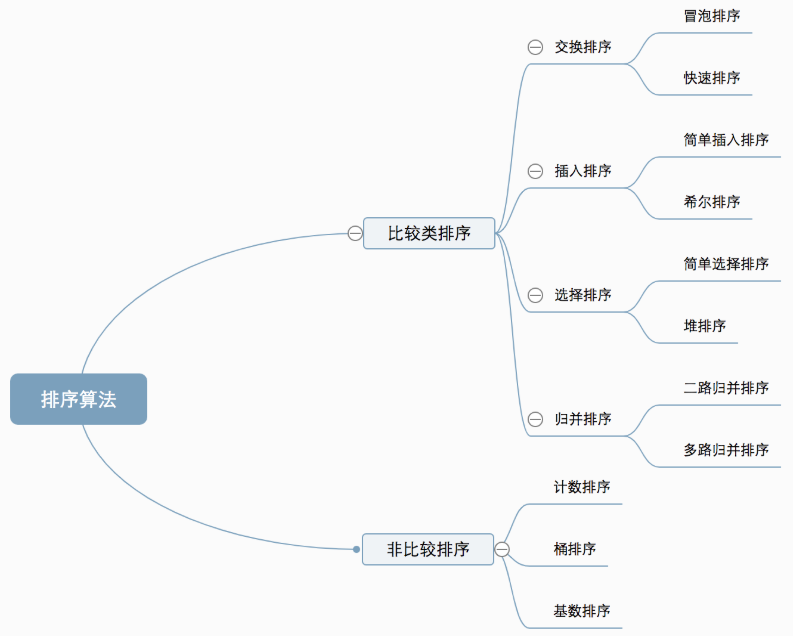
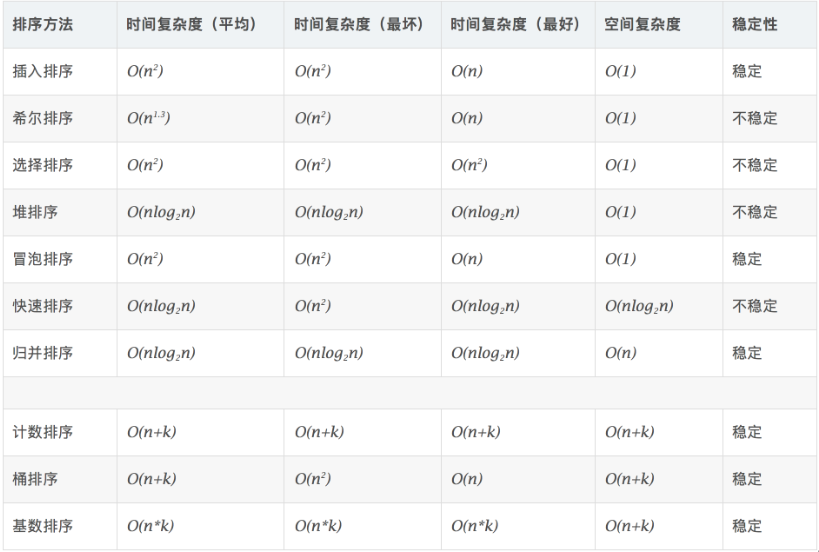

### 一、排序算法

  

**0 相关概念**

- **稳定**：如果a原本在b前面，而a=b，排序之后a仍然在b的前面。
- **不稳定**：如果a原本在b的前面，而a=b，排序之后 a 可能会出现在 b 的后面。
- **时间复杂度**：对排序数据的总的操作次数。反映当n变化时，操作次数呈现什么规律。
- **空间复杂度：**是指算法在计算机


####  1）比较类排序

#####        1、快速排序

```java
/**
 * 快速排序——不稳定
 * 思想：选择一个基准数【一般为第一个或最后一个】,将小于基准数放在左边，大于基准数放在右边。递归分治后的左右两边
 * @param arr
 */
public static void fastSort(int[] arr,int start,int end){
    if(end<=start) return  ;//出口
    int middle=partition(arr,start,end);//基准数归位后的位置
    fastSort(arr,start,middle-1);//递归基准数的左边部分
    fastSort(arr,middle+1,end);//递归基准数的右边部分
}

/**
 * 快排第二步：分治，返回中间位置
 * @param arr
 * @param start
 * @param end
 * @return
 */
public static int partition(int[] arr,int start,int end){
    int locaton=end;
    int key=arr[start];//基准数
    for (int i=end;i>start;i--){//将大值交换到后面
        if (arr[i]>key){
            swap(arr,locaton--,i);
        }
    }
    swap(arr, locaton,start);//将基准数归中
    return locaton;
}

/**
 * 手写测试调整基准数的位置
 * @param arr
 * @param start
 * @param end
 * @return
 */
public static int test(int[] arr,int start,int end){
    int locaton=start;
    int key=arr[end];
    for(int i=start;i<end;i++){
        if (arr[i]>key){//将大值交换到前面
            swap(arr,locaton++,i);
        }
    }
    swap(arr,locaton,end);
    return locaton;
}

/**
 * 交换位置
 * @param arr
 * @param index1
 * @param index2
 */
public static void swap(int[] arr,int index1,int index2){
    int temp=arr[index1];
    arr[index1]=arr[index2];
    arr[index2]=temp;
}
```


#####        2、堆排序

```java
/**
 * 堆排序——不稳定
 * 思想：将原序列构造成一个堆【大顶堆或小顶堆————完全二叉树】，利用【堆顶元素均大于或等于其子节点】特性。
 *
 * @param arrays 数组
 */
public static void heapSort(int[] arrays){
      buildHead(arrays);//构造大顶堆
      int len=arrays.length;
      for(int i = len-1;i>0;i--){
          swap(arrays,0,i);//交换堆顶和堆尾的
          len--;
          headiFy(arrays,0,len);//从堆顶开始重新调整堆
      }
}

/**
 * 从最后一个非叶子节点开始调整
 * 最后一个叶子节点下标=math.floor(array.len/2)-1
 * @param arrays 数组
 */
public static void buildHead(int[] arrays){
    for(int i=(int) Math.floor(arrays.length/2)-1;i>=0;i--){
        headiFy(arrays,i,arrays.length); 
    }
}

/**
 * 调整堆
 * 比较传入的节点及其子节点的大小，违背堆的特性则交换。并判断交换后其字节点是否满足
 * @param arr 数组引用
 * @param i  传入的堆点
 * @param len  数组长度
 */
public static void headiFy(int[] arr,int i,int len){
    int leftIndex=i*2+1;//左子节点
    int rightIndex=leftIndex+1;//右子节点
    int maxIndex=i;
    if(leftIndex<len && arr[leftIndex]>arr[maxIndex]){//比较更新节点及其子节点
        maxIndex=leftIndex;
    }
    if (rightIndex<len && arr[rightIndex]>arr[maxIndex]){
        maxIndex=rightIndex;
    }
    if (maxIndex!=i){
        swap(arr,maxIndex,i);//交换后其maxIndex的子节点可能不满足堆的要求，需要递归调整其子节点
        headiFy(arr,maxIndex,len);
    }

}
```


#####        3、 插入排序

######                 -1）简单插入 

```java
/**
 * 场景：小规模数据或数据基本有序
 * 插入排序--稳定
 * 思想：分为有序序列，和无序序列；遍历将无序项移动到有序序列
 */
public static void insertSort(int[] arrays){
    for(int i=0;i<arrays.length;i++){
        int pre=i-1;
        int cur=i;
        while (pre>=0 && arrays[pre]>arrays[cur]){//一直移动到合适位置
            int temp=arrays[cur];
            arrays[cur]=arrays[pre];
            arrays[pre]=temp;
            pre--;
            cur--;
        }
    }

}
```


######                 -2） 希尔排序

​     1959年Shell发明，第一个突破O(n2)的排序算法，是简单插入排序的改进版。它与插入排序的不同之处在于，它会优先比较距离较远的元素。 又叫**缩小增量排序**

```java
/**
 * 希尔排序——不稳定
 * 思想：在简单插入排序的基础上改进，对无序序列进行按间隔分组，对分组进行简单插入排序。逐渐缩小间隔直到为间隔为整个数组。
 * 优化：对增量序列进行优化 {1,2,4,8,...2^(n-1) } 时间复杂度为最坏 o(n^2)
 *                      {1,3,7,15,...2^n-1  } 时间复杂度为 o(n^1.5)
 * @param arr
 */
public static void shellSort(int[] arr){
    int len=arr.length;
    int gap=1;
    while(len>Math.pow(2,gap)){
          gap++;
    }
    int increment=gap;
    gap=(int) Math.pow(2,gap)-1;

    for (;gap>0;gap=(int) Math.pow(2,--increment)-1){
        for (int i=gap;i<len;i++){
           inserItem(arr,i,gap);
        }
    }
}

/**
 * 传入代插入项，对该项所在组进行插入
 * @param arr
 * @param i  待比较插入的项
 * @param gap  间隔
 */
public static void inserItem(int[] arr,int i,int gap){
    int insertValue=arr[i];
    int j=i-gap;
    for (;j >= 0 && arr[j] < insertValue ;j-=gap){
        arr[j+gap]=arr[j];
    }
    arr[j+gap]=insertValue;
}
```


#####        4、冒泡排序

```java
/**
 * 冒泡排序——稳定
 * 思想：相邻两元素交换位置，每轮循环比较出一个最大的值到最外面，依次减少内层循环次数。
 * @param arr
 */
public static int[] BubbleSort(int[] arr){

    for(int i=0;i<arr.length-1;i++){
        for (int j=0;j<arr.length-1-i;j++){
            if (arr[j]>arr[j+1]){
                int temp=arr[j];
                arr[j]=arr[j+1];
                arr[j+1]=temp;
            }
        }
    }
    return arr;
}
```


#####  5、选择排序

```java
/**
 * 选择排序
 * 思想：选择无序序列中最大或者最小的项移动到左边
 * @param arr
 */
public static void selectSort(int[] arr){

    for (int i=0;i<arr.length;i++){
        int maxIndex=i;
        int j;
        for (j=i+1;j<arr.length;j++){
            if (arr[j]>arr[maxIndex]){
                maxIndex=j;
            }
        }
        swap(arr,i,maxIndex);
    }
}
```

#####  6、归并排序


