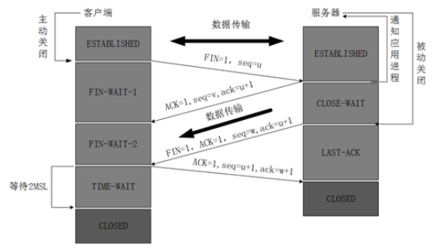

#### 一、协议层级

- 物理层： 二进制电流                                 中继器、集线器                FTP、TELNET、DNS、SMTP.
- 数据链路层： 数据帧（MAC地址）         交换机、网桥
- 网络层： 数据包（IP）                              路由器                               IP、ICMP、IGMP 。
- 传输层： 数据段（TCP UDP）
- 会话层： 区分不同应用的数据
- 表示层： 转码器
- 应用层： 应用程序与下一层的接口 (SSH)    
- 网络接口层：Wi-Fi、ATM 、GPRS、EVDO、HSPA。
  

**1、TCP协议的拥塞控制可以使网络中的路由器或链路不致过载：**
     1）、慢开始、拥塞控制
     2）、快重传、快恢复

**2、预防Ddos的方法：**
    1）、限制同时打开SYN半链接的数目。
    2）、缩短SYN半链接的Time out 时间。
    3）、关闭不必要的服务。

**3、SSH**

​     SSH 为Secure Shell的缩写，由 IETF 的网络小组（Network Working Group）所制定；SSH 为建立在**应用层**基础上的安全协议。SSH 是目前较可靠，专为远程登录会话和其他网络服务提供安全性的协议。

**4、滑动窗口协议有**

​     1）、停止等待协议，发送窗口=1，接受窗口=1；

​     2）、退后N帧协议，发送>1,接收=1;

​     3）、选择重传协议，发送>1,接收>1;

#### 二、TCP/UDP

#####     0、概念

​          **TCP、UDP区别**

​               1.TCP【流模式】面向连接，UDP【数据报模式】面向无连接

​               2.TCP保证数据的顺序和正确性，UDP不保证顺序和正确性。

​               3.TCP要求系统资源教多，UPD较少程序也比较简单。

​         **TCP报头**

​                                  

​         **UDP报文**

​                                

#####     1、TCP三次握手

​                

1、客户端向服务器发出连接请求报文，这是报文首部中的同部位SYN=1，同时选择一个初始序列号 seq=x 

2、服务器收到请求报文后，如果同意连接，则发出确认报文。确认报文中应该 ACK=1，SYN=1，确认号是ack=x+1，同时也要为自己初始化一个序列号 seq=y

3、客户进程收到确认后，还要向服务器给出确认。确认报文的ACK=1，ack=y+1，自己的序列号seq=x+1，此时，TCP连接建立，开始通讯。

**为什么是三次握手建立连接？**

​    因为是两次的话，如果客户端的第一个连接请求因为网络延迟没到达服务器，迟迟没收到服务器的确认连接，又重新发了一次连接请求，服务器收到并发出确认连接请求。客服端与服务器建立连接，通讯后并关闭。这时延迟的第一次客户端请求才到达服务器，服务器接受并发出确认。再次建立连接。就会出现两次连接，耗费服务器的资源。

#####     2、TCP四次挥手

1、客户端进程发出连接释放报文，并且停止发送数据。释放数据报文首部，FIN=1，其序列号为seq=u（等于前面已经传送过来的数据的最后一个字节的序号加1），客户端进入FIN-WAIT-1（终止等待1）状态。

2、服务器收到连接释放报文，发出确认报文，ACK=1，ack=u+1，并且带上自己的序列号seq=v，此时，服务端就进入了CLOSE-WAIT（关闭等待）状态。

3、客户端收到服务器的确认请求后，此时，客户端就进入FIN-WAIT-2（终止等待2）状态，等待服务器发送连接释放报文（在这之前还需要接受服务器发送的最后的数据）

4、服务器向客户端发送连接释放报文，FIN=1，ack=u+1，由于在半关闭状态，服务器很可能又发送了一些数据，假定此时的序列号为seq=w，此时，服务器就进入了LAST-ACK（最后确认）状态，等待客户端的确认。

5、客户端收到服务器的连接释放报文后，必须发出确认，ACK=1，ack=w+1，而自己的序列号是seq=u+1，此时，客户端就进入了TIME-WAIT（时间等待）状态。注意此时TCP连接还没有释放，**必须经过2MSL**（最长报文段寿命）的时间后，当客户端撤销相应的TCB后，才进入CLOSED状态。

6、服务器只要收到了客户端发出的确认，立即进入CLOSED状态。同样，撤销TCB后，就结束了这次的TCP连接。

**客户端为为什么要等待2MSL？**

​      第一：因为客服端发给服务器的确认报文可能丢失或者延迟，服务器若迟迟没有收到确认报文会重新发送请求释放报文，那么客户端就会收到这个，发送确认报文，并重新计算2MSL。防止确认报文的丢失。

​     第二：在这个2MSL时间段中，就可以使本连接持续的时间内所产生的所有报文段都从网络中消失。这样新的连接中不会出现旧连接的请求报文。

**如果已经建立了连接，但是客户端突然出现故障了怎么办？**

TCP还设有一个保活计时器，显然，客户端如果出现故障，服务器不能一直等下去，白白浪费资源。服务器每收到一次客户端的请求后都会重新复位这个计时器，时间通常是设置为2小时，若两小时还没有收到客户端的任何数据，服务器就会发送一个探测报文段，以后每隔75s发送一次。若一连发送10个探测报文仍然没反应，服务器就认为客户端出了故障，接着就关闭连接。